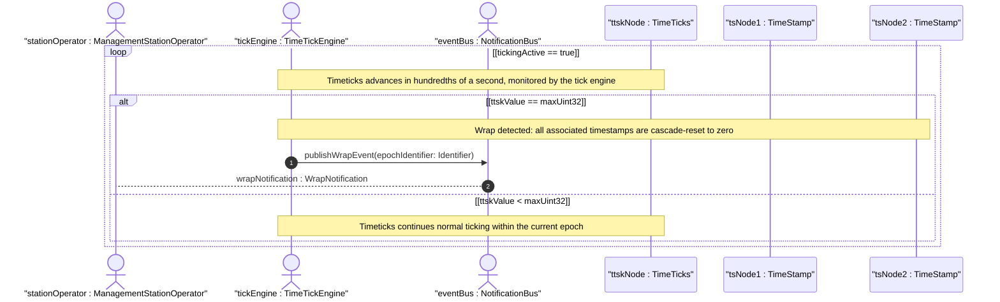
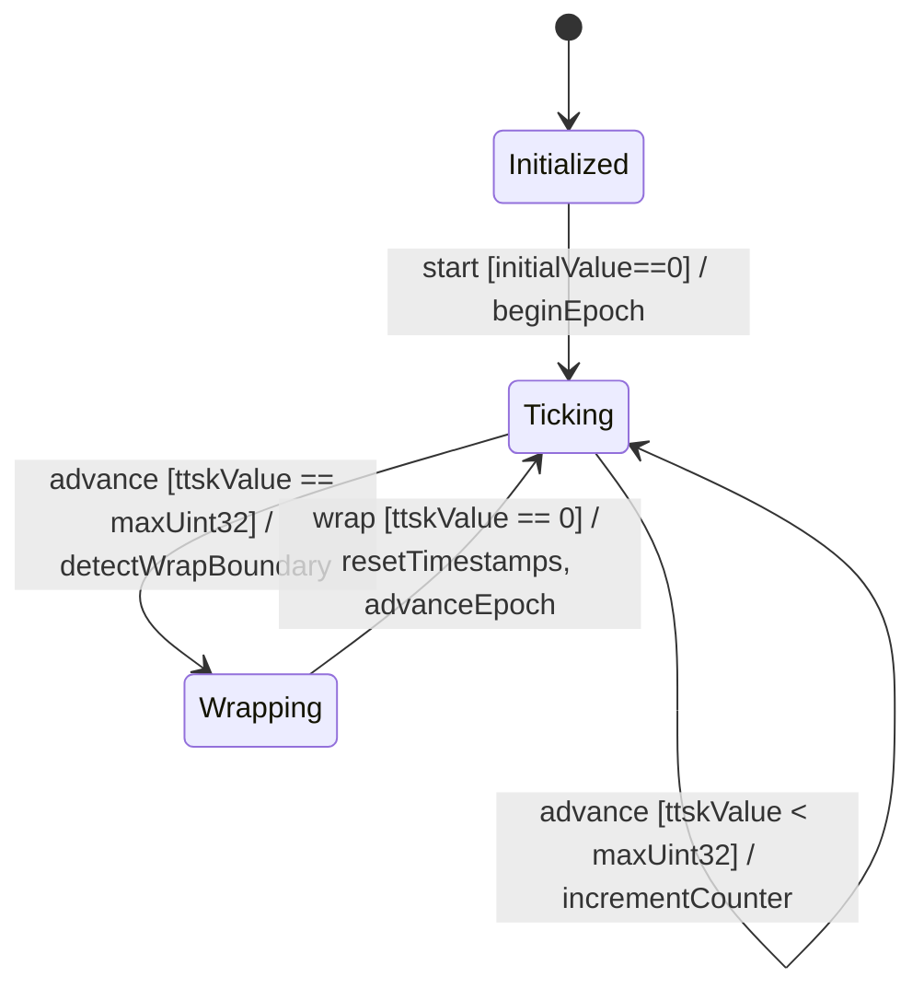

# User Story: Timeticks Wrap Lifecycle and Timestamp Cascade Reset Expiration

## Parent Epic
- [ ] #11 - [ietf-yang-types: Core YANG Data Types](https://github.com/gintatkinson/3dgs-033/blob/main/docs/epics/epic-01-ietf-yang-types.md) (timeticks and timestamp are core types within the ietf-yang-types module)

## Domain Object Mapping
- **Primary Domain Objects:** TimeTicks, TimeStamp
- **Actor/Role:** ManagementStationOperator — the entity monitoring timeticks lifecycle and timestamp validity

## BDD Scenario (OOA/OOD Realization)
**As a** ManagementStationOperator
**I want to** detect when the timeticks counter wraps past its modulo boundary and ensure all associated timestamp values are reset to zero
**So that** I do not misinterpret stale timestamp values as valid event occurrence times after the timeticks lifecycle has expired

**Given** a timeticks counter with current value 4294967295 (one hundredth of a second before wrap)
**When** one additional hundredth of a second elapses
**Then** the timeticks value wraps to 0
**And** the timeticks epoch reference advances by one full modulo period (2^32 hundredths, approximately 497 days)

**Given** a timeticks counter that has just wrapped to 0
**And** five associated timestamp nodes with values {360000, 720000, 1000000, 5000, 999999}
**When** the wrap lifecycle handler executes
**Then** all five timestamp values are cascade-reset to 0
**And** a wrap-event notification is emitted

**Given** a timestamp node whose value is 0
**When** the value is interpreted by the management station
**Then** the interpretation is that either the event occurred before the last timeticks zero point or the timeticks recently wrapped

**Given** a timeticks counter that has NOT wrapped (still in the current epoch)
**And** an associated timestamp with value 500000
**When** the management station queries the timeticks current value 800000
**Then** the event recorded at timestamp 500000 occurred 300000 hundredths (3000 seconds) ago

**Given** a management station that polls timeticks values infrequently (interval > 497 days)
**When** a poll eventually occurs
**Then** the station cannot determine how many times the timeticks wrapped and must treat timeticks-derived data as ambiguous

**Given** a new schema node using the timestamp type is defined
**When** the schema node description is reviewed
**Then** it MUST specify the associated timeticks schema node and the specific occurrence it records

## UML Sequence Diagram


## UML State Machine Diagram


## Operational Context
> The timeticks type represents a non-negative integer that represents the time, modulo 2^32 (4294967296 decimal), in hundredths of a second between two epochs. (RFC 9911, Section 3)

> Note that this requires all timestamp values to be reset to zero when the value of the associated timeticks schema node instance reaches 497+ days and wraps around to zero. The associated timeticks schema node must be specified in the description of any schema node using this type. (RFC 9911, Section 3)

> When the specific occurrence occurred prior to the last time the associated timeticks schema node instance was zero, then the timestamp value is zero. (RFC 9911, Section 3)

## Required Features Matrix
- [ ] #5 - [Define Time Tracking Types](https://github.com/gintatkinson/3dgs-033/blob/main/docs/features/feat-05-time-tracking-types.md) (provides the TimeTicks and TimeStamp type definitions with their lifecycle semantics and temporal expiration behavior)

## Source References
Structural Schema: [ietf-yang-types@2025-12-22.yang](https://github.com/YangModels/yang/blob/main/standard/ietf/RFC/ietf-yang-types%402025-12-22.yang) (Clause: typedef timeticks, timestamp)
Normative Specification: [RFC 9911](https://datatracker.ietf.org/doc/rfc9911/) (Clause: Section 3, timeticks and timestamp typedefs)

> [!WARNING]
> **Mermaid Block Closing Constraints & Code Fence Integrity:**
> - Every Mermaid diagram MUST be strictly closed with ``` ``` ``` on a new line. Leaking Mermaid blocks (e.g. having headings like `##` inside an unclosed diagram) or stray/unclosed code fences will fail downstream validation checks.
> - Ensure there are no stray backticks or unmatched code fences in the document.
> - **All Mermaid syntax constraints are defined in `rules/platform-independence.md` and MUST be observed in full** — including the prohibition on semicolons in `Note` and message text, colons in class members and note strings, stereotypes on relationship lines, and curly braces in class member lines. Do not maintain a local subset here; subsets drift (issue #289).
