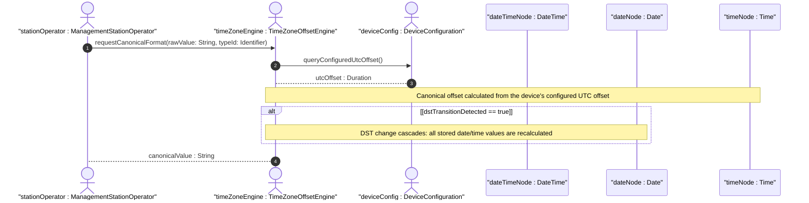
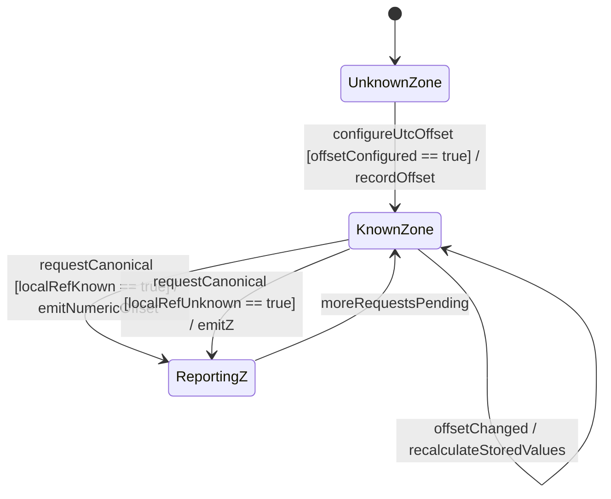

# User Story: Canonical Time Zone Offset Derivation and Daylight Saving Time Transition Handling

## Parent Epic
- [ ] #11 - [ietf-yang-types: Core YANG Data Types](https://github.com/gintatkinson/3dgs-033/blob/main/docs/epics/epic-01-ietf-yang-types.md) (date-and-time, date, and time types are within the ietf-yang-types module)

## Domain Object Mapping
- **Primary Domain Objects:** DateTime, Date, Time
- **Actor/Role:** ManagementStationOperator — the entity reading date/time values and requiring canonical representation

## BDD Scenario (OOA/OOD Realization)
**As a** ManagementStationOperator
**I want to** receive date-and-time values in canonical format with time zone offsets calculated from the device's configured UTC offset
**So that** I can correctly interpret timestamps across devices in different time zones and during DST transitions

**Given** a device configured with a known UTC offset of +02:00 (Central European Summer Time)
**And** a date-and-time value representing 2025-06-15T14:30:00 local time
**When** the canonical format is requested
**Then** the value is returned as 2025-06-15T14:30:00+02:00 (numeric offset calculated from the device's configured offset)

**Given** a device configured with a known UTC offset and DST ends, changing the offset from +02:00 to +01:00
**When** the device's offset to UTC changes due to the DST transition
**Then** all stored date-and-time values with the calculated offset are recalculated
**And** a value previously recorded as 2025-10-26T02:30:00+02:00 may become 2025-10-26T01:30:00+01:00

**Given** a date-and-time value reported in UTC with an unknown local time zone reference point
**When** the canonical format is requested
**Then** the time-offset Z is used (e.g., 2025-12-22T14:30:00Z)
**And** the Z indicates UTC time but does not assert the local reference point is UTC

**Given** a date-and-time value reported in UTC where the local time zone reference point is known to be UTC
**When** the canonical format is requested
**Then** the time-offset +00:00 is used (e.g., 2025-12-22T14:30:00+00:00)
**And** the +00:00 indicates both UTC time and that the local reference is UTC

**Given** two date-and-time values "2025-12-22T14:30:00Z" and "2025-12-22T14:30:00+00:00"
**When** the values are compared for semantic equivalence in the context of local-time-zone knowledge
**Then** they represent the same instant in UTC but differ in the preservation of local time zone reference information

**Given** a device that does not follow DST (static UTC offset)
**And** a date value of 2025-12-22 with the known offset +05:30
**When** the canonical format is requested
**Then** the value is returned as 2025-12-22+05:30

## UML Sequence Diagram


## UML State Machine Diagram


## Operational Context
> The canonical format for date-and-time values with a known time zone uses a numeric time zone offset that is calculated using the device's configured known offset to UTC time. A change of the device's offset to UTC time will cause date-and-time values to change accordingly. Such changes might happen periodically if a server automatically follows daylight saving time (DST) time zone offset changes. (RFC 9911, Section 3, date-and-time)

> The time-offset Z indicates that the date-and-time value is reported in UTC and that the local time zone reference point is unknown. The time-offset +00:00 indicates that the date-and-time value is reported in UTC and that the local time zone reference point is UTC (see Section 2 of RFC 9557). (RFC 9911, Section 3)

## Required Features Matrix
- [ ] #3 - [Define Date and Time Representation Types](https://github.com/gintatkinson/3dgs-033/blob/main/docs/features/feat-03-date-time-types.md) (provides the date-and-time, date, and time type definitions with their canonical format semantics and time zone offset handling requirements)

## Source References
Structural Schema: [ietf-yang-types@2025-12-22.yang](https://github.com/YangModels/yang/blob/main/standard/ietf/RFC/ietf-yang-types%402025-12-22.yang) (Clause: typedef date-and-time, date, time)
Normative Specification: [RFC 9911](https://datatracker.ietf.org/doc/rfc9911/) (Clause: Section 3, date-and-time canonical format and DST behavior)

> [!WARNING]
> **Mermaid Block Closing Constraints & Code Fence Integrity:**
> - Every Mermaid diagram MUST be strictly closed with ``` ``` ``` on a new line. Leaking Mermaid blocks (e.g. having headings like `##` inside an unclosed diagram) or stray/unclosed code fences will fail downstream validation checks.
> - Ensure there are no stray backticks or unmatched code fences in the document.
> - **All Mermaid syntax constraints are defined in `rules/platform-independence.md` and MUST be observed in full** — including the prohibition on semicolons in `Note` and message text, colons in class members and note strings, stereotypes on relationship lines, and curly braces in class member lines. Do not maintain a local subset here; subsets drift (issue #289).
