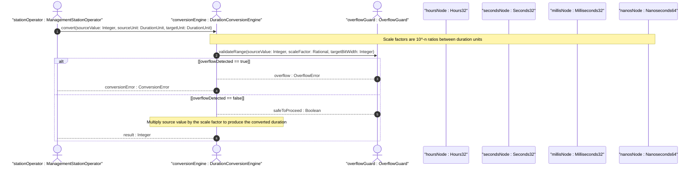

# User Story: Duration Unit Conversion Across Time Measurement Scales

## Parent Epic
- [ ] #11 - [ietf-yang-types: Core YANG Data Types](https://github.com/gintatkinson/3dgs-033/blob/main/docs/epics/epic-01-ietf-yang-types.md) (all duration types are within the ietf-yang-types module)

## Domain Object Mapping
- **Primary Domain Objects:** Hours32, Minutes32, Seconds32, Centiseconds32, Milliseconds32, Microseconds32, Microseconds64, Nanoseconds32, Nanoseconds64
- **Actor/Role:** ManagementStationOperator — the entity performing cross-scale duration comparisons and conversions

## BDD Scenario (OOA/OOD Realization)
**As a** ManagementStationOperator
**I want to** convert duration values between different time measurement scales (hours down to nanoseconds)
**So that** I can compare, aggregate, and display durations consistently regardless of the unit in which they were originally recorded

**Given** a hours32 value of 1
**When** conversion to seconds is requested
**Then** the equivalent seconds32 value is 3600 (1 hour = 60 minutes x 60 seconds)

**Given** a milliseconds32 value of 1500
**When** conversion to seconds is requested
**Then** the equivalent value is 1.5 seconds (milliseconds = seconds x 10^-3)

**Given** a centiseconds32 value of 100
**When** conversion to seconds is requested
**Then** the equivalent value is 1.0 seconds (centiseconds = seconds x 10^-2)

**Given** a microseconds64 value of 1000000
**When** conversion to milliseconds is requested
**Then** the equivalent value is 1000 milliseconds (1 millisecond = 1000 microseconds)

**Given** a nanoseconds64 value of 1000000000
**When** conversion to seconds is requested
**Then** the equivalent value is 1.0 seconds (nanoseconds = seconds x 10^-9)

**Given** a microseconds32 value of 2147483647 (near int32 max, approximately 2147 seconds)
**When** conversion to nanoseconds32 is attempted
**Then** the conversion fails with overflow because the result would exceed the int32 range of nanoseconds32 (approximately 2 seconds)
**And** the operator is informed that a wider type (nanoseconds64) should be used

**Given** a seconds32 value of -60
**When** conversion to minutes32 is requested
**Then** the equivalent value is -1 minute

**Given** a hours32 value of 48 and a seconds32 value of 172800
**When** cross-scale equality comparison is performed
**Then** both values are determined to represent the same time duration after unit normalization

**Given** a conversion from hours32 to microseconds64 at a value near int32 max for hours32
**When** the microsecond-equivalent exceeds int64 max
**Then** the conversion overflows and is flagged as an error

## UML Sequence Diagram


## Operational Context
> A period of time measured in units of hours. The maximum time period that can be expressed is in the range [-89478485 days 08:00:00 to 89478485 days 07:00:00]. (RFC 9911, Section 3, hours32)

> This type should be range-restricted in situations where only non-negative time periods are desirable (i.e., range '0..max'). (RFC 9911, Section 3, all duration typedefs)

> A period of time measured in units of 10^-2 seconds (centiseconds). A period of time measured in units of 10^-3 seconds (milliseconds). A period of time measured in units of 10^-6 seconds (microseconds). A period of time measured in units of 10^-9 seconds (nanoseconds). (RFC 9911, Section 3, duration typedefs)

## Required Features Matrix
- [ ] #4 - [Define Time Duration Measurement Types](https://github.com/gintatkinson/3dgs-033/blob/main/docs/features/feat-04-time-duration-types.md) (provides all nine duration type definitions with their respective unit scales, ranges, and conversion factors)

## Source References
Structural Schema: [ietf-yang-types@2025-12-22.yang](https://github.com/YangModels/yang/blob/main/standard/ietf/RFC/ietf-yang-types%402025-12-22.yang) (Clause: typedef hours32, minutes32, seconds32, centiseconds32, milliseconds32, microseconds32, microseconds64, nanoseconds32, nanoseconds64)
Normative Specification: [RFC 9911](https://datatracker.ietf.org/doc/rfc9911/) (Clause: Section 3, time duration typedefs)

> [!WARNING]
> **Mermaid Block Closing Constraints & Code Fence Integrity:**
> - Every Mermaid diagram MUST be strictly closed with ``` ``` ``` on a new line. Leaking Mermaid blocks (e.g. having headings like `##` inside an unclosed diagram) or stray/unclosed code fences will fail downstream validation checks.
> - Ensure there are no stray backticks or unmatched code fences in the document.
> - **All Mermaid syntax constraints are defined in `rules/platform-independence.md` and MUST be observed in full** — including the prohibition on semicolons in `Note` and message text, colons in class members and note strings, stereotypes on relationship lines, and curly braces in class member lines. Do not maintain a local subset here; subsets drift (issue #289).
