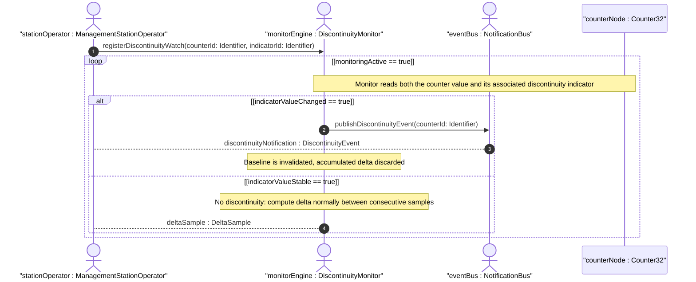
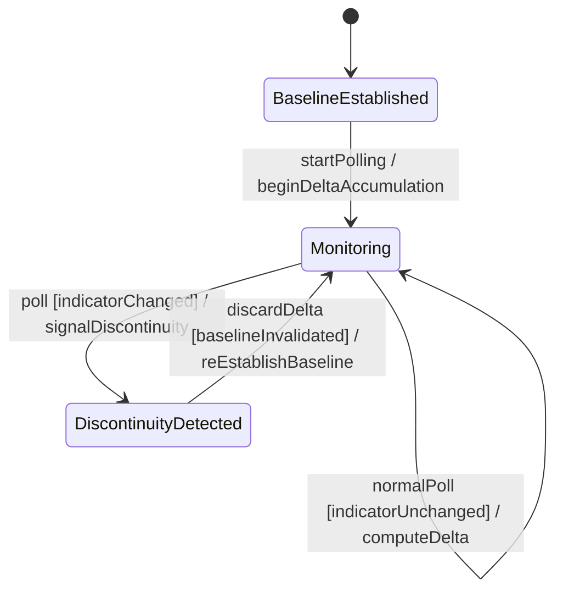

# User Story: Counter Discontinuity Detection Using Associated Indicator Schema Nodes

## Parent Epic
- [ ] #11 - [ietf-yang-types: Core YANG Data Types](https://github.com/gintatkinson/3dgs-033/blob/main/docs/epics/epic-01-ietf-yang-types.md) (counter types are core types within the ietf-yang-types module)

## Domain Object Mapping
- **Primary Domain Objects:** Counter32, Counter64, ZeroBasedCounter32, ZeroBasedCounter64
- **Actor/Role:** ManagementStationOperator — the entity detecting and responding to counter discontinuity events

## BDD Scenario (OOA/OOD Realization)
**As a** ManagementStationOperator
**I want to** detect when a counter has been reset due to system re-initialization or schema node instantiation
**So that** I can discard invalid delta calculations and avoid making decisions based on corrupted counter data

**Given** a counter32 with a running value of 50000
**And** an associated discontinuity-indicator schema node with value currentCounter == 0
**When** the management system is re-initialized and the counter resets to an arbitrary value
**Then** the discontinuity-indicator transitions to a new counter value
**And** a discontinuity event is flagged for the monitoring system

**Given** a counter64 schema node is instantiated for the first time during system operation (not at boot)
**When** the counter64 takes its first arbitrary value (not 0)
**Then** a corresponding discontinuity-indicator schema node is updated to record the instantiation event
**And** any management station polling this counter can detect the initial discontinuity

**Given** a counter32 that has wrapped normally from 4294967295 to 0 without a management system re-initialization
**When** the discontinuity indicator is polled
**Then** the indicator does NOT signal a discontinuity — only re-initialization and instantiation events trigger the indicator

**Given** a zero-based-counter32 that was set to 0 on creation and has been incrementing normally
**When** the node is deleted and re-created (re-instantiation)
**Then** the zero-based-counter32 is reset to its default value of 0
**And** the associated discontinuity indicator records the re-instantiation

**Given** a management station that detects a discontinuity indicator change
**When** the last reliable delta sample was taken before the discontinuity
**Then** all delta calculations spanning the discontinuity boundary are discarded
**And** the station re-establishes a new baseline from the first post-discontinuity sample

## UML Sequence Diagram


## UML State Machine Diagram


## Operational Context
> Discontinuities in the monotonically increasing value normally occur at re-initialization of the management system and at other times as specified in the description of a schema node using this type. If discontinuities occur at times other than re-initialization (for example, at the instantiation of a schema node of type counter32), then a corresponding schema node should be defined, with an appropriate type, to indicate the last discontinuity. (RFC 9911, Section 3)

> The counter32 type should not be used for configuration schema nodes. A default statement SHOULD NOT be used in combination with the type counter32. (RFC 9911, Section 3)

## Required Features Matrix
- [ ] #1 - [Define Counter and Gauge Integer Types](https://github.com/gintatkinson/3dgs-033/blob/main/docs/features/feat-01-counter-gauge-types.md) (provides the counter type definitions including their discontinuity semantics and the requirement for associated discontinuity-indicator schema nodes)

## Source References
Structural Schema: [ietf-yang-types@2025-12-22.yang](https://github.com/YangModels/yang/blob/main/standard/ietf/RFC/ietf-yang-types%402025-12-22.yang) (Clause: typedef counter32, counter64)
Normative Specification: [RFC 9911](https://datatracker.ietf.org/doc/rfc9911/) (Clause: Section 3, counter discontinuity semantics)

> [!WARNING]
> **Mermaid Block Closing Constraints & Code Fence Integrity:**
> - Every Mermaid diagram MUST be strictly closed with ``` ``` ``` on a new line. Leaking Mermaid blocks (e.g. having headings like `##` inside an unclosed diagram) or stray/unclosed code fences will fail downstream validation checks.
> - Ensure there are no stray backticks or unmatched code fences in the document.
> - **All Mermaid syntax constraints are defined in `rules/platform-independence.md` and MUST be observed in full** — including the prohibition on semicolons in `Note` and message text, colons in class members and note strings, stereotypes on relationship lines, and curly braces in class member lines. Do not maintain a local subset here; subsets drift (issue #289).
