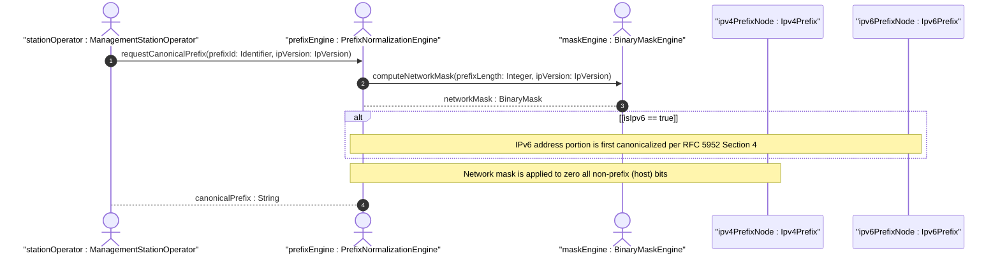

# User Story: IP Prefix Host-Bit Zeroing and Canonical Normalization on Output

## Parent Epic
- [ ] #12 - [ietf-inet-types: Internet Protocol Suite Data Types](https://github.com/gintatkinson/3dgs-033/blob/main/docs/epics/epic-02-ietf-inet-types.md) (IP prefix types are within the ietf-inet-types module)

## Domain Object Mapping
- **Primary Domain Objects:** Ipv4Prefix, Ipv6Prefix, IpPrefix
- **Actor/Role:** ManagementStationOperator — the entity reading IP prefix values and requiring canonical output

## BDD Scenario (OOA/OOD Realization)
**As a** ManagementStationOperator
**I want to** receive IP prefix values in canonical format with all non-prefix (host) bits set to zero
**So that** I can deterministically compare, store, and match prefixes without ambiguity caused by non-zero host bits

**Given** an ipv4-prefix value of 192.0.2.1/24 written by a configuration tool with host bits set
**When** the prefix is read back from the data tree
**Then** the canonical output is 192.0.2.0/24 (host bits zeroed by applying the /24 network mask)
**And** the original non-canonical input was accepted without error on write

**Given** an ipv6-prefix value of 2001:db8::1/64 with host bits set
**When** the canonical output is requested
**Then** the prefix is returned as 2001:db8::/64 (host bits zeroed, RFC 5952 canonical address format)

**Given** an ipv4-prefix value of 10.0.0.0/8
**When** the prefix is read
**Then** the host bits are already zero so no normalization is needed and the value is returned as-is

**Given** an ipv4-address-and-prefix value of 192.0.2.1/24
**When** the value is read
**Then** the host bits are NOT zeroed because address-and-prefix types represent a specific host address with its associated prefix
**And** the value 192.0.2.1/24 is preserved as written

**Given** an ipv6-prefix value of 2001:0db8:0000:0000:0000:0000:0000:0001/64
**When** the canonical format is requested
**Then** the IPv6 address portion is first normalized per RFC 5952 Section 4 (lowercase, zero-compressed: 2001:db8::1)
**And** the prefix mask is applied to zero the host bits
**And** the final canonical output is 2001:db8::/64

**Given** an ipv4-prefix value of 0.0.0.0/0 (default route)
**When** the prefix is normalized
**Then** all bits are zeroed and the output remains 0.0.0.0/0

**Given** an ipv4-prefix value of 255.255.255.255/32 (host route)
**When** the prefix is read
**Then** the prefix length occupies all 32 bits so no host bits exist to zero
**And** the value is returned as-is at 255.255.255.255/32

## UML Sequence Diagram


## Operational Context
> The canonical format of an IPv4 prefix has all bits of the IPv4 address set to zero that are not part of the IPv4 prefix. The definition of ipv4-prefix does not require that bits that are not part of the prefix be set to zero. However, implementations have to return values in canonical format, which requires non-prefix bits to be set to zero. This means that 192.0.2.1/24 must be accepted as a valid value, but it will be converted into the canonical format 192.0.2.0/24. (RFC 9911, Section 4, ipv4-prefix)

> The canonical format of an IPv6 prefix has all bits of the IPv6 address set to zero that are not part of the IPv6 prefix. Furthermore, the IPv6 address is represented as defined in Section 4 of RFC 5952. (RFC 9911, Section 4, ipv6-prefix)

> The ipv4-address-and-prefix type represents an IPv4 address and an associated IPv4 prefix. Unlike ipv4-prefix, this type does NOT require host bits to be zeroed on output because it represents a specific host address along with its network prefix. (RFC 9911, Section 4, ipv4-address-and-prefix)

## Required Features Matrix
- [ ] #9 - [Define IP Prefix Representation Types](https://github.com/gintatkinson/3dgs-033/blob/main/docs/features/feat-09-ip-prefix-types.md) (provides the ipv4-prefix, ipv6-prefix, ip-address-and-prefix type definitions with their canonical normalization requirements)

## Source References
Structural Schema: [ietf-inet-types@2025-12-22.yang](https://github.com/YangModels/yang/blob/main/standard/ietf/RFC/ietf-inet-types%402025-12-22.yang) (Clause: typedef ipv4-prefix, ipv6-prefix, ip-address-and-prefix)
Normative Specification: [RFC 9911](https://datatracker.ietf.org/doc/rfc9911/) (Clause: Section 4, IP prefix canonical normalization)

> [!WARNING]
> **Mermaid Block Closing Constraints & Code Fence Integrity:**
> - Every Mermaid diagram MUST be strictly closed with ``` ``` ``` on a new line. Leaking Mermaid blocks (e.g. having headings like `##` inside an unclosed diagram) or stray/unclosed code fences will fail downstream validation checks.
> - Ensure there are no stray backticks or unmatched code fences in the document.
> - **All Mermaid syntax constraints are defined in `rules/platform-independence.md` and MUST be observed in full** — including the prohibition on semicolons in `Note` and message text, colons in class members and note strings, stereotypes on relationship lines, and curly braces in class member lines. Do not maintain a local subset here; subsets drift (issue #289).
