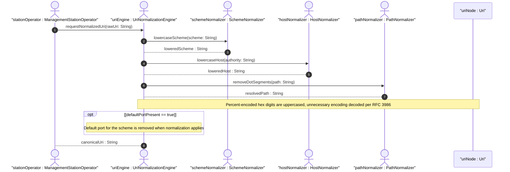

# User Story: URI Normalization to RFC 3986 Canonical Representation

## Parent Epic
- [ ] #12 - [ietf-inet-types: Internet Protocol Suite Data Types](https://github.com/gintatkinson/3dgs-033/blob/main/docs/epics/epic-02-ietf-inet-types.md) (URI type is within the ietf-inet-types module)

## Domain Object Mapping
- **Primary Domain Objects:** Uri
- **Actor/Role:** ManagementStationOperator — the entity storing and retrieving URIs that require canonical normalization

## BDD Scenario (OOA/OOD Realization)
**As a** ManagementStationOperator
**I want to** have URIs automatically normalized to RFC 3986 canonical form on output
**So that** I can rely on URI uniqueness for deduplication, comparison, and IANA-registered scheme processing

**Given** a URI input of "HTTPS://Example.COM:443/Path?Query=Value"
**When** the URI is normalized per RFC 3986 Sections 6.2.1, 6.2.2.1, and 6.2.2.2
**Then** the scheme is lowercased to "https"
**And** the host is lowercased to "example.com"
**And** the default port 443 for https is removed
**And** the path "/Path" is preserved (case-sensitive)
**And** the canonical output is "https://example.com/Path?Query=Value"

**Given** a URI input of "HTTP://EXAMPLE.COM/a/b/c/./../../g"
**When** the URI is normalized
**Then** dot-segments are removed per Section 6.2.2.3 (RFC 3986)
**And** the path resolves to "/a/g"

**Given** a URI input of "https://example.com/path%3fvalue"
**When** the URI is normalized
**Then** percent-encoded hexadecimal digits are uppercased to "%3F"
**And** unnecessary percent-encoding is decoded where the character can be represented without encoding
**And** the canonical form uses uppercase hex within percent-encoded triplets

**Given** a URI input of "https://example.com/%7Euser"
**When** the URI is normalized
**Then** the tilde is not percent-encoded (characters that can be represented directly are decoded)
**And** the output is "https://example.com/~user"

**Given** a URI with a scheme that is not recognized by the implementation
**When** the URI is processed
**Then** scheme-based default port removal is skipped (only known schemes have their default ports removed)
**And** scheme lowercase and host lowercase normalization still apply

**Given** a zero-length URI string is provided
**When** the value is stored
**Then** it is interpreted as "URI absent" (no URI is associated)
**And** it is not treated as a valid URI for normalization or comparison purposes

**Given** a URI with percent-encoded UTF-8 characters in the path
**When** the URI is normalized
**Then** the percent-encoded octets are uppercased but the encoding is preserved (not decoded to raw UTF-8)

## UML Sequence Diagram


## Operational Context
> Objects using the uri type MUST be in ASCII encoding and MUST be normalized as described in Sections 6.2.1, 6.2.2.1, and 6.2.2.2 of RFC 3986. Characters that can be represented without using percent-encoding are represented as characters (without percent-encoding), and all case-insensitive characters are set to lowercase except for hexadecimal digits within a percent-encoded triplet, which are normalized to uppercase as described in Section 6.2.2.1 of RFC 3986. The purpose of this normalization is to help provide unique URIs. Note that this normalization is not sufficient to provide uniqueness. Two URIs that are textually distinct after this normalization may still be equivalent. (RFC 9911, Section 4, uri)

> A zero-length URI is not a valid URI. This can be used to express 'URI absent' where required. (RFC 9911, Section 4, uri)

## Required Features Matrix
- [ ] #10 - [Define Domain Name, Host, URI, and Email Types](https://github.com/gintatkinson/3dgs-033/blob/main/docs/features/feat-10-domain-host-types.md) (provides the URI type definition with its mandatory RFC 3986 canonical normalization requirements and percent-encoding rules)

## Source References
Structural Schema: [ietf-inet-types@2025-12-22.yang](https://github.com/YangModels/yang/blob/main/standard/ietf/RFC/ietf-inet-types%402025-12-22.yang) (Clause: typedef uri)
Normative Specification: [RFC 9911](https://datatracker.ietf.org/doc/rfc9911/) (Clause: Section 4, uri type normalization requirements)

> [!WARNING]
> **Mermaid Block Closing Constraints & Code Fence Integrity:**
> - Every Mermaid diagram MUST be strictly closed with ``` ``` ``` on a new line. Leaking Mermaid blocks (e.g. having headings like `##` inside an unclosed diagram) or stray/unclosed code fences will fail downstream validation checks.
> - Ensure there are no stray backticks or unmatched code fences in the document.
> - **All Mermaid syntax constraints are defined in `rules/platform-independence.md` and MUST be observed in full** — including the prohibition on semicolons in `Note` and message text, colons in class members and note strings, stereotypes on relationship lines, and curly braces in class member lines. Do not maintain a local subset here; subsets drift (issue #289).
