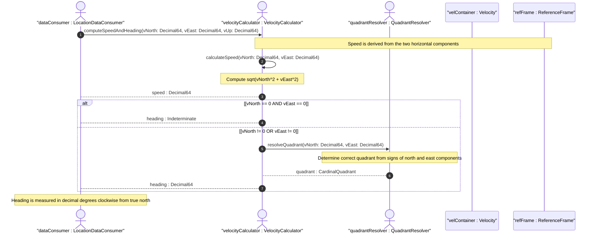

# User Story: Derive Speed and Heading from Velocity Vector Components

## Parent Epic
- [ ] #30 - [ietf-geo-location: Geographic Location Data Model](https://github.com/gintatkinson/3dgs-033/blob/main/docs/epics/epic-03-ietf-geo-location.md) (velocity container within the geo-location grouping provides the source vector components for this derivation)

## Domain Object Mapping
- **Primary Domain Objects:** Velocity, ReferenceFrame, GeodeticSystem
- **Actor/Role:** LocationDataConsumer — the entity querying geo-location data and computing derived motion metrics from raw velocity components

## BDD Scenario (OOA/OOD Realization)
**As a** LocationDataConsumer
**I want to** compute two-dimensional speed and heading from the three-dimensional velocity vector components (v-north, v-east, v-up)
**So that** I can display or analyze the object's motion in standard navigational terms regardless of the raw component encoding

**Given** a geo-location record with velocity components v-north=3.0 m/s, v-east=4.0 m/s, and v-up=0.1 m/s
**When** the speed and heading derivation is requested
**Then** the computed speed is exactly 5.0 m/s (sqrt(3.0^2 + 4.0^2))
**And** the computed heading is arctan(4.0 / 3.0) degrees clockwise from true north

**Given** a geo-location with v-north=0.5 m/s and v-east=0.0 m/s (pure northward motion)
**When** the speed and heading are computed
**Then** the speed is 0.5 m/s
**And** the heading is 0 degrees (or 360 degrees) indicating motion directly toward true north

**Given** a geo-location with v-north=0.0 m/s and v-east=5.0 m/s (pure eastward motion)
**When** the speed and heading are computed
**Then** the speed is 5.0 m/s
**And** the heading is 90 degrees indicating motion directly toward true east

**Given** a geo-location with v-north=-2.0 m/s and v-east=0.0 m/s (southward motion)
**When** the speed and heading are computed
**Then** the speed is 2.0 m/s
**And** the heading is 180 degrees (the arctan correctly resolves the quadrant for the negative north component)

**Given** a geo-location with v-north=0.0 m/s and v-east=-3.0 m/s (westward motion)
**When** the speed and heading are computed
**Then** the speed is 3.0 m/s
**And** the heading is 270 degrees (the arctan correctly resolves the quadrant for the negative east component)

**Given** a geo-location with velocity components at 12-fraction-digit precision (e.g., v-north=0.123456789012)
**When** the speed is computed from the high-precision components
**Then** the result is accurate to within the precision limits of the decimal64 type without introducing unnecessary rounding errors upstream of the final display

**Given** a geo-location with v-north=0.0 m/s and v-east=0.0 m/s (stationary object)
**When** the speed and heading are requested
**Then** the speed is 0.0 m/s
**And** the heading is undefined or reported as indeterminate (arctan(0/0) is undefined)

**Given** a geo-location with only v-north and v-up components (v-east is absent)
**When** speed and heading computation is requested
**Then** the two-dimensional heading is not computable because both horizontal components are required
**And** the computation reports an incomplete-vector error or returns the heading as unavailable

## UML Sequence Diagram


## Operational Context
> Support is added for objects in relatively stable motion. For objects in relatively stable motion, the grouping provides a three-dimensional vector value. The components of the vector are 'v-north', 'v-east', and 'v-up', which are all given in fractional meters per second. The values 'v-north' and 'v-east' are relative to true north as defined by the reference frame for the astronomical body; 'v-up' is perpendicular to the plane defined by 'v-north' and 'v-east', and is pointed away from the center of mass. (RFC 9179, Section 2.3)

> To derive the two-dimensional heading and speed, one would use the following formulas:
> speed = sqrt(v_north^2 + v_east^2)
> heading = arctan(v_east / v_north) (RFC 9179, Section 2.3)

> For some applications that demand high accuracy and where the data is infrequently updated, this velocity vector can track very slow movement such as continental drift. (RFC 9179, Section 2.3)

## Required Features Matrix
- [ ] #29 - [Define Velocity Vector](https://github.com/gintatkinson/3dgs-033/blob/main/docs/features/feat-17-velocity.md) (provides the v-north, v-east, and v-up leaf definitions in meters per second with 12 fraction digits of precision that serve as source data for the speed and heading derivation)
- [ ] #25 - [Define Geodetic System](https://github.com/gintatkinson/3dgs-033/blob/main/docs/features/feat-13-geodetic-system.md) (the geodetic datum defines true north orientation used by the heading derivation and the reference frame context for interpreting north/east directions)
- [ ] #24 - [Define Reference Frame](https://github.com/gintatkinson/3dgs-033/blob/main/docs/features/feat-12-reference-frame.md) (the astronomical body selection determines the physical meaning of true north against which heading and directional velocity are measured)

## Source References
Structural Schema: [ietf-geo-location@2022-02-11.yang](https://github.com/YangModels/yang/blob/main/standard/ietf/RFC/ietf-geo-location%402022-02-11.yang) (Clause: container velocity, leaf v-north, leaf v-east, leaf v-up)
Normative Specification: [RFC 9179](https://datatracker.ietf.org/doc/rfc9179/) (Clause: Section 2.3, Motion — formulas for speed and heading derivation)

> [!WARNING]
> **Mermaid Block Closing Constraints & Code Fence Integrity:**
> - Every Mermaid diagram MUST be strictly closed with ``` ``` ``` on a new line. Leaking Mermaid blocks (e.g. having headings like `##` inside an unclosed diagram) or stray/unclosed code fences will fail downstream validation checks.
> - Ensure there are no stray backticks or unmatched code fences in the document.
> - **All Mermaid syntax constraints are defined in `rules/platform-independence.md` and MUST be observed in full** — including the prohibition on semicolons in `Note` and message text, colons in class members and note strings, stereotypes on relationship lines, and curly braces in class member lines. Do not maintain a local subset here; subsets drift (issue #289).
