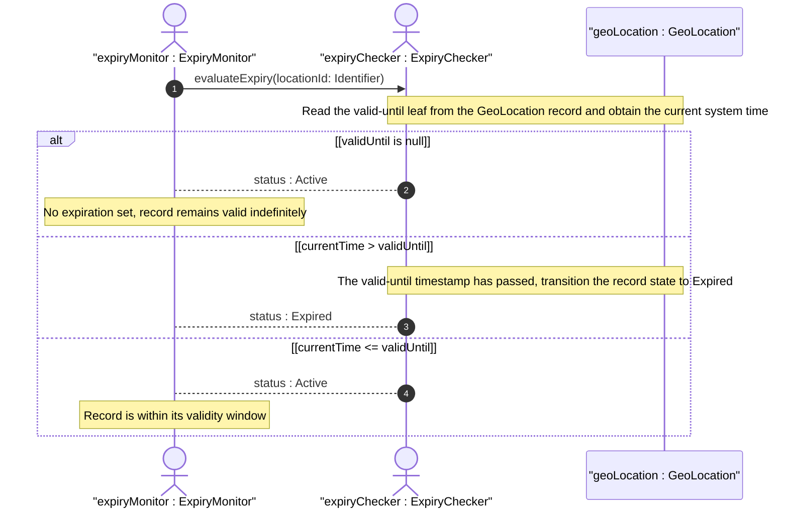
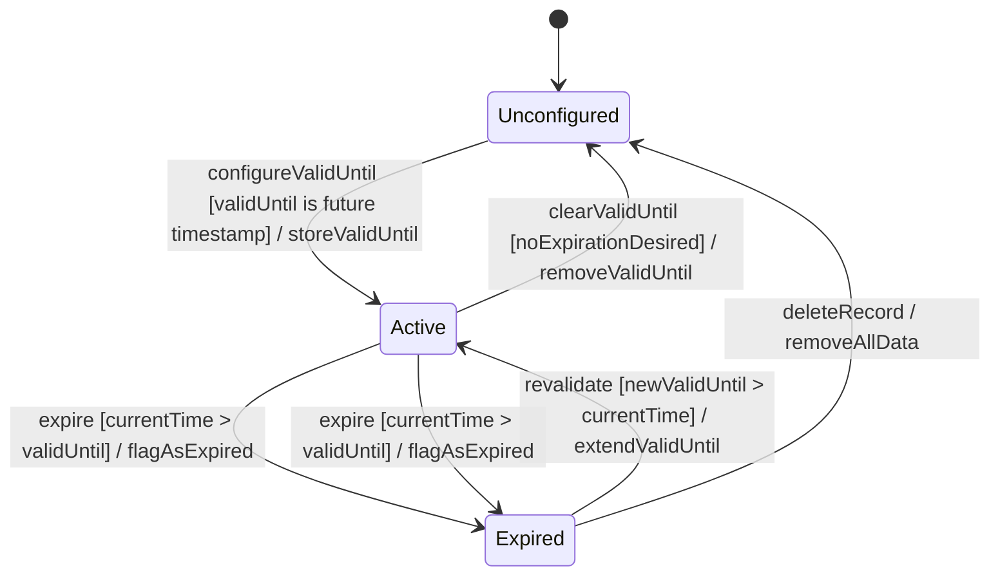

# User Story: Expire Geo-Location Data at valid-until Temporal Boundary

## Parent Epic
- [ ] #30 - [ietf-geo-location: Geographic Location Data Model](https://github.com/gintatkinson/3dgs-033/blob/main/docs/epics/epic-03-ietf-geo-location.md) (geo-location container defines the valid-until leaf and governs the data lifecycle from active to expired)

## Domain Object Mapping
- **Primary Domain Objects:** GeoLocation
- **Actor/Role:** ExpiryMonitor — the system component that evaluates the current time against the valid-until timestamp and transitions the geo-location state accordingly

## BDD Scenario (OOA/OOD Realization)
**As a** ExpiryMonitor
**I want to** detect when a geo-location record's valid-until timestamp has passed the current system time
**So that** expired location data is flagged as stale and consumers can avoid relying on out-of-date positional information

**Given** a geo-location record with valid-until set to "2026-12-31T23:59:59Z"
**And** the current system time is "2027-01-01T00:00:00Z"
**When** the expiry monitor evaluates the record
**Then** the geo-location is transitioned from the Active state to the Expired state
**And** any consumer querying the record is notified that the location data has expired

**Given** a geo-location record with valid-until set to "2026-12-31T23:59:59Z"
**And** the current system time is "2026-06-15T12:00:00Z"
**When** the expiry monitor evaluates the record
**Then** the geo-location remains in the Active state
**And** the record is considered valid for operational use

**Given** a geo-location record with no valid-until value set
**When** the expiry monitor evaluates the record
**Then** the geo-location is treated as having no specific expiration time
**And** the record remains in the Active state indefinitely

**Given** a geo-location record in the Expired state
**And** a new valid-until timestamp is configured to a future date "2028-01-01T00:00:00Z"
**When** the expiry monitor re-evaluates the record
**Then** the geo-location transitions from Expired back to the Active state
**And** the record is once again considered valid for operational use

**Given** a geo-location record with valid-until in the past
**And** the location coordinates, reference frame, and velocity data remain stored and intact
**When** a read-only consumer queries the Expired record
**Then** the full data content is still accessible for historical or forensic purposes
**And** the data carries an Expired status flag rather than being deleted or truncated

**Given** a geo-location record with valid-until set to a timestamp that equals the current time exactly
**When** the expiry monitor evaluates the record at the boundary instant
**Then** the record is treated as expired (inclusive boundary: the data is valid until but not at the timestamp itself)

## UML Sequence Diagram


## UML State Machine Diagram


## Operational Context
> The timestamp for which this geo-location is valid until. If unspecified, the geo-location has no specific expiration time. (RFC 9179, YANG schema — leaf valid-until)

> All the data nodes defined in this YANG module are writable/creatable/deletable (i.e., "config true", which is the default). (RFC 9179, Section 7)

> Since the grouping defined in this module identifies locations, authors using this grouping SHOULD consider any privacy issues that may arise when the data is readable. (RFC 9179, Section 7)

## Required Features Matrix
- [ ] #23 - [Define Geo-Location Container](https://github.com/gintatkinson/3dgs-033/blob/main/docs/features/feat-11-geo-location-container.md) (the geo-location container provides the valid-until leaf of type yang:date-and-time that defines the expiry boundary for this temporal lifecycle)

## Source References
Structural Schema: [ietf-geo-location@2022-02-11.yang](https://github.com/YangModels/yang/blob/main/standard/ietf/RFC/ietf-geo-location%402022-02-11.yang) (Clause: leaf valid-until)
Normative Specification: [RFC 9179](https://datatracker.ietf.org/doc/rfc9179/) (Clause: Section 2.6, Tree — valid-until leaf; Section 7, Security Considerations)

> [!WARNING]
> **Mermaid Block Closing Constraints & Code Fence Integrity:**
> - Every Mermaid diagram MUST be strictly closed with ``` ``` ``` on a new line. Leaking Mermaid blocks (e.g. having headings like `##` inside an unclosed diagram) or stray/unclosed code fences will fail downstream validation checks.
> - Ensure there are no stray backticks or unmatched code fences in the document.
> - **All Mermaid syntax constraints are defined in `rules/platform-independence.md` and MUST be observed in full** — including the prohibition on semicolons in `Note` and message text, colons in class members and note strings, stereotypes on relationship lines, and curly braces in class member lines. Do not maintain a local subset here; subsets drift (issue #289).
