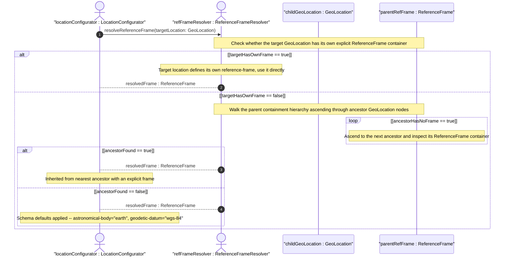

# User Story: Inherit Reference Frame from Parent Container in Nested Location Hierarchies

## Parent Epic
- [ ] #30 - [ietf-geo-location: Geographic Location Data Model](https://github.com/gintatkinson/3dgs-033/blob/main/docs/epics/epic-03-ietf-geo-location.md) (geo-location grouping supports nesting and provides the reference-frame container that may be inherited across hierarchy levels)

## Domain Object Mapping
- **Primary Domain Objects:** ReferenceFrame, GeoLocation
- **Actor/Role:** LocationConfigurator — the operator or system constructing hierarchical location records (e.g., a building containing floors containing rooms)

## BDD Scenario (OOA/OOD Realization)
**As a** LocationConfigurator
**I want to** omit the reference-frame on nested child locations and have it implicitly inherited from the nearest ancestor that defines one
**So that** I can avoid redundant configuration when all locations in a hierarchy share the same astronomical body and geodetic datum

**Given** a parent geo-location record with reference-frame astronomical-body="earth" and geodetic-datum="wgs-84"
**And** a nested child geo-location record with coordinates configured but no reference-frame of its own
**When** the child's coordinate interpretation is required
**Then** the child inherits the parent's reference-frame (astronomical-body="earth", geodetic-datum="wgs-84")

**Given** a parent geo-location on Mars with astronomical-body="mars" and geodetic-datum="mars-me"
**And** a child geo-location with its own explicit reference-frame set to astronomical-body="mars", geodetic-datum="mars-pa"
**When** the child's coordinates are interpreted
**Then** the child uses its own explicitly configured reference-frame (astronomical-body="mars", geodetic-datum="mars-pa")
**And** the parent's reference-frame is not inherited because the child has an explicit override

**Given** a three-level location hierarchy (building > floor > room)
**And** only the building defines a reference-frame (earth/wgs-84)
**And** neither the floor nor the room defines their own reference-frame
**When** the room's coordinates are interpreted
**Then** the room inherits the reference-frame from the building (the nearest ancestor)
**And** the floor inherits the same reference-frame from the building

**Given** a deeply nested child with no ancestor having a reference-frame defined
**When** the child's coordinates need interpretation
**Then** the system applies the schema default: astronomical-body="earth" with geodetic-datum="wgs-84"

**Given** a child with a partially defined reference-frame (e.g., only astronomical-body="moon" but no geodetic-datum)
**When** the reference-frame resolution occurs
**Then** the child's explicit astronomical-body is used but the geodetic-datum is inherited from the nearest ancestor that defines one (or defaults to the datum for the specified body)

**Given** a nested location hierarchy spanning multiple astronomical bodies (parent on Earth, child on the Moon)
**When** the child's coordinates are interpreted
**Then** each level independently resolves its reference-frame and no cross-body inheritance contamination occurs

## UML Sequence Diagram


## Operational Context
> When locations are nested (e.g., a building may have a location that houses routers that also have locations), the module using this grouping is free to indicate in its definition that the 'reference-frame' is inherited from the containing object so that the 'reference-frame' need not be repeated in every instance of location data. (RFC 9179, Section 2.4)

> The default 'astronomical-body' value is 'earth'. (RFC 9179, Section 2.1)

> The default value for 'geodetic-datum' is 'wgs-84' (i.e., the World Geodetic System), which is used by the Global Positioning System (GPS) among many others. (RFC 9179, Section 2.1)

## Required Features Matrix
- [ ] #24 - [Define Reference Frame](https://github.com/gintatkinson/3dgs-033/blob/main/docs/features/feat-12-reference-frame.md) (provides the astronomical-body and alternate-system leaves that constitute the reference-frame being inherited across nested location hierarchies)
- [ ] #23 - [Define Geo-Location Container](https://github.com/gintatkinson/3dgs-033/blob/main/docs/features/feat-11-geo-location-container.md) (the geo-location container is the unit of nesting, and the parent-child containment relationship defines the hierarchy through which reference-frame inheritance propagates)

## Source References
Structural Schema: [ietf-geo-location@2022-02-11.yang](https://github.com/YangModels/yang/blob/main/standard/ietf/RFC/ietf-geo-location%402022-02-11.yang) (Clause: container reference-frame, leaf astronomical-body)
Normative Specification: [RFC 9179](https://datatracker.ietf.org/doc/rfc9179/) (Clause: Section 2.4, Nested Locations)

> [!WARNING]
> **Mermaid Block Closing Constraints & Code Fence Integrity:**
> - Every Mermaid diagram MUST be strictly closed with ``` ``` ``` on a new line. Leaking Mermaid blocks (e.g. having headings like `##` inside an unclosed diagram) or stray/unclosed code fences will fail downstream validation checks.
> - Ensure there are no stray backticks or unmatched code fences in the document.
> - **All Mermaid syntax constraints are defined in `rules/platform-independence.md` and MUST be observed in full** — including the prohibition on semicolons in `Note` and message text, colons in class members and note strings, stereotypes on relationship lines, and curly braces in class member lines. Do not maintain a local subset here; subsets drift (issue #289).
