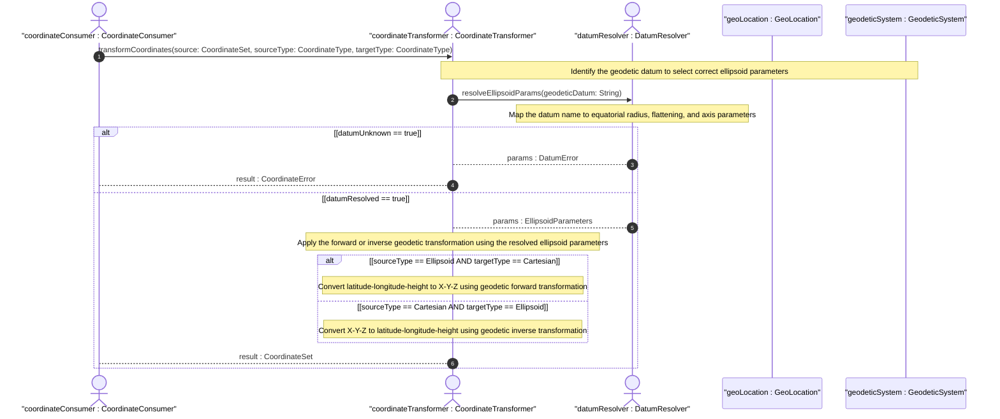

# User Story: Transform Between Ellipsoidal and Cartesian Coordinate Representations

## Parent Epic
- [ ] #30 - [ietf-geo-location: Geographic Location Data Model](https://github.com/gintatkinson/3dgs-033/blob/main/docs/epics/epic-03-ietf-geo-location.md) (the location choice provides both ellipsoidal and Cartesian coordinate alternatives that describe the same spatial point)

## Domain Object Mapping
- **Primary Domain Objects:** Ellipsoid, Cartesian, GeodeticSystem, Location
- **Actor/Role:** CoordinateConsumer — the entity that receives location data in one coordinate system and needs it expressed in the other

## BDD Scenario (OOA/OOD Realization)
**As a** CoordinateConsumer
**I want to** convert a location point between ellipsoidal representation (latitude, longitude, height) and Cartesian representation (x, y, z)
**So that** I can consume location data in whichever coordinate system my application requires, regardless of how the data was originally stored

**Given** a geo-location stored in ellipsoidal coordinates: latitude=40.73297 degrees, longitude=-74.007696 degrees, height=35.0 meters
**And** the reference frame defines the geodetic datum as "wgs-84" (Earth)
**When** a transformation to Cartesian coordinates is requested
**Then** the equivalent Cartesian coordinates (x, y, z) in meters are computed using the WGS-84 ellipsoid parameters
**And** the resulting values correctly represent the same spatial point on the Earth's surface

**Given** a geo-location stored in Cartesian coordinates: x=1335832.5, y=-4652426.0, z=4138321.5 meters
**And** the reference frame defines the geodetic datum as "wgs-84"
**When** a transformation to ellipsoidal coordinates is requested
**Then** the equivalent latitude, longitude, and height are computed
**And** the latitude and longitude are within the valid decimal degree ranges for Earth (-90..90, -180..180)

**Given** a geo-location with Cartesian coordinates defined in a non-Earth geodetic datum (e.g., lunar "me" datum)
**And** the reference frame specifies astronomical-body="moon" with geodetic-datum="me"
**When** an ellipsoidal transformation is requested
**Then** the transformation uses the Moon's ellipsoid parameters (equatorial radius, flattening) from the geodetic datum definition
**And** the resulting latitude and longitude are correct for the lunar coordinate system

**Given** a transformation request from ellipsoidal to Cartesian with an incomplete ellipsoidal point (e.g., latitude present but longitude absent)
**When** the transformation is attempted
**Then** the computation fails with an incomplete-input error because both latitude and longitude (at minimum) are required for the transformation

**Given** a geo-location with height=0.0 in ellipsoidal coordinates (reference zero level)
**When** the transformation to Cartesian is performed
**Then** the computed z coordinate correctly reflects the point lying on the reference ellipsoid surface (not above or below it)

**Given** a transformation from high-precision ellipsoidal coordinates (16 fraction digits) to Cartesian (6 fraction digits)
**When** the forward and inverse transformations are applied in sequence
**Then** the round-trip preserves spatial location to within 0.000001 meters (the precision limit of the Cartesian 6-fraction-digit representation)

**Given** a transformation between coordinate systems using a geodetic datum for which the ellipsoid parameters are not available
**When** the transformation is attempted
**Then** the computation fails with an unknown-datum error
**And** the consumer is informed that the specific geodetic datum must be recognized by the transformation engine before conversion can proceed

## UML Sequence Diagram


## Operational Context
> This is the location on, or relative to, the astronomical object. It is specified using two or three coordinate values. These values are given either as 'latitude', 'longitude', and an optional 'height', or as Cartesian coordinates of 'x', 'y', and 'z'. (RFC 9179, Section 2.2)

> For the standard location choice, 'latitude' and 'longitude' are specified as decimal degrees, and the 'height' value is in fractions of meters. For the Cartesian choice, 'x', 'y', and 'z' are in fractions of meters. In both choices, the exact meanings of all the values are defined by the 'geodetic-datum' value in Section 2.1. (RFC 9179, Section 2.2)

> The GML 'gml:pos' values can be mapped directly to the YANG grouping with the caveat that some loss of precision (in the extremes) may occur due to the YANG grouping using decimal64 values rather than doubles. Conversely, mapping YANG grouping values to GML is fully supported for Earth-based geodetic systems. (RFC 9179, Section 5.1.3)

## Required Features Matrix
- [ ] #27 - [Define Ellipsoid Coordinates](https://github.com/gintatkinson/3dgs-033/blob/main/docs/features/feat-15-ellipsoid-coordinates.md) (provides the latitude, longitude, and height leaf definitions in decimal degrees and meters at 16 and 6 fraction digits of precision — one endpoint of the transformation)
- [ ] #28 - [Define Cartesian Coordinates](https://github.com/gintatkinson/3dgs-033/blob/main/docs/features/feat-16-cartesian-coordinates.md) (provides the x, y, and z leaf definitions in meters at 6 fraction digits — the other endpoint of the transformation)
- [ ] #26 - [Define Location Coordinate Choice](https://github.com/gintatkinson/3dgs-033/blob/main/docs/features/feat-14-location-choice.md) (the YANG choice node that enforces mutual exclusivity between the two coordinate representations, defining which system is active for a given transformation)
- [ ] #25 - [Define Geodetic System](https://github.com/gintatkinson/3dgs-033/blob/main/docs/features/feat-13-geodetic-system.md) (the geodetic datum value selects the ellipsoid parameters — equatorial radius, flattening — required as mathematical inputs to the coordinate transformation formulas)

## Source References
Structural Schema: [ietf-geo-location@2022-02-11.yang](https://github.com/YangModels/yang/blob/main/standard/ietf/RFC/ietf-geo-location%402022-02-11.yang) (Clause: case ellipsoid, case cartesian, leaf geodetic-datum)
Normative Specification: [RFC 9179](https://datatracker.ietf.org/doc/rfc9179/) (Clause: Section 2.2, Location; Section 5.1.3, Geography Markup Language — coordinate mapping discussion)

> [!WARNING]
> **Mermaid Block Closing Constraints & Code Fence Integrity:**
> - Every Mermaid diagram MUST be strictly closed with ``` ``` ``` on a new line. Leaking Mermaid blocks (e.g. having headings like `##` inside an unclosed diagram) or stray/unclosed code fences will fail downstream validation checks.
> - Ensure there are no stray backticks or unmatched code fences in the document.
> - **All Mermaid syntax constraints are defined in `rules/platform-independence.md` and MUST be observed in full** — including the prohibition on semicolons in `Note` and message text, colons in class members and note strings, stereotypes on relationship lines, and curly braces in class member lines. Do not maintain a local subset here; subsets drift (issue #289).
