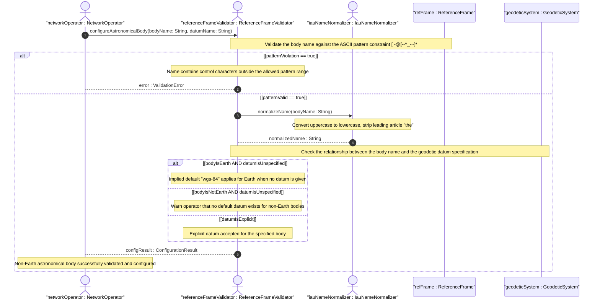

# User Story: Configure Geo-Location on a Non-Earth Astronomical Body

## Parent Epic
- [ ] #30 - [ietf-geo-location: Geographic Location Data Model](https://github.com/gintatkinson/3dgs-033/blob/main/docs/epics/epic-03-ietf-geo-location.md) (the reference-frame container allows specifying any astronomical body for geo-location data)

## Domain Object Mapping
- **Primary Domain Objects:** ReferenceFrame, GeodeticSystem, GeoLocation
- **Actor/Role:** NetworkOperator — the entity deploying or managing network infrastructure on or around astronomical bodies other than Earth

## BDD Scenario (OOA/OOD Realization)
**As a** NetworkOperator
**I want to** configure a geo-location record that references an astronomical body other than Earth
**So that** I can accurately locate network equipment deployed on the Moon, Mars, asteroids, comets, or other celestial objects

**Given** a network device located on the surface of Mars
**When** the operator configures the reference-frame with astronomical-body="mars"
**Then** the value "mars" is accepted and stored
**And** all coordinate data (ellipsoidal or Cartesian) is interpreted relative to the Martian reference frame

**Given** a geo-location being configured for a lunar deployment
**When** astronomical-body is set to "moon" and geodetic-datum is set to "me" (Mean Earth/Polar Axis)
**Then** the system accepts the IANA-registered datum value for the Moon
**And** coordinate precision and zero-height reference are defined by the lunar "me" datum

**Given** a network node deployed on the Saturnian moon Enceladus
**When** astronomical-body is set to "enceladus"
**Then** the system accepts the IAU-named body
**And** the value is stored in lowercase per the schema normalization guidance

**Given** a hypothetical deployment on comet 67P/Churyumov-Gerasimenko
**When** astronomical-body is set to "67p/churyumov-gerasimenko"
**Then** the system accepts the forward-slash separated comet designation
**And** the characters are all within the allowed ASCII pattern range [ -@\[-\^_-~]*

**Given** a configuration attempt with astronomical-body set to "Earth" (uppercase E)
**When** the value is submitted
**Then** the system accepts the value but normalizes it to lowercase "earth" for storage per the specification guidance

**Given** a geo-location configured on Mars with no explicit geodetic-datum set
**When** coordinates are stored and need interpretation
**Then** the system does not default to "wgs-84" because the implied default of "wgs-84" applies only when the astronomical body is Earth
**And** the operator is warned that the geodetic datum is unspecified for the non-Earth body

**Given** a reference frame with astronomical-body set using control characters (byte values 0..31)
**When** validation is performed
**Then** the value is rejected because control characters are prohibited by the pattern constraint `[ -@\[-\^_-~]*`

## UML Sequence Diagram


## Operational Context
> Additionally, while this location is typically relative to Earth, it does not need to be. Indeed, it is easy to imagine a network or device located on the Moon, on Mars, on Enceladus (the moon of Saturn), or even on a comet (e.g., 67p/churyumov-gerasimenko). (RFC 9179, Section 1)

> The frame of reference ('reference-frame') defines what the location values refer to and their meaning. The referred-to object can be any astronomical body. It could be a planet such as Earth or Mars, a moon such as Enceladus, an asteroid such as Ceres, or even a comet such as 1P/Halley. This value is specified in 'astronomical-body' and is defined by the International Astronomical Union. The default 'astronomical-body' value is 'earth'. (RFC 9179, Section 2.1)

> The ASCII value SHOULD have uppercase converted to lowercase and not include control characters (i.e., values 32..64, and 91..126). Any preceding 'the' in the name SHOULD NOT be included. (RFC 9179, YANG schema — leaf astronomical-body)

## Required Features Matrix
- [ ] #24 - [Define Reference Frame](https://github.com/gintatkinson/3dgs-033/blob/main/docs/features/feat-12-reference-frame.md) (provides the astronomical-body leaf with IAU naming conventions, ASCII pattern constraint, and default "earth" that makes non-Earth body specification possible)
- [ ] #25 - [Define Geodetic System](https://github.com/gintatkinson/3dgs-033/blob/main/docs/features/feat-13-geodetic-system.md) (the geodetic-datum leaf supports non-Earth datum values such as "me" for lunar coordinate systems and any IANA-registered datum for other bodies)

## Source References
Structural Schema: [ietf-geo-location@2022-02-11.yang](https://github.com/YangModels/yang/blob/main/standard/ietf/RFC/ietf-geo-location%402022-02-11.yang) (Clause: leaf astronomical-body, leaf geodetic-datum)
Normative Specification: [RFC 9179](https://datatracker.ietf.org/doc/rfc9179/) (Clause: Section 1, Introduction; Section 2.1, Frame of Reference; Section 6.1, Geodetic System Values Registry)

> [!WARNING]
> **Mermaid Block Closing Constraints & Code Fence Integrity:**
> - Every Mermaid diagram MUST be strictly closed with ``` ``` ``` on a new line. Leaking Mermaid blocks (e.g. having headings like `##` inside an unclosed diagram) or stray/unclosed code fences will fail downstream validation checks.
> - Ensure there are no stray backticks or unmatched code fences in the document.
> - **All Mermaid syntax constraints are defined in `rules/platform-independence.md` and MUST be observed in full** — including the prohibition on semicolons in `Note` and message text, colons in class members and note strings, stereotypes on relationship lines, and curly braces in class member lines. Do not maintain a local subset here; subsets drift (issue #289).
