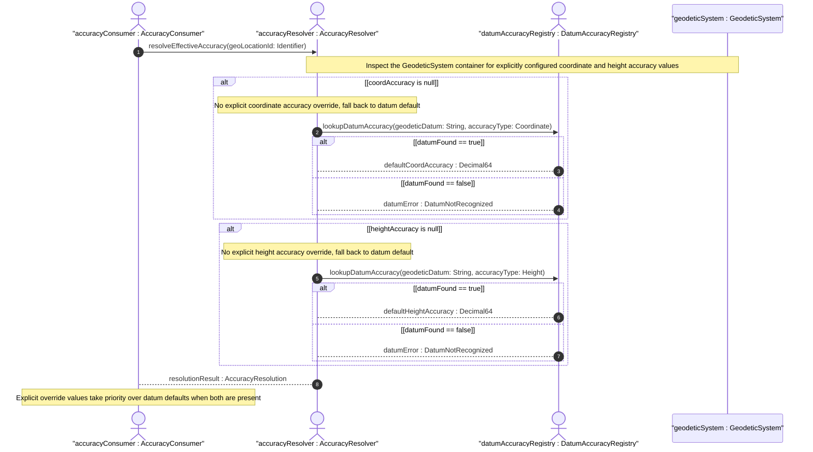

# User Story: Resolve Effective Coordinate Accuracy from Datum Defaults and Explicit Overrides

## Parent Epic
- [ ] #30 - [ietf-geo-location: Geographic Location Data Model](https://github.com/gintatkinson/3dgs-033/blob/main/docs/epics/epic-03-ietf-geo-location.md) (the geodetic-system container provides coord-accuracy and height-accuracy leaves that override datum-implied accuracy values)

## Domain Object Mapping
- **Primary Domain Objects:** GeodeticSystem, ReferenceFrame
- **Actor/Role:** AccuracyConsumer — any downstream application that needs the effective accuracy to interpret coordinate precision or to compose mapping data

## BDD Scenario (OOA/OOD Realization)
**As a** AccuracyConsumer
**I want to** determine the effective coordinate accuracy and height accuracy for a geo-location point
**So that** I know whether the explicitly configured accuracy overrides the default accuracy implied by the geodetic datum or whether the datum's default accuracy applies

**Given** a geo-location with geodetic-datum="wgs-84" and no coord-accuracy or height-accuracy values set
**When** the effective accuracy is resolved
**Then** the effective coord-accuracy is the default accuracy implied by the WGS-84 datum specification
**And** the effective height-accuracy is the default accuracy implied by the WGS-84 datum

**Given** a geo-location with geodetic-datum="wgs-84" and coord-accuracy explicitly set to 0.000001 (1e-6)
**And** height-accuracy explicitly set to 0.01 (1 centimeter)
**When** the effective accuracy is resolved
**Then** the effective coord-accuracy is 0.000001 (the explicit override takes precedence over the datum default)
**And** the effective height-accuracy is 0.01 (the explicit override takes precedence over the datum default)

**Given** a geo-location with geodetic-datum="wgs-84" and coord-accuracy set to 0.000001
**And** height-accuracy is not set
**When** the effective accuracy is resolved
**Then** the effective coord-accuracy is 0.000001 (explicit override)
**And** the effective height-accuracy is the WGS-84 datum default (no explicit override for height)

**Given** a geo-location with geodetic-datum="wgs-84-96" (a more precise variant of WGS-84 updated in 1996)
**When** the effective accuracy is resolved with no explicit overrides
**Then** the effective accuracy values reflect the tighter precision guarantees of the "wgs-84-96" datum variant compared to the base "wgs-84" datum

**Given** a geo-location using Cartesian coordinates (x, y, z) with height-accuracy explicitly set to 0.01
**When** the effective height-accuracy is queried for Cartesian data
**Then** the height-accuracy value is resolved but semantically not applied to Cartesian coordinates per the specification
**And** the consumer is informed that height-accuracy is only meaningful for ellipsoidal coordinate height values

**Given** a geo-location configured with an unrecognized geodetic-datum value (not in the IANA registry)
**And** no coord-accuracy or height-accuracy overrides are set
**When** the effective accuracy is resolved
**Then** the resolution returns unknown-accuracy because the datum's default accuracy cannot be determined
**And** the consumer is warned that coordinate precision is undefined for this unregistered datum

**Given** a geo-location with coord-accuracy set to 1.0 and height-accuracy set to 5.0 (unusually coarse accuracy)
**When** the resolution is performed
**Then** the system honors the explicit values even if they are coarser than the datum default
**And** no automatic clamping to the datum default occurs because explicit configuration always takes precedence

## UML Sequence Diagram


## Operational Context
> In addition to the 'geodetic-datum' value, we allow overriding the coordinate and height accuracy using 'coord-accuracy' and 'height-accuracy', respectively. When specified, these values override the defaults implied by the 'geodetic-datum' value. (RFC 9179, Section 2.1)

> When coord-accuracy is specified, it indicates how precisely the coordinates in the associated list of locations have been determined with respect to the coordinate system defined by the geodetic-datum. For example, there might be uncertainty due to measurement error if an experimental measurement was made to determine each location. (RFC 9179, YANG schema — leaf coord-accuracy)

> The accuracy of the height value for ellipsoidal coordinates; this value is not used with Cartesian coordinates. When height-accuracy is specified, it indicates how precisely the heights in the associated list of locations have been determined with respect to the coordinate system defined by the geodetic-datum. (RFC 9179, YANG schema — leaf height-accuracy)

## Required Features Matrix
- [ ] #25 - [Define Geodetic System](https://github.com/gintatkinson/3dgs-033/blob/main/docs/features/feat-13-geodetic-system.md) (provides the coord-accuracy and height-accuracy leaf definitions with 6 fraction digits, and the geodetic-datum leaf whose default accuracy values serve as the fallback when no explicit override is configured)

## Source References
Structural Schema: [ietf-geo-location@2022-02-11.yang](https://github.com/YangModels/yang/blob/main/standard/ietf/RFC/ietf-geo-location%402022-02-11.yang) (Clause: leaf coord-accuracy, leaf height-accuracy, leaf geodetic-datum)
Normative Specification: [RFC 9179](https://datatracker.ietf.org/doc/rfc9179/) (Clause: Section 2.1, Frame of Reference — accuracy override semantics)

> [!WARNING]
> **Mermaid Block Closing Constraints & Code Fence Integrity:**
> - Every Mermaid diagram MUST be strictly closed with ``` ``` ``` on a new line. Leaking Mermaid blocks (e.g. having headings like `##` inside an unclosed diagram) or stray/unclosed code fences will fail downstream validation checks.
> - Ensure there are no stray backticks or unmatched code fences in the document.
> - **All Mermaid syntax constraints are defined in `rules/platform-independence.md` and MUST be observed in full** — including the prohibition on semicolons in `Note` and message text, colons in class members and note strings, stereotypes on relationship lines, and curly braces in class member lines. Do not maintain a local subtree here; subsets drift (issue #289).
