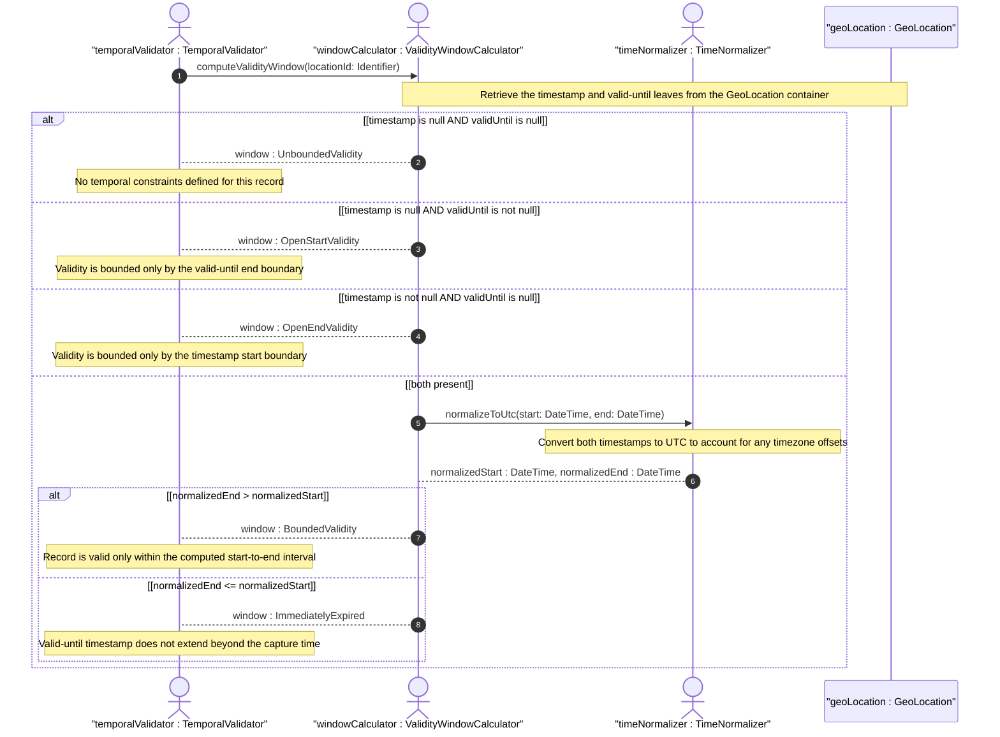
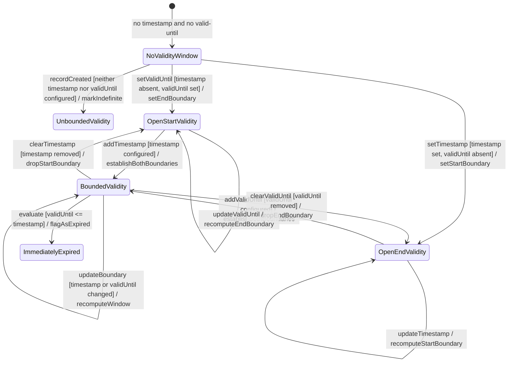

# User Story: Compute Geo-Location Validity Window from Timestamp and valid-until

## Parent Epic
- [ ] #30 - [ietf-geo-location: Geographic Location Data Model](https://github.com/gintatkinson/3dgs-033/blob/main/docs/epics/epic-03-ietf-geo-location.md) (the geo-location container provides both timestamp and valid-until leaves that together define the temporal validity window)

## Domain Object Mapping
- **Primary Domain Objects:** GeoLocation
- **Actor/Role:** TemporalValidator — the system component that computes the temporal window during which a geo-location record is considered current and authoritative

## BDD Scenario (OOA/OOD Realization)
**As a** TemporalValidator
**I want to** compute the temporal validity window of a geo-location record from its timestamp (capture time) and valid-until (expiration time)
**So that** I can determine whether the location data is current, stale, or has an unbounded validity period

**Given** a geo-location with timestamp="2026-06-01T12:00:00Z" and valid-until="2026-06-02T12:00:00Z"
**When** the validity window is computed
**Then** the window is a 24-hour period starting at 2026-06-01T12:00:00Z and ending at 2026-06-02T12:00:00Z
**And** any query time within this interval returns the record as current

**Given** a geo-location with timestamp="2026-06-01T12:00:00Z" but no valid-until set
**When** the validity window is computed
**Then** the window has a defined start (the timestamp) but an unbounded end
**And** the record is considered valid indefinitely from the timestamp onward

**Given** a geo-location with valid-until="2026-06-01T12:00:00Z" but no timestamp set
**When** the validity window is computed
**Then** the window has a defined end but an undefined start
**And** any query time before the valid-until timestamp finds the record as valid

**Given** a geo-location with neither timestamp nor valid-until set
**When** the validity window is computed
**Then** the window is entirely unbounded
**And** the record has no temporal constraints on its validity

**Given** a geo-location with valid-until="2026-01-01T00:00:00Z" which is before its timestamp="2026-06-01T12:00:00Z"
**When** the validity window is computed
**Then** the window is a negative-duration interval (end is before start)
**And** the record is immediately expired because the valid-until has already passed by the time the location was captured

**Given** a geo-location with timestamp and valid-until specifying the exact same instant
**When** the validity window is computed
**Then** the window has zero duration (start equals end)
**And** the record is valid only at that precise instant and expires immediately afterward

**Given** a geo-location with timestamp="2026-06-01T12:00:00+05:00" and valid-until="2026-06-01T07:00:00Z"
**When** the validity window is computed with timezone normalization
**Then** both timestamps are normalized to a common time zone (UTC) before comparing
**And** the window correctly accounts for timezone offsets in both the timestamp and valid-until

**Given** a geo-location record whose timestamp is in the distant past but no valid-until is set
**When** a consumer queries whether the data is current
**Then** the answer is "yes" because the unbounded validity window means the record never expires
**And** the consumer must independently assess whether the stale capture time renders the data unreliable for their use case

## UML Sequence Diagram


## UML State Machine Diagram


## Operational Context
> Reference time when location was recorded. (RFC 9179, YANG schema — leaf timestamp)

> The timestamp for which this geo-location is valid until. If unspecified, the geo-location has no specific expiration time. (RFC 9179, YANG schema — leaf valid-until)

> The YANG data model defines the timestamp with arbitrarily large precision by using a string that encompasses all representable values of this timestamp value. (RFC 9179, Section 5.1.2.1 — timestamp comparison with W3C DOMTimeStamp)

> GML also defines an observation value in 'gml:Observation', which includes a timestamp value 'gml:validTime' in addition to other components. Only the timestamp is mappable to and from the YANG grouping. Furthermore, 'gml:validTime' can either be an instantaneous measure ('gml:TimeInstant') or a time period ('gml:TimePeriod'). The instantaneous 'gml:TimeInstant' is mappable to and from the YANG grouping 'timestamp' value, and values down to the resolution of seconds for 'gml:TimePeriod' can be mapped using the 'valid-until' node of the YANG grouping. (RFC 9179, Section 5.1.3)

## Required Features Matrix
- [ ] #23 - [Define Geo-Location Container](https://github.com/gintatkinson/3dgs-033/blob/main/docs/features/feat-11-geo-location-container.md) (provides the timestamp leaf of type yang:date-and-time recording the capture instant and the valid-until leaf marking the expiration time — both required to construct the temporal validity window)

## Source References
Structural Schema: [ietf-geo-location@2022-02-11.yang](https://github.com/YangModels/yang/blob/main/standard/ietf/RFC/ietf-geo-location%402022-02-11.yang) (Clause: leaf timestamp, leaf valid-until)
Normative Specification: [RFC 9179](https://datatracker.ietf.org/doc/rfc9179/) (Clause: Section 2.6, Tree; Section 5.1.2.1, W3C Comparison — timestamp precision; Section 5.1.3, GML — validTime mapping)

> [!WARNING]
> **Mermaid Block Closing Constraints & Code Fence Integrity:**
> - Every Mermaid diagram MUST be strictly closed with ``` ``` ``` on a new line. Leaking Mermaid blocks (e.g. having headings like `##` inside an unclosed diagram) or stray/unclosed code fences will fail downstream validation checks.
> - Ensure there are no stray backticks or unmatched code fences in the document.
> - **All Mermaid syntax constraints are defined in `rules/platform-independence.md` and MUST be observed in full** — including the prohibition on semicolons in `Note` and message text, colons in class members and note strings, stereotypes on relationship lines, and curly braces in class member lines. Do not maintain a local subset here; subsets drift (issue #289).
