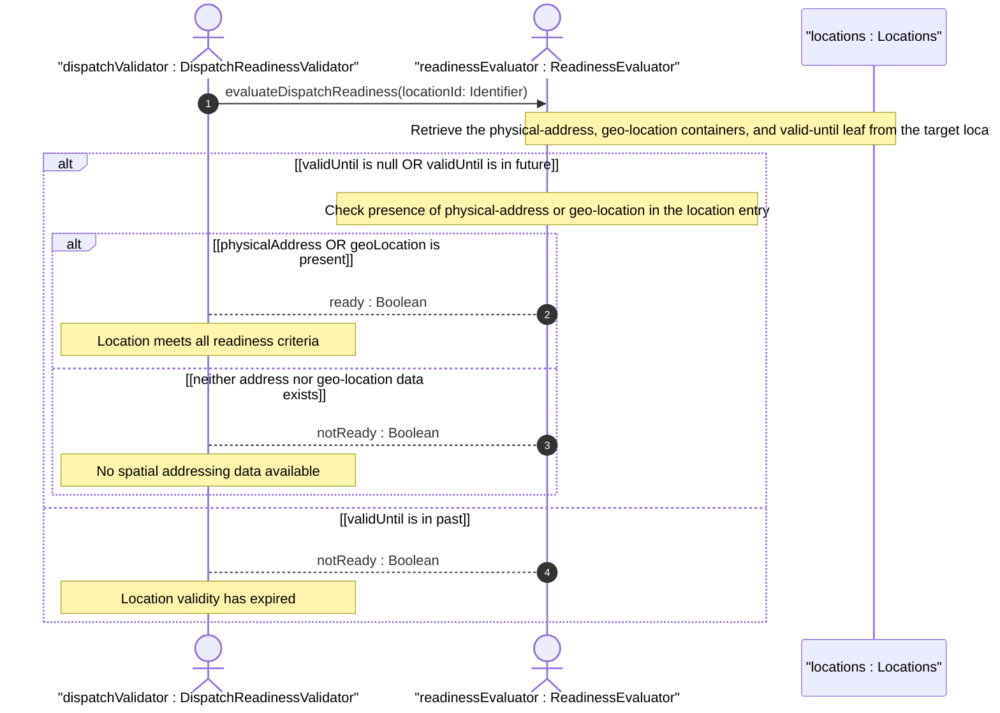

# User Story: Validate Location Dispatch Readiness from Address, Geo-Location, and Validity Data

## Parent Epic
- [ ] #49 - [ietf-ni-location: Network Inventory Location](https://github.com/gintatkinson/3dgs-033/blob/main/docs/epics/epic-04-ietf-ni-location.md) (the locations container provides the physical-address, geo-location, and valid-until leaves that serve as inputs to the dispatch readiness calculation)

## Domain Object Mapping
- **Primary Domain Objects:** Locations, PhysicalAddress, GeoLocation
- **Actor/Role:** DispatchReadinessValidator — the system component that evaluates whether a location is operationally ready for field dispatch or planning by verifying the composite readiness conditions defined in Section 6 of the normative specification

## BDD Scenario (OOA/OOD Realization)
**As a** DispatchReadinessValidator
**I want to** compute a composite dispatch readiness boolean from the presence of address or geo-location data and the validity window of a location
**So that** field dispatch and planning operations can gate on verifiable location data rather than assuming a location is always ready

**Given** a location with physical-address populated and valid-until set to "2030-12-31T23:59:59Z" (a future time)
**When** the dispatch readiness is evaluated against the current system time
**Then** the location is marked as dispatch-ready because at least one of physical-address or geo-location is present AND valid-until has not yet elapsed

**Given** a location with geo-location coordinates populated and no valid-until set
**When** the dispatch readiness is evaluated
**Then** the location is marked as dispatch-ready because geo-location data is present AND the absence of valid-until indicates indefinite validity

**Given** a location with both physical-address and geo-location populated and valid-until set to "2025-01-01T00:00:00Z" (a past time)
**When** the dispatch readiness is evaluated
**Then** the location is marked as NOT dispatch-ready because the valid-until timestamp has elapsed, rendering the location stale for operational purposes

**Given** a location with neither physical-address nor geo-location data populated
**When** the dispatch readiness is evaluated
**Then** the location is marked as NOT dispatch-ready regardless of the valid-until value because no spatial addressing data is available

**Given** a location with only a partial physical-address (e.g., only city and country-code)
**When** the dispatch readiness is evaluated
**Then** the location is marked as dispatch-ready because the presence of ANY physical-address data satisfies the "at least one" condition

**Given** a location with geo-location coordinates but with geo-location valid-until in the past while the location-level valid-until is in the future
**When** the dispatch readiness is evaluated
**Then** the location is marked as NOT dispatch-ready because the geo-location data is stale even though the location-level validity window is still open

## UML Sequence Diagram


## Operational Context
> Before using a location for field dispatch or planning, verification is required to ensure at least one of physical-address or geo-location is present, and that the valid-until leaf is either not present or indicates a future time. Once the valid-until time has passed, the location MUST be considered stale and MUST NOT be used for operational purposes. (draft-ietf-ivy-network-inventory-location-06, Section 6)

> Data quality is indicated through timestamps recording the last update time, as well as an optional expiration time for location validity. (draft-ietf-ivy-network-inventory-location-06, Section 6)

> The Network Inventory location model is to record physical locations, such as sites, building, equipment rooms, racks, and so on. Additionally, it includes provisions for physical addresses or geo-location data (geographic coordinates). (draft-ietf-ivy-network-inventory-location-06, Section 1)

## Required Features Matrix
- [ ] #45 - [Define Locations Container](https://github.com/gintatkinson/3dgs-033/blob/main/docs/features/feat-18-locations-container.md) (provides the location entry with the valid-until leaf and the structural container that houses both physical-address and geo-location sub-containers)
- [ ] #46 - [Define Physical Address](https://github.com/gintatkinson/3dgs-033/blob/main/docs/features/feat-19-physical-address.md) (provides the physical-address container with postal address fields checked as part of the "at least one of physical-address or geo-location" readiness condition)
- [ ] #23 - [Define Geo-Location Container](https://github.com/gintatkinson/3dgs-033/blob/main/docs/features/feat-11-geo-location-container.md) (provides the geo-location container imported via RFC 9179 grouping, whose presence and own valid-until leaf are part of the composite readiness calculation)

## Source References
Structural Schema: [ietf-ni-location@2026-07-06.yang](https://github.com/ietf-ivy-wg/network-inventory-location/blob/main/ietf-ni-location.yang) (Clause: container locations, leaf valid-until, uses physical-address, uses geo:geo-location)
Normative Specification: [draft-ietf-ivy-network-inventory-location-06](https://datatracker.ietf.org/doc/html/draft-ietf-ivy-network-inventory-location) (Clause: Section 6, Operational Considerations)

> [!WARNING]
> **Mermaid Block Closing Constraints & Code Fence Integrity:**
> - Every Mermaid diagram MUST be strictly closed with ``` ``` ``` on a new line. Leaking Mermaid blocks (e.g. having headings like `##` inside an unclosed diagram) or stray/unclosed code fences will fail downstream validation checks.
> - Ensure there are no stray backticks or unmatched code fences in the document.
> - **All Mermaid syntax constraints are defined in `rules/platform-independence.md` and MUST be observed in full** — including the prohibition on semicolons in `Note` and message text, colons in class members and note strings, stereotypes on relationship lines, and curly braces in class member lines. Do not maintain a local subset here; subsets drift (issue #289).
