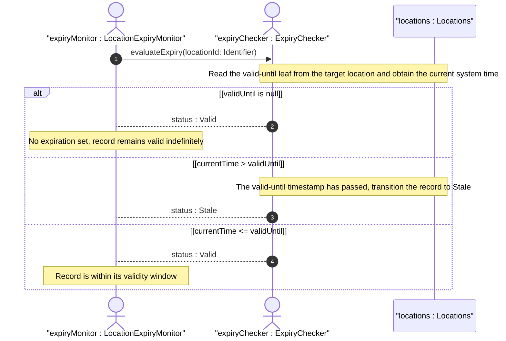
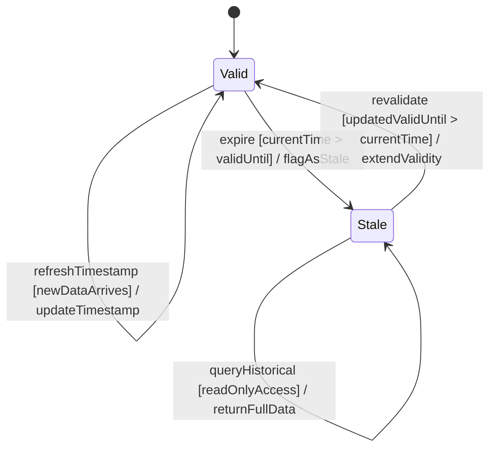

# User Story: Expire Location Record at valid-until Temporal Boundary

## Parent Epic
- [ ] #49 - [ietf-ni-location: Network Inventory Location](https://github.com/gintatkinson/3dgs-033/blob/main/docs/epics/epic-04-ietf-ni-location.md) (the locations container defines the valid-until leaf on each location entry and governs the data lifecycle from valid to stale)

## Domain Object Mapping
- **Primary Domain Objects:** Locations
- **Actor/Role:** LocationExpiryMonitor — the system component that evaluates the current time against the location-level valid-until timestamp and transitions the location state accordingly

## BDD Scenario (OOA/OOD Realization)
**As a** LocationExpiryMonitor
**I want to** detect when a location record's valid-until timestamp has passed the current system time
**So that** expired location data is flagged as stale and consumers avoid using out-of-date location information for operational purposes

**Given** a location record with valid-until set to "2027-12-31T23:59:59Z"
**And** the current system time is "2028-01-01T00:00:00Z"
**When** the expiry monitor evaluates the record
**Then** the location is transitioned from the Valid state to the Stale state
**And** any consumer querying the record is informed that the location data has expired

**Given** a location record with valid-until set to "2027-12-31T23:59:59Z"
**And** the current system time is "2026-06-15T12:00:00Z"
**When** the expiry monitor evaluates the record
**Then** the location remains in the Valid state
**And** the record is considered current for operational use

**Given** a location record with no valid-until value set
**When** the expiry monitor evaluates the record
**Then** the location is treated as having no specific expiration time
**And** the record remains in the Valid state indefinitely

**Given** a location record in the Stale state
**And** the valid-until is updated to a future timestamp "2029-01-01T00:00:00Z"
**When** the expiry monitor re-evaluates the record
**Then** the location transitions from Stale back to the Valid state
**And** the record is once again considered current for operational use

**Given** a location record with valid-until in the past
**And** the location details such as type, parent, physical-address, and geo-location remain stored and intact
**When** a read-only consumer queries the Stale record
**Then** the full data content is still accessible for historical or forensic purposes
**And** the data carries a Stale status flag rather than being deleted or truncated

**Given** a location record with valid-until set to a timestamp that equals the current time exactly
**When** the expiry monitor evaluates the record at the boundary instant
**Then** the record is treated as expired (inclusive boundary: the data is valid until but not at the timestamp itself)

## UML Sequence Diagram


## UML State Machine Diagram


## Operational Context
> The timestamp for which this location is valid until. If unspecified, the location has no specific expiration time. (ietf-ni-location.yang — leaf valid-until on location list)

> Before using a location for field dispatch or planning, verification is required to ensure at least one of physical-address or geo-location is present, and that the valid-until leaf is either not present or indicates a future time. Once the valid-until time has passed, the location MUST be considered stale and MUST NOT be used for operational purposes. (draft-ietf-ivy-network-inventory-location-06, Section 6)

> Data quality is indicated through timestamps recording the last update time, as well as an optional expiration time for location validity. (draft-ietf-ivy-network-inventory-location-06, Section 6)

## Required Features Matrix
- [ ] #45 - [Define Locations Container](https://github.com/gintatkinson/3dgs-033/blob/main/docs/features/feat-18-locations-container.md) (provides the location entry with the valid-until leaf of type yang:date-and-time that defines the expiry boundary for this temporal lifecycle)

## Source References
Structural Schema: [ietf-ni-location@2026-07-06.yang](https://github.com/ietf-ivy-wg/network-inventory-location/blob/main/ietf-ni-location.yang) (Clause: leaf valid-until on list location)
Normative Specification: [draft-ietf-ivy-network-inventory-location-06](https://datatracker.ietf.org/doc/html/draft-ietf-ivy-network-inventory-location) (Clause: Section 6, Operational Considerations)

> [!WARNING]
> **Mermaid Block Closing Constraints & Code Fence Integrity:**
> - Every Mermaid diagram MUST be strictly closed with ``` ``` ``` on a new line. Leaking Mermaid blocks (e.g. having headings like `##` inside an unclosed diagram) or stray/unclosed code fences will fail downstream validation checks.
> - Ensure there are no stray backticks or unmatched code fences in the document.
> - **All Mermaid syntax constraints are defined in `rules/platform-independence.md` and MUST be observed in full** — including the prohibition on semicolons in `Note` and message text, colons in class members and note strings, stereotypes on relationship lines, and curly braces in class member lines. Do not maintain a local subset here; subsets drift (issue #289).
