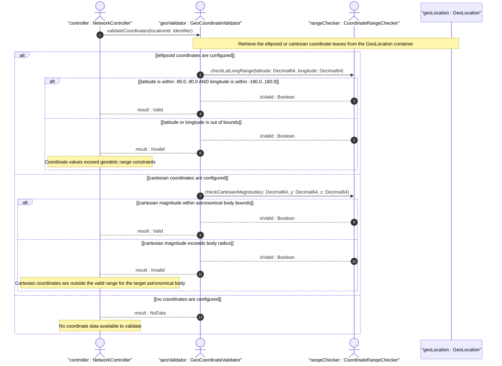

# User Story: Validate Geographic Coordinate Ranges Against Bounded Constraints

## Parent Epic
- [ ] #49 - [ietf-ni-location: Network Inventory Location](https://github.com/gintatkinson/3dgs-033/blob/main/docs/epics/epic-04-ietf-ni-location.md) (the ietf-ni-location module imports geo:geo-location which defines ellipsoid and cartesian coordinate representations that require bounded range validation)
- [ ] #30 - [ietf-geo-location: Geographic Location Data Model](https://github.com/gintatkinson/3dgs-033/blob/main/docs/epics/epic-03-ietf-geo-location.md) (the geo-location grouping defines the coordinate leafs and their decimal64 types which carry implicit range constraints from geodetic definitions)

## Domain Object Mapping
- **Primary Domain Objects:** GeoLocation, EllipsoidCoordinates, CartesianCoordinates
- **Actor/Role:** GeoCoordinateValidator — the system component that verifies latitude, longitude, and other coordinate values fall within their defined geodetic and coordinate-system bounds

## BDD Scenario (OOA/OOD Realization)
**As a** GeoCoordinateValidator
**I want to** validate that ellipsoid and cartesian coordinate values conform to their defined range constraints
**So that** invalid or impossible geographic positions are rejected before they enter the network inventory

**Given** a candidate geo-location with latitude 40.7128 and longitude -74.0060
**When** the ellipsoid coordinate range validator checks the values
**Then** both latitude and longitude pass validation because they fall within the valid ranges of [-90, 90] and [-180, 180] respectively

**Given** a candidate geo-location with latitude 95.0
**When** the latitude range validation is performed
**Then** the value is rejected because it exceeds the maximum permissible latitude of 90 degrees

**Given** a candidate geo-location with latitude -91.0
**When** the latitude range validation is performed
**Then** the value is rejected because it falls below the minimum permissible latitude of -90 degrees

**Given** a candidate geo-location with longitude 185.0
**When** the longitude range validation is performed
**Then** the value is rejected because it exceeds the maximum permissible longitude of 180 degrees

**Given** a candidate geo-location with longitude -180.0
**When** the longitude range validation is performed
**Then** the value is accepted because -180 is the inclusive lower bound (antimeridian)

**Given** a candidate geo-location with latitude 90.0
**When** the latitude range validation is performed
**Then** the value is accepted because 90 is the inclusive upper bound (North Pole)

**Given** a candidate geo-location with an ellipsoid height of 10000.0 meters
**When** the height validation is performed against a configured maximum altitude of 100000.0 meters
**Then** the value passes validation because it does not exceed the altitude ceiling

**Given** a geo-location configured with cartesian coordinates x=6371000.0 with the reference-frame.astronomical-body set to "earth"
**When** the cartesian coordinate validation is performed against the Earth radius of approximately 6371000 meters
**Then** the coordinates are validated within a tolerance margin applicable to the specified astronomical body

## UML Sequence Diagram


## Operational Context
> The Network Inventory location model is to record physical locations, such as sites, building, equipment rooms, racks, and so on. Additionally, it includes provisions for physical addresses or geo-location data (geographic coordinates). (draft-ietf-ivy-network-inventory-location-06, Section 1)

> The "ietf-ni-location" module uses types defined in [RFC9911], [RFC9179], and [I-D.ietf-ivy-network-inventory-yang]. (draft-ietf-ivy-network-inventory-location-06, Section 5)

> RFC 9179: The 'latitude' leaf uses the decimal64 type to allow for precise representation of coordinates. Latitude values range from -90.0 to 90.0 degrees. Longitude values range from -180.0 to 180.0 degrees.

## Required Features Matrix
- [ ] #45 - [Define Locations Container](https://github.com/gintatkinson/3dgs-033/blob/main/docs/features/feat-18-locations-container.md) (the location entry imports geo:geo-location grouping and provides the structural container for coordinate data)
- [ ] #23 - [Define Geo-Location Container](https://github.com/gintatkinson/3dgs-033/blob/main/docs/features/feat-11-geo-location-container.md) (provides the GeoLocation container that houses the ellipsoid and cartesian coordinate representations)
- [ ] #27 - [Define Ellipsoid Coordinates](https://github.com/gintatkinson/3dgs-033/blob/main/docs/features/feat-13-ellipsoid-coordinates.md) (provides the latitude, longitude, and height leafs whose decimal64 types carry implicit geodetic range constraints)
- [ ] #28 - [Define Cartesian Coordinates](https://github.com/gintatkinson/3dgs-033/blob/main/docs/features/feat-14-cartesian-coordinates.md) (provides the x, y, and z leafs whose cartesian coordinate ranges are bounded by the astronomical body radius)

## Source References
Structural Schema: [ietf-ni-location@2026-07-06.yang](https://github.com/ietf-ivy-wg/network-inventory-location/blob/main/ietf-ni-location.yang) (Clause: uses geo:geo-location on list location)
Normative Specification: [draft-ietf-ivy-network-inventory-location-06](https://datatracker.ietf.org/doc/html/draft-ietf-ivy-network-inventory-location) (Clause: Section 4, Network Inventory Location Tree; Section 5, YANG Data Model)
Imported Schema: [ietf-geo-location@2022-02-11.yang](https://github.com/YangModels/yang/blob/main/standard/ietf/RFC/ietf-geo-location%402022-02-11.yang) (RFC 9179)

> [!WARNING]
> **Mermaid Block Closing Constraints & Code Fence Integrity:**
> - Every Mermaid diagram MUST be strictly closed with ``` ``` ``` on a new line. Leaking Mermaid blocks (e.g. having headings like `##` inside an unclosed diagram) or stray/unclosed code fences will fail downstream validation checks.
> - Ensure there are no stray backticks or unmatched code fences in the document.
> - **All Mermaid syntax constraints are defined in `rules/platform-independence.md` and MUST be observed in full** — including the prohibition on semicolons in `Note` and message text, colons in class members and note strings, stereotypes on relationship lines, and curly braces in class member lines. Do not maintain a local subset here; subsets drift (issue #289).
