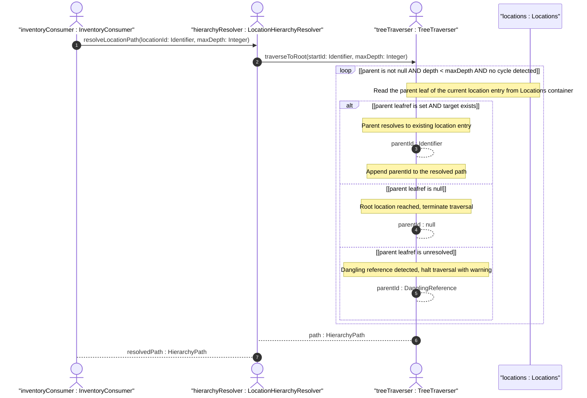

# User Story: Resolve Hierarchical Location Parent-Child Chain to Root

## Parent Epic
- [ ] #49 - [ietf-ni-location: Network Inventory Location](https://github.com/gintatkinson/3dgs-033/blob/main/docs/epics/epic-04-ietf-ni-location.md) (the locations container defines the parent leafref that enables hierarchical nesting of locations and must be resolved transitively for tree traversal)

## Domain Object Mapping
- **Primary Domain Objects:** Locations
- **Actor/Role:** LocationHierarchyResolver — the system component that traverses the parent chain from any location entry to the root of the location tree and resolves the full containment path

## BDD Scenario (OOA/OOD Realization)
**As a** LocationHierarchyResolver
**I want to** traverse the parent reference chain from a leaf location up to the root location
**So that** consumers can assert the full physical containment path (e.g., corridor -> floor -> building -> site) and query equipment by transitively associated location context

**Given** a location hierarchy with site "Foo-DC" as root, "Building-A" with parent "Foo-DC", and "Room-101" with parent "Building-A"
**When** the hierarchy resolver traverses from "Room-101" upward via the parent leafref chain
**Then** the resolved path is ["Room-101", "Building-A", "Foo-DC"] representing the full containment lineage

**Given** a location "Site-X" with no parent leaf set
**When** the hierarchy resolver attempts to resolve the parent of "Site-X"
**Then** "Site-X" is identified as a root location in the hierarchy and traversal terminates

**Given** a location "Floor-2" with parent "Building-A" and location "Corridor-East" with parent "Floor-2"
**When** a consumer queries all equipment in "Building-A"
**Then** the hierarchy resolver transitively identifies "Floor-2", "Corridor-East", and any deeper descendants as children of "Building-A"
**And** all contained-chassis entries and racks at those descendent locations are included in the result

**Given** a location "Room-101" with parent "NonExistent-Building" where "NonExistent-Building" does not exist in the location list
**When** the hierarchy resolver attempts to traverse the parent chain
**Then** the traversal stops at "Room-101" with a dangling parent reference
**And** the resolver reports the broken chain as a dangling leafref rather than silently ignoring it

**Given** a circular reference where location "A" has parent "B" and location "B" has parent "A"
**When** the hierarchy resolver traverses the parent chain
**Then** the resolver detects the cycle and terminates traversal with a cycle-detected error
**And** the cycle is reported to prevent infinite loop during tree resolution

**Given** a location four levels deep in the hierarchy (Corridor-East -> Floor-2 -> Building-A -> Foo-DC)
**When** the hierarchy resolver computes the full path
**Then** the complete traversal executes in bounded time proportional to the chain depth
**And** the traversal does not exceed a configurable maximum depth limit

## UML Sequence Diagram


## Operational Context
> Locations can be nested to form a hierarchy. For example, buildings may be within a site, and a room may be within a building. (draft-ietf-ivy-network-inventory-location-06, Section 2)

> The "location" list is generalized to support a variety of geographic location, such as sites, rooms, buildings. (draft-ietf-ivy-network-inventory-location-06, Section 2)

> A site represents a general geographic location to group a set of NEs and corresponding inventory components. NEs, racks, equipment rooms, and buildings can be grouped within a site. (draft-ietf-ivy-network-inventory-location-06, Section 2)

## Required Features Matrix
- [ ] #45 - [Define Locations Container](https://github.com/gintatkinson/3dgs-033/blob/main/docs/features/feat-18-locations-container.md) (provides the location list with the parent leafref that enables hierarchical nesting and tree-structured containment relationships)

## Source References
Structural Schema: [ietf-ni-location@2026-07-06.yang](https://github.com/ietf-ivy-wg/network-inventory-location/blob/main/ietf-ni-location.yang) (Clause: leaf parent on list location, leafref to ../../location/id)
Normative Specification: [draft-ietf-ivy-network-inventory-location-06](https://datatracker.ietf.org/doc/html/draft-ietf-ivy-network-inventory-location) (Clause: Section 2, Hierarchical Locations of Network Inventory)

> [!WARNING]
> **Mermaid Block Closing Constraints & Code Fence Integrity:**
> - Every Mermaid diagram MUST be strictly closed with ``` ``` ``` on a new line. Leaking Mermaid blocks (e.g. having headings like `##` inside an unclosed diagram) or stray/unclosed code fences will fail downstream validation checks.
> - Ensure there are no stray backticks or unmatched code fences in the document.
> - **All Mermaid syntax constraints are defined in `rules/platform-independence.md` and MUST be observed in full** — including the prohibition on semicolons in `Note` and message text, colons in class members and note strings, stereotypes on relationship lines, and curly braces in class member lines. Do not maintain a local subset here; subsets drift (issue #289).
