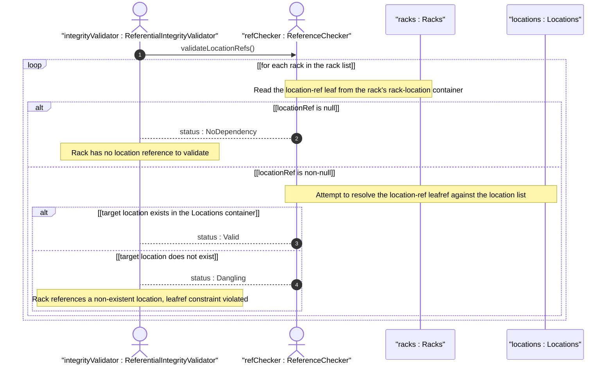

# User Story: Validate Rack-to-Location Referential Integrity

## Parent Epic
- [ ] #49 - [ietf-ni-location: Network Inventory Location](https://github.com/gintatkinson/3dgs-033/blob/main/docs/epics/epic-04-ietf-ni-location.md) (the rack-location container uses the ni-location-ref leafref typedef to reference a location from the location list, establishing a referential dependency that must be validated)

## Domain Object Mapping
- **Primary Domain Objects:** Racks, RackLocation, Locations
- **Actor/Role:** ReferentialIntegrityValidator — the system component that verifies the location-ref leaf within each rack's rack-location container resolves to an existing location entry in the location list

## BDD Scenario (OOA/OOD Realization)
**As a** ReferentialIntegrityValidator
**I want to** verify that every rack's location-ref points to a location that exists in the location list
**So that** the inventory does not contain racks assigned to phantom locations and operators can trust the location associations

**Given** a location with id "Room-101" exists in the location list
**And** a rack Rack-A has rack-location.location-ref set to "Room-101"
**When** the referential integrity validator checks Rack-A
**Then** the location-ref resolves successfully because "Room-101" is present in the location list

**Given** a rack Rack-B has rack-location.location-ref set to "Removed-Room"
**And** "Removed-Room" does not exist in the current location list
**When** the referential integrity validator checks Rack-B
**Then** the location-ref is flagged as a dangling reference
**And** the validator reports Rack-B as referencing a non-existent location

**Given** a location "Room-201" exists and a rack Rack-C references it
**And** the location "Room-201" is subsequently removed from the location list
**When** the referential integrity validator performs a bulk integrity scan
**Then** Rack-C's location-ref is detected as a broken leafref and reported to the operator

**Given** a rack Rack-D with no rack-location container configured (all three leafs absent)
**When** the referential integrity validator checks Rack-D
**Then** no integrity violation is reported because the rack has no location dependency to validate

**Given** a rack Rack-E has rack-location.row-number and rack-location.column-number populated but location-ref is absent
**When** the referential integrity validator checks Rack-E
**Then** the row and column values are accepted without requiring a location-ref because all three rack-location leafs are independently optional

**Given** a rack Rack-F references "Room-101" via the ni-location-ref typedef which traverses the full path /nwi:network-inventory/nil:locations/nil:location/nil:id
**When** the leafref constraint is evaluated by the YANG datastore
**Then** the YANG engine enforces that "Room-101" exists at the exact schema path specified by the ni-location-ref typedef

## UML Sequence Diagram


## Operational Context
> Through "rack-location", each rack can be assigned to a site or a specific location within a site, such as an equipment room. (draft-ietf-ivy-network-inventory-location-06, Section 3)

> Each rack is assigned a unique ID and a name in the context of a facility, e.g. a site. (draft-ietf-ivy-network-inventory-location-06, Section 3)

## Required Features Matrix
- [ ] #47 - [Define Racks Container](https://github.com/gintatkinson/3dgs-033/blob/main/docs/features/feat-20-racks-container.md) (provides the rack list that carries the rack-location sub-container with the location-ref leafref dependency)
- [ ] #48 - [Define Rack Location](https://github.com/gintatkinson/3dgs-033/blob/main/docs/features/feat-21-rack-location.md) (provides the rack-location container with the location-ref leaf using the ni-location-ref typedef that targets /nwi:network-inventory/nil:locations/nil:location/nil:id)
- [ ] #45 - [Define Locations Container](https://github.com/gintatkinson/3dgs-033/blob/main/docs/features/feat-18-locations-container.md) (provides the location list that is the target of the ni-location-ref leafref and must contain the referenced location id)

## Source References
Structural Schema: [ietf-ni-location@2026-07-06.yang](https://github.com/ietf-ivy-wg/network-inventory-location/blob/main/ietf-ni-location.yang) (Clause: typedef ni-location-ref, container rack-location, leaf location-ref)
Normative Specification: [draft-ietf-ivy-network-inventory-location-06](https://datatracker.ietf.org/doc/html/draft-ietf-ivy-network-inventory-location) (Clause: Section 3, Rack)

> [!WARNING]
> **Mermaid Block Closing Constraints & Code Fence Integrity:**
> - Every Mermaid diagram MUST be strictly closed with ``` ``` ``` on a new line. Leaking Mermaid blocks (e.g. having headings like `##` inside an unclosed diagram) or stray/unclosed code fences will fail downstream validation checks.
> - Ensure there are no stray backticks or unmatched code fences in the document.
> - **All Mermaid syntax constraints are defined in `rules/platform-independence.md` and MUST be observed in full** — including the prohibition on semicolons in `Note` and message text, colons in class members and note strings, stereotypes on relationship lines, and curly braces in class member lines. Do not maintain a local subset here; subsets drift (issue #289).
