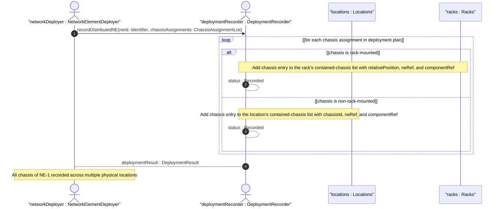

# User Story: Deploy Distributed Network Element Across Multiple Physical Locations

## Parent Epic
- [ ] #49 - [ietf-ni-location: Network Inventory Location](https://github.com/gintatkinson/3dgs-033/blob/main/docs/epics/epic-04-ietf-ni-location.md) (the location and rack containers support linking chassis distributed across multiple rooms via ne-ref and component-ref leafrefs, enabling multi-location NE deployment recording)

## Domain Object Mapping
- **Primary Domain Objects:** Locations, LocationChassis, Racks, RackChassis
- **Actor/Role:** NetworkElementDeployer — the operator or orchestration component that records a distributed network element whose chassis span multiple physical locations

## BDD Scenario (OOA/OOD Realization)
**As a** NetworkElementDeployer
**I want to** record a single logical network element whose chassis are installed in different rooms and racks across a facility
**So that** the inventory can express that NE-1 (a stack switch) is physically present in Room-101 Rack-A, Room-201 Rack-B, and Room-301 Rack-C while maintaining a single logical identity

**Given** a stack switch NE-1 with three chassis (chassis-1 as master, chassis-2 and chassis-3 as stack members)
**And** three equipment rooms (Room-101, Room-201, Room-301) each at different floors within site "Foo-DC"
**And** three racks (Rack-101-A, Rack-201-B, Rack-301-C) installed in the respective rooms
**When** the deployment is recorded with chassis-1 at Rack-101-A relative-position 10, chassis-2 at Rack-201-B relative-position 15, and chassis-3 at Rack-301-C relative-position 20
**Then** all three chassis entries reference the same ne-ref "NE-1" while having distinct component-refs ("chassis-1", "chassis-2", "chassis-3")
**And** querying by ne-ref "NE-1" returns all three physical locations with their respective rack positions

**Given** the distributed deployment recorded above
**When** a network operator queries the inventory for all locations hosting NE-1
**Then** the result set includes Room-101, Room-201, and Room-301 as distinct physical locations
**And** each result carries the rack identifier and relative-position where the chassis is installed

**Given** a distributed NE deployment
**When** a chassis-2 in Room-201 is physically relocated to Room-301
**Then** the rack-location for chassis-2 is updated to reference Rack-301-C with a new relative-position
**And** the ne-ref "NE-1" remains consistent across all three chassis entries regardless of physical move

**Given** a non-rack-mounted chassis (e.g., a switch shelf) that is directly placed in a location without rack enclosure
**And** that chassis belongs to distributed NE-2 along with other rack-mounted chassis
**When** the deployment is recorded
**Then** the non-rack chassis is recorded in Room-XXX's contained-chassis list under the location entry
**And** the rack-mounted chassis are recorded in their respective racks' contained-chassis lists
**And** all entries share the same ne-ref value "NE-2" for logical grouping

**Given** a distributed NE with chassis in three different rooms
**When** the NE's total power draw across all locations is calculated by summing the power ratings of chassis in each rack
**Then** the per-rack max-allocated-power constraint is checked independently for each rack
**And** no single rack's power budget is exceeded regardless of the aggregate NE power

## UML Sequence Diagram


## Operational Context
> Chassis directly deployed in this location without rack. Also used for distributed chassis components that are logically part of a network element but physically located. (ietf-ni-location.yang — description of contained-chassis under location)

> Multiple chassis entries may reference the same ne-ref for distributed systems. (ietf-ni-location.yang — description of ne-ref under contained-chassis)

> The list of chassis within a rack. (ietf-ni-location.yang — description of contained-chassis under rack)

## Required Features Matrix
- [ ] #45 - [Define Locations Container](https://github.com/gintatkinson/3dgs-033/blob/main/docs/features/feat-18-locations-container.md) (provides the location entry with the contained-chassis list for recording non-rack chassis deployments and the ne-ref leafref for distributed NE linkage)
- [ ] #47 - [Define Racks Container](https://github.com/gintatkinson/3dgs-033/blob/main/docs/features/feat-20-racks-container.md) (provides the rack entry with the contained-chassis list for recording rack-mounted chassis and rack position tracking)

## Source References
Structural Schema: [ietf-ni-location@2026-07-06.yang](https://github.com/ietf-ivy-wg/network-inventory-location/blob/main/ietf-ni-location.yang) (Clause: list contained-chassis on location, list contained-chassis on rack)
Normative Specification: [draft-ietf-ivy-network-inventory-location-06](https://datatracker.ietf.org/doc/html/draft-ietf-ivy-network-inventory-location) (Clause: Appendix A.2, Distributed Multi-Chassis Network Element)

> [!WARNING]
> **Mermaid Block Closing Constraints & Code Fence Integrity:**
> - Every Mermaid diagram MUST be strictly closed with ``` ``` ``` on a new line. Leaking Mermaid blocks (e.g. having headings like `##` inside an unclosed diagram) or stray/unclosed code fences will fail downstream validation checks.
> - Ensure there are no stray backticks or unmatched code fences in the document.
> - **All Mermaid syntax constraints are defined in `rules/platform-independence.md` and MUST be observed in full** — including the prohibition on semicolons in `Note` and message text, colons in class members and note strings, stereotypes on relationship lines, and curly braces in class member lines. Do not maintain a local subset here; subsets drift (issue #289).
