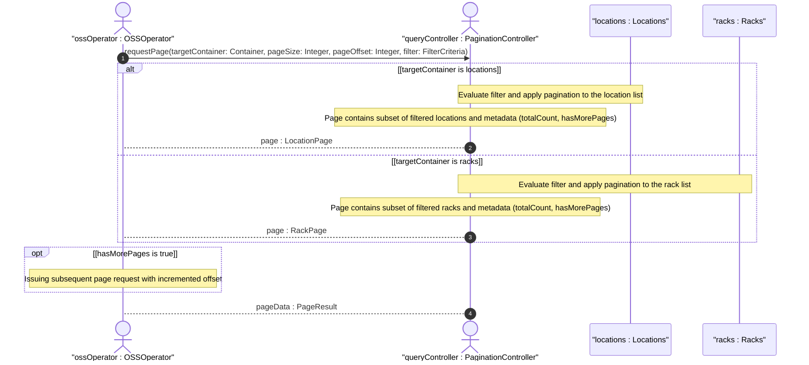

# User Story: Paginate Large Inventory Location Query Results

## Parent Epic
- [ ] #49 - [ietf-ni-location: Network Inventory Location](https://github.com/gintatkinson/3dgs-033/blob/main/docs/epics/epic-04-ietf-ni-location.md) (the locations and racks containers may hold large numbers of entries in production deployments, requiring pagination mechanisms for efficient retrieval)

## Domain Object Mapping
- **Primary Domain Objects:** Locations, Racks
- **Actor/Role:** OSSOperator — the operations support system consumer that queries network inventory location data and requires paginated results to avoid overwhelming the server

## BDD Scenario (OOA/OOD Realization)
**As a** OSSOperator
**I want to** retrieve location and rack data in paginated pages with configurable page size
**So that** I can process large inventories containing thousands of locations and racks without overwhelming the server or exceeding client memory limits

**Given** a network inventory with 5000 location entries and 3000 rack entries
**When** the OSS system requests locations with a page size of 500
**Then** the server returns the first 500 location entries along with pagination metadata indicating there are more pages
**And** the response includes a continuation token or offset for the next page

**Given** a paginated query for locations with page-size 100 starting at offset 0
**When** the OSS system requests the second page (offset 100)
**Then** the server returns locations 101-200 from the full result set
**And** the response indicates that 10 total pages exist for the current page size

**Given** a query for rack entries filtered by rack-class equal to "rack-secure-high"
**And** the filtered result set contains 50 entries
**When** the OSS system requests with page-size 100
**Then** the single page response indicates this is the last page (no more results)

**Given** a query for locations within a specific site hierarchy (parent transitively resolves to site "Foo-DC")
**And** the filtered results exceed the page size
**When** the first page is retrieved
**Then** subsequent pages return the remaining matching locations in the same sorted order

**Given** a paginated query where the server supports a maximum page size of 1000 entries
**When** the OSS system requests a page size of 5000
**Then** the server rejects the request or silently caps the page size to 1000
**And** the response includes the actual page size used

**Given** a concurrent modification scenario where new racks are being added while pagination is in progress
**When** the OSS system retrieves page N and page N+1
**Then** the pagination does not guarantee snapshot consistency across pages
**And** entries added between page requests may or may not appear in subsequent pages

## UML Sequence Diagram


## Operational Context
> In large-scale inventories containing numerous network elements and components, querying location associations can impose a load on the server. To optimize retrieval and avoid overwhelming the server, mechanisms such as RESTCONF or NETCONF pagination should be utilized for queries involving large result sets. (draft-ietf-ivy-network-inventory-location-06, Section 6)

> OSS systems and other management applications obtain location information via standard YANG retrieval operations (NETCONF, RESTCONF), such as querying network elements associated with a specific site or rack. (draft-ietf-ivy-network-inventory-location-06, Section 6)

## Required Features Matrix
- [ ] #45 - [Define Locations Container](https://github.com/gintatkinson/3dgs-033/blob/main/docs/features/feat-18-locations-container.md) (provides the location list that may grow to thousands of entries in large-scale deployments and must support paginated retrieval)
- [ ] #47 - [Define Racks Container](https://github.com/gintatkinson/3dgs-033/blob/main/docs/features/feat-20-racks-container.md) (provides the rack list that similarly requires pagination for data centers with hundreds of racks across multiple equipment rooms)

## Source References
Structural Schema: [ietf-ni-location@2026-07-06.yang](https://github.com/ietf-ivy-wg/network-inventory-location/blob/main/ietf-ni-location.yang) (Clause: container locations, container racks — list types with unbounded multiplicity)
Normative Specification: [draft-ietf-ivy-network-inventory-location-06](https://datatracker.ietf.org/doc/html/draft-ietf-ivy-network-inventory-location) (Clause: Section 6, Operational Considerations)

> [!WARNING]
> **Mermaid Block Closing Constraints & Code Fence Integrity:**
> - Every Mermaid diagram MUST be strictly closed with ``` ``` ``` on a new line. Leaking Mermaid blocks (e.g. having headings like `##` inside an unclosed diagram) or stray/unclosed code fences will fail downstream validation checks.
> - Ensure there are no stray backticks or unmatched code fences in the document.
> - **All Mermaid syntax constraints are defined in `rules/platform-independence.md` and MUST be observed in full** — including the prohibition on semicolons in `Note` and message text, colons in class members and note strings, stereotypes on relationship lines, and curly braces in class member lines. Do not maintain a local subset here; subsets drift (issue #289).
