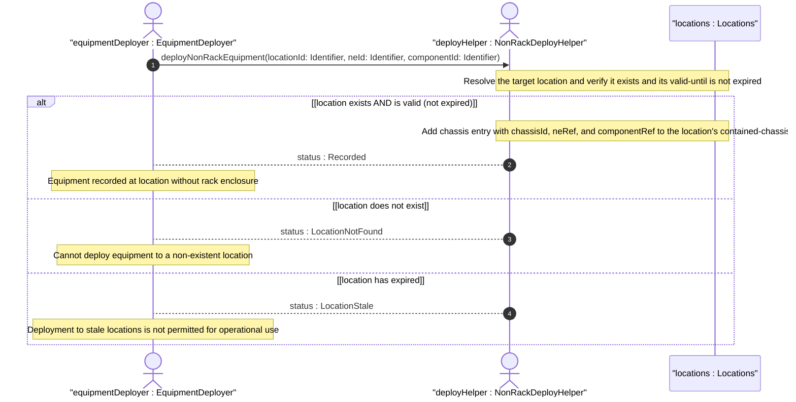

# User Story: Deploy Non-Rack Equipment Directly at a Location

## Parent Epic
- [ ] #49 - [ietf-ni-location: Network Inventory Location](https://github.com/gintatkinson/3dgs-033/blob/main/docs/epics/epic-04-ietf-ni-location.md) (the location entry's contained-chassis list records equipment deployed directly at a location without rack enclosure, supporting edge deployments like ceiling-mounted access points)

## Domain Object Mapping
- **Primary Domain Objects:** Locations, LocationChassis
- **Actor/Role:** EquipmentDeployer — the operator or automated provisioning system that registers equipment deployed directly at a location without a rack enclosure

## BDD Scenario (OOA/OOD Realization)
**As a** EquipmentDeployer
**I want to** record network equipment that is installed directly at a location without a rack enclosure
**So that** the inventory captures the physical location of edge devices such as ceiling-mounted access points, wall-mounted switches, and pole-mounted radios

**Given** a location "Corridor-East" representing an east corridor on Floor 2 of Building-A
**And** an access point AP-Corridor-East-01 that is ceiling-mounted without a rack
**When** the deployment is recorded in "Corridor-East"'s contained-chassis list with chassis-id 1, ne-ref "AP-Corridor-East-01", and component-ref "chassis-1"
**Then** the AP is recorded as directly deployed at "Corridor-East" without requiring a rack entry

**Given** a location hierarchy: Site "Foo-Enterprise-Campus" contains Building "Building-A" contains Floor "Floor-2" contains Corridor "Corridor-East"
**And** AP-Corridor-East-01 recorded in "Corridor-East"'s contained-chassis list
**When** a network operator queries the inventory for all equipment within "Floor-2"
**Then** AP-Corridor-East-01 is transitively included because its location "Corridor-East" is a descendant of "Floor-2"

**Given** a location "Corridor-East" with physical-address and geo-location data populated
**And** AP-Corridor-East-01 recorded in its contained-chassis with chassis-id 1
**When** a field technician dispatches to locate AP-Corridor-East-01
**Then** the technician receives both the postal address and geographic coordinates from the parent location
**And** the chassis-id 1 uniquely identifies the AP among all contained-chassis entries at that location

**Given** a location "Rooftop-North" designated as type "roof"
**And** a microwave radio unit is non-rack mounted at the rooftop location
**When** the equipment deployer records the radio in "Rooftop-North"'s contained-chassis list
**Then** the rooftop location type and the contained-chassis entry together express the deployment context: outdoor, non-rack, roof-mounted

**Given** a location "Corridor-East" currently hosting AP-Corridor-East-01 as contained-chassis chassis-id 1
**And** a second access point AP-Corridor-East-02 is added to the same corridor
**When** AP-02 is recorded as contained-chassis chassis-id 2 at the same location
**Then** both chassis entries exist independently under the same location, each with a distinct chassis-id key

**Given** a location with multiple contained-chassis entries
**When** the equipment deployer queries by ne-ref to find all locations hosting a specific network element
**Then** the result distinguishes between rack-mounted and non-rack-mounted chassis based on whether the chassis entry appears in a rack's contained-chassis list or a location's contained-chassis list

## UML Sequence Diagram


## Operational Context
> Chassis directly deployed in this location without rack. Also used for distributed chassis components that are logically part of a network element but physically located. (ietf-ni-location.yang — description of contained-chassis list under location)

> Network Elements (NEs) can be grouped by location to provide more information for network planning, deployment, and maintenance (e.g., easily locate problematic NEs, optimize network resources, or help planning forecasts). The location can reflect outdoor or indoor information. An indoor location may be represented as a building, room, or other similar organizational structures. Outdoor locations can be walls, poles, or other mount places. (draft-ietf-ivy-network-inventory-location-06, Section 1)

## Required Features Matrix
- [ ] #45 - [Define Locations Container](https://github.com/gintatkinson/3dgs-033/blob/main/docs/features/feat-18-locations-container.md) (provides the location entry with the contained-chassis list, chassis-id key, and ne-ref/component-ref leafrefs that record non-rack equipment deployment)

## Source References
Structural Schema: [ietf-ni-location@2026-07-06.yang](https://github.com/ietf-ivy-wg/network-inventory-location/blob/main/ietf-ni-location.yang) (Clause: list contained-chassis under location)
Normative Specification: [draft-ietf-ivy-network-inventory-location-06](https://datatracker.ietf.org/doc/html/draft-ietf-ivy-network-inventory-location) (Clause: Appendix A.1, Non-Rack Deployment: Access Point)

> [!WARNING]
> **Mermaid Block Closing Constraints & Code Fence Integrity:**
> - Every Mermaid diagram MUST be strictly closed with ``` ``` ``` on a new line. Leaking Mermaid blocks (e.g. having headings like `##` inside an unclosed diagram) or stray/unclosed code fences will fail downstream validation checks.
> - Ensure there are no stray backticks or unmatched code fences in the document.
> - **All Mermaid syntax constraints are defined in `rules/platform-independence.md` and MUST be observed in full** — including the prohibition on semicolons in `Note` and message text, colons in class members and note strings, stereotypes on relationship lines, and curly braces in class member lines. Do not maintain a local subset here; subsets drift (issue #289).
