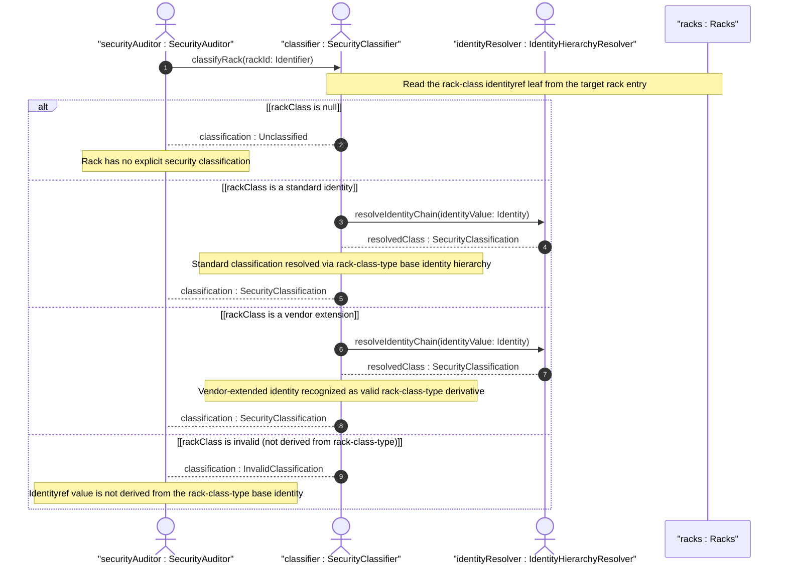

# User Story: Resolve Rack Security Classification from Extensible Identity Hierarchy

## Parent Epic
- [ ] #49 - [ietf-ni-location: Network Inventory Location](https://github.com/gintatkinson/3dgs-033/blob/main/docs/epics/epic-04-ietf-ni-location.md) (the racks container defines the rack-class leaf as an identityref with a base identity hierarchy of security classifications that must be resolved by consumers)

## Domain Object Mapping
- **Primary Domain Objects:** Racks
- **Actor/Role:** SecurityClassifier — the system component that resolves a rack's identityref value into a human-readable security classification and enforces the identity hierarchy constraints

## BDD Scenario (OOA/OOD Realization)
**As a** SecurityClassifier
**I want to** resolve the rack-class identityref on each rack to its corresponding security posture
**So that** operators and security tools can assess the physical protection level of equipment based on the rack classification

**Given** a rack with rack-class set to the identity "rack-standard"
**When** the security classifier resolves the identityref value
**Then** the rack is classified as "Standard general-purpose rack without physical locking mechanisms"
**And** the classification maps to the base identity chain: rack-class-type -> rack-standard

**Given** a rack with rack-class set to "rack-secure-high"
**When** the security classifier resolves the identityref value
**Then** the rack is classified with the highest security tier: "High security lockable rack"
**And** the resolution traverses the identity chain: rack-class-type -> rack-secure-high

**Given** a rack with no rack-class configured
**When** the security classifier evaluates the rack
**Then** the rack has no explicit security classification
**And** the classifier returns an Unclassified status without defaulting to any security level

**Given** a vendor has extended the rack-class-type base identity with a custom identity "rack-secure-vendor-bio"
**And** a rack has rack-class set to "rack-secure-vendor-bio"
**When** the security classifier attempts to resolve the identity
**Then** the classifier recognizes it as a valid extension of rack-class-type
**And** the vendor-specific classification is accepted without requiring modification to the core model

**Given** a rack with rack-class set to an identity that is NOT derived from rack-class-type
**When** the identityref validation runs
**Then** the YANG datastore rejects the value because the identityref base constraint restricts valid values to those derived from rack-class-type

**Given** the four standard rack classifications (rack-standard, rack-secure-baseline, rack-secure-medium, rack-secure-high)
**When** an operator queries the inventory to group racks by security tier
**Then** the classification hierarchy naturally supports ordering from least to most secure: standard < secure-baseline < secure-medium < secure-high
**And** the operator can filter or sort racks by ascending or descending security requirement

**Given** a secure baseline rack containing network elements that process sensitive data
**And** a rack-standard rack in the same equipment room containing general-purpose equipment
**When** a site security audit queries for all equipment below a certain protection threshold
**Then** the rack-class identityref enables filtering for racks with rack-class equal to "rack-standard" (or unclassified) that may need physical security upgrades

## UML Sequence Diagram


## Operational Context
> The rack attributes include: rack-class Classification of the rack. (draft-ietf-ivy-network-inventory-location-06, Section 3)

> Base identity for generic rack classification based on physical security characteristics. This identity is designed to be extended by regional or vendor-specific rack classes. (ietf-ni-location.yang — description of identity rack-class-type)

> Standard general-purpose rack without physical locking mechanisms. (ietf-ni-location.yang — description of identity rack-standard)

> Baseline secure lockable rack. (ietf-ni-location.yang — description of identity rack-secure-baseline)

> Medium security lockable rack. (ietf-ni-location.yang — description of identity rack-secure-medium)

> High security lockable rack. (ietf-ni-location.yang — description of identity rack-secure-high)

## Required Features Matrix
- [ ] #47 - [Define Racks Container](https://github.com/gintatkinson/3dgs-033/blob/main/docs/features/feat-20-racks-container.md) (provides the rack entry with the rack-class leaf of type identityref based on rack-class-type, and defines the four standard derived identities in the YANG module)

## Source References
Structural Schema: [ietf-ni-location@2026-07-06.yang](https://github.com/ietf-ivy-wg/network-inventory-location/blob/main/ietf-ni-location.yang) (Clause: identities rack-class-type, rack-standard, rack-secure-baseline, rack-secure-medium, rack-secure-high; leaf rack-class on list rack)
Normative Specification: [draft-ietf-ivy-network-inventory-location-06](https://datatracker.ietf.org/doc/html/draft-ietf-ivy-network-inventory-location) (Clause: Section 3, Rack; Section 7, Security Considerations)

> [!WARNING]
> **Mermaid Block Closing Constraints & Code Fence Integrity:**
> - Every Mermaid diagram MUST be strictly closed with ``` ``` ``` on a new line. Leaking Mermaid blocks (e.g. having headings like `##` inside an unclosed diagram) or stray/unclosed code fences will fail downstream validation checks.
> - Ensure there are no stray backticks or unmatched code fences in the document.
> - **All Mermaid syntax constraints are defined in `rules/platform-independence.md` and MUST be observed in full** — including the prohibition on semicolons in `Note` and message text, colons in class members and note strings, stereotypes on relationship lines, and curly braces in class member lines. Do not maintain a local subset here; subsets drift (issue #289).
