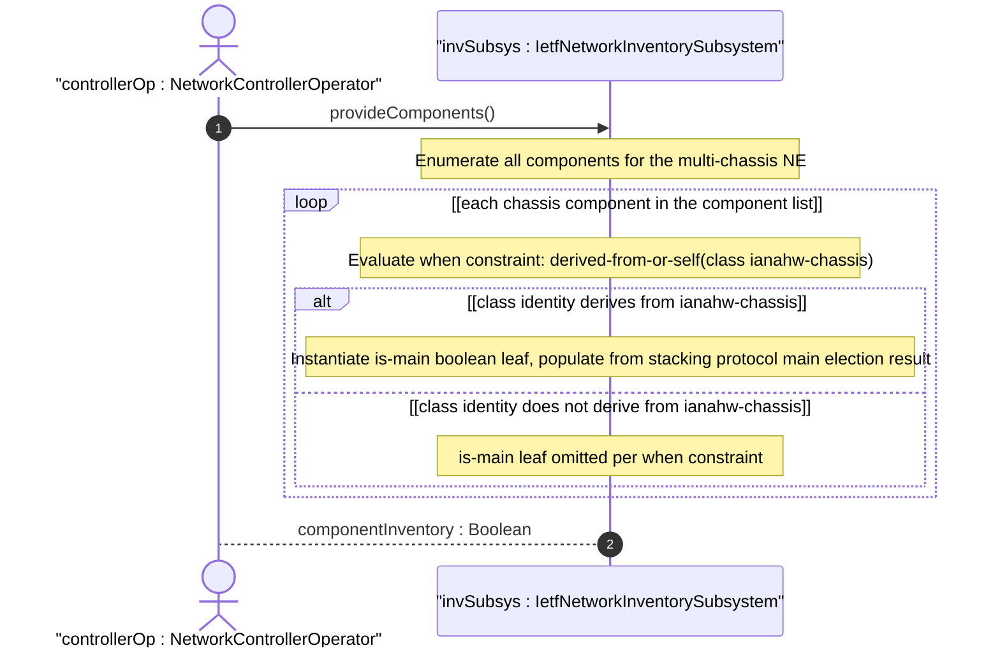
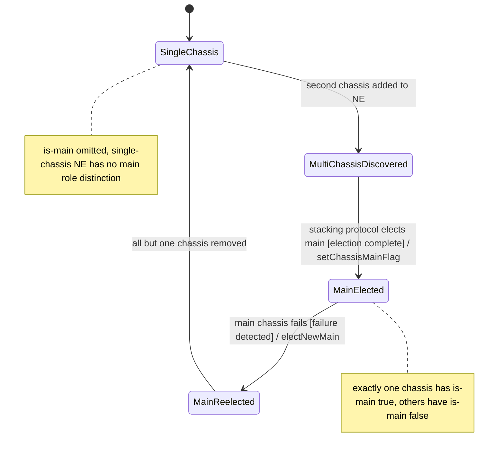

# User Story: Identify Main Chassis in Multi-Chassis Network Element

## Parent Epic
- [ ] #67 - [ietf-network-inventory: Base Network Inventory Data Model](https://github.com/gintatkinson/3dgs-033/blob/main/docs/epics/epic-05-ietf-network-inventory.md) (multi-chassis NE topology modelled via chassis components with is-main flag, draft Section 3.3 and Appendix E)

## Domain Object Mapping
- **Primary Domain Objects:** Component (chassis class), NetworkElement, is-main leaf
- **Actor/Role:** NetworkControllerOperator — the management entity that discovers and reports multi-chassis network elements assembled from stacked or cascaded physical switches

## BDD Scenario (OOA/OOD Realization)

**Given** a multi-chassis network element NE-1 composed of three stacked switches (chassis-1, chassis-2, chassis-3) interconnected in a ring topology
**And** the network controller has discovered all three chassis as components within NE-1, each with `class` deriving from `ianahw:chassis`
**And** chassis-1 has been elected as the stack master (main) by the stacking protocol
**When** the controller populates the component list for NE-1
**Then** the `is-main` leaf is instantiated for each chassis component because `derived-from-or-self(class, 'ianahw:chassis')` evaluates to true
**And** chassis-1 reports `is-main` = true, designating it as the main chassis
**And** chassis-2 and chassis-3 report `is-main` = false
**And** exactly one chassis in the NE has `is-main` = true

**Given** a single-chassis network element (pizza box) with one chassis component
**When** the controller populates the component list for that NE
**Then** the `is-main` leaf is omitted for the chassis component because the NE does not contain chassis components which can take or not take the main role (single-chassis scenario)

**Given** a component with `class` derived from `ianahw:port` (not chassis)
**When** the controller reports that component
**Then** the `is-main` leaf is not instantiated because the `when` constraint `derived-from-or-self(class, 'ianahw:chassis')` evaluates to false

## UML Sequence Diagram


## UML State Machine Diagram


## Operational Context

From draft-ietf-ivy-network-inventory-yang-18, Appendix E:

> Multi-chassis network elements are network elements composed by two or more chassis interconnected, in principle, with any topology.
>
> Stacked switches are an example of multi-chassis which consist of multiple standalone switches that are interconnected through dedicated stack ports and cables and managed as a single logical unit.
>
> Cascaded switches are another example of multi-chassis which consist of multiple standalone switches that are interconnected and managed as a single logical unit. Cascaded switch: the root of the tree is configured as Main.

From schema `is-main` description:

> This node is applicable only to scenarios where the network element contains chassis components which can take or not the 'main' role (e.g., multi-chassis network elements). It is therefore omitted in scenarios where the network element does not contain chassis components which can take or not the 'main' role (e.g., single-chassis network elements).

## Required Features Matrix
- [ ] #64 - [Define Network Inventory Root Container](https://github.com/gintatkinson/3dgs-033/blob/main/docs/features/feat-22-network-inventory-root.md) (the root container anchors the network-elements list where multi-chassis NEs reside)
- [ ] #65 - [Define Network Elements Container and List](https://github.com/gintatkinson/3dgs-033/blob/main/docs/features/feat-23-network-elements-list.md) (each multi-chassis assembly is modelled as a single network element entry)
- [ ] #66 - [Define Components Container and List](https://github.com/gintatkinson/3dgs-033/blob/main/docs/features/feat-24-components-list.md) (each physical switch is modelled as a chassis component within the NE, with the is-main flag distinguishing the primary chassis)

## Source References
Structural Schema: [ietf-network-inventory.yang](https://github.com/ietf-ivy-wg/network-inventory-yang/blob/main/yang/ietf-network-inventory.yang) (Clause: leaf is-main, lines 466-483)
Normative Specification: [draft-ietf-ivy-network-inventory-yang-18](https://datatracker.ietf.org/doc/html/draft-ietf-ivy-network-inventory-yang) (Section 3.3, Appendix E)

> [!WARNING]
> **Mermaid Block Closing Constraints & Code Fence Integrity:**
> - Every Mermaid diagram MUST be strictly closed with ```` ``` ```` on a new line. Leaking Mermaid blocks (e.g. having headings like `##` inside an unclosed diagram) or stray/unclosed code fences will fail downstream validation checks.
> - Ensure there are no stray backticks or unmatched code fences in the document.
> - **All Mermaid syntax constraints are defined in `rules/platform-independence.md` and MUST be observed in full** — including the prohibition on semicolons in `Note` and message text, colons in class members and note strings, stereotypes on relationship lines, and curly braces in class member lines. Do not maintain a local subset here; subsets drift (issue #289).
