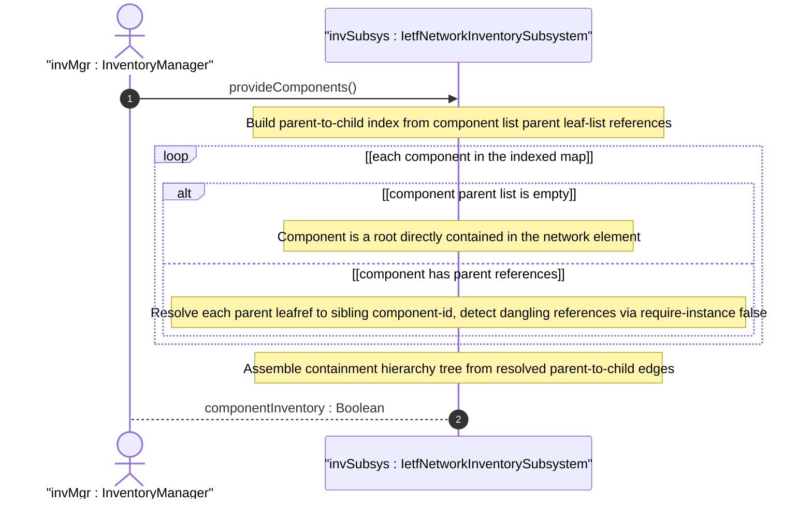

# User Story: Traverse Component Parent Containment Hierarchy Within a Network Element

## Parent Epic
- [ ] #67 - [ietf-network-inventory: Base Network Inventory Data Model](https://github.com/gintatkinson/3dgs-033/blob/main/docs/epics/epic-05-ietf-network-inventory.md) (component parent leaf-list establishing containment relationships, draft Section 3.3 and Section 3.3.1)

## Domain Object Mapping
- **Primary Domain Objects:** Component (parent leaf-list), NetworkElement, Components
- **Actor/Role:** InventoryManager — the operator or application that needs to understand the physical layout of components within a network element

## BDD Scenario (OOA/OOD Realization)

**Given** a network element NE-1 with components: chassis-1, slot-1-1 (parent: chassis-1), card-1-1 (parent: slot-1-1), port-1-1-1 (parent: card-1-1)
**When** the InventoryManager requests the physical containment hierarchy for NE-1
**Then** the traversal resolves chassis-1 as the root (empty parent list, directly contained in the NE)
**And** slot-1-1 is a direct child of chassis-1 (parent list contains only chassis-1)
**And** card-1-1 is a direct child of slot-1-1
**And** port-1-1-1 is a direct child of card-1-1
**And** the full containment path from root to leaf is: chassis-1 -> slot-1-1 -> card-1-1 -> port-1-1-1

**Given** a component "board-1" with an empty `parent` leaf-list
**When** the containment hierarchy is traversed
**Then** board-1 is identified as directly contained in the network element (not within any sibling component)

**Given** a component with `parent` leaf-list referencing "slot-99" where "slot-99" does not exist in the component list
**When** the containment hierarchy is traversed
**Then** the dangling parent reference is detected and flagged (referential integrity is not enforced at schema level due to `require-instance false`)
**And** the traversal does not fail but records the unresolved parent for operator review

## UML Sequence Diagram


## Operational Context

From draft-ietf-ivy-network-inventory-yang-18, Section 3.3.1:

> Figure 1 describes the relationship between typical inventory objects in a physical network element:
> network element -> 1:M chassis -> 1:N slot/board -> 1:N port

From schema `parent` leaf-list description:

> The identifiers of all the components that physically contain this component. If this list is empty, this component is not contained in any other component but it is contained in the network-element.

From schema, `parent` uses `require-instance false`:

> Referential integrity is not enforced at the schema level — dangling references are permitted for operational flexibility.

## Required Features Matrix
- [ ] #64 - [Define Network Inventory Root Container](https://github.com/gintatkinson/3dgs-033/blob/main/docs/features/feat-22-network-inventory-root.md) (the root container provides the structural anchor for the component containment tree traversal)
- [ ] #65 - [Define Network Elements Container and List](https://github.com/gintatkinson/3dgs-033/blob/main/docs/features/feat-23-network-elements-list.md) (each NE hosts its own component containment hierarchy via the components container)
- [ ] #66 - [Define Components Container and List](https://github.com/gintatkinson/3dgs-033/blob/main/docs/features/feat-24-components-list.md) (the parent leaf-list defines the containment edges, and require-instance false permits dangling references during traversal)

## Source References
Structural Schema: [ietf-network-inventory.yang](https://github.com/ietf-ivy-wg/network-inventory-yang/blob/main/yang/ietf-network-inventory.yang) (Clause: leaf-list parent, lines 430-445)
Normative Specification: [draft-ietf-ivy-network-inventory-yang-18](https://datatracker.ietf.org/doc/html/draft-ietf-ivy-network-inventory-yang) (Section 3.3, Section 3.3.1)

> [!WARNING]
> **Mermaid Block Closing Constraints & Code Fence Integrity:**
> - Every Mermaid diagram MUST be strictly closed with ```` ``` ```` on a new line. Leaking Mermaid blocks (e.g. having headings like `##` inside an unclosed diagram) or stray/unclosed code fences will fail downstream validation checks.
> - Ensure there are no stray backticks or unmatched code fences in the document.
> - **All Mermaid syntax constraints are defined in `rules/platform-independence.md` and MUST be observed in full** — including the prohibition on semicolons in `Note` and message text, colons in class members and note strings, stereotypes on relationship lines, and curly braces in class member lines. Do not maintain a local subset here; subsets drift (issue #289).
