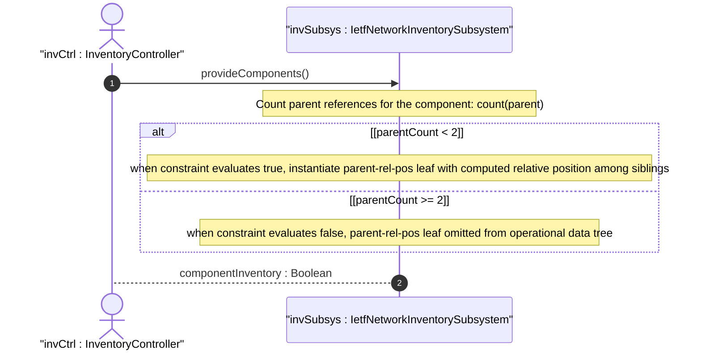

# User Story: Compute Conditional Applicability of Parent Relative Position

## Parent Epic
- [ ] #67 - [ietf-network-inventory: Base Network Inventory Data Model](https://github.com/gintatkinson/3dgs-033/blob/main/docs/epics/epic-05-ietf-network-inventory.md) (parent-rel-pos leaf governed by when constraint count(parent) < 2, draft Section 3.4.3)

## Domain Object Mapping
- **Primary Domain Objects:** Component (parent leaf-list, parent-rel-pos leaf, when constraint)
- **Actor/Role:** InventoryController — the server-side subsystem that evaluates the `when` expression and conditionally instantiates the `parent-rel-pos` leaf

## BDD Scenario (OOA/OOD Realization)

**Given** a component with an empty `parent` leaf-list (count = 0, directly contained in the network element)
**When** the inventory controller evaluates the `when 'count(../parent) < 2'` constraint
**Then** the condition evaluates to true (0 < 2)
**And** the `parent-rel-pos` leaf is instantiated with the relative position of the component at the NE level
**And** the value is a string encoding the position (e.g., "1" for the first chassis in a stack)

**Given** a component with exactly one parent reference (count = 1)
**When** the inventory controller evaluates the `when 'count(../parent) < 2'` constraint
**Then** the condition evaluates to true (1 < 2)
**And** the `parent-rel-pos` leaf is instantiated with the relative position among siblings sharing the same parent
**And** the format is implementation-specific — when mapping from RFC 6933 entPhysicalParentRelPos the integer value is encoded as an integer string

**Given** a component with two or more parent references (count = 2)
**When** the inventory controller evaluates the `when 'count(../parent) < 2'` constraint
**Then** the condition evaluates to false (2 < 2)
**And** the `parent-rel-pos` leaf is not instantiated — it is omitted from the operational data tree
**And** no error is generated — the omission is by design per the schema

**Given** a component whose parent references change at runtime (e.g., a module is moved from slot-1 to slot-1-32)
**When** the parent list transitions from count = 1 to count = 0 (module removed, now directly in NE)
**Then** the `when` condition re-evaluates to true and `parent-rel-pos` may be instantiated with an updated position value

## UML Sequence Diagram


## Operational Context

From draft-ietf-ivy-network-inventory-yang-18, Section 3.4.3:

> There are some use cases where the parent relative position is not reported as an integer but as a string. In order to support these use cases and allowing a straightforward match between the relative position definition in the device and in the network inventory, this model is defining the 'parent-rel-pos' data node as a string instead of as an integer.
>
> If the device reports the relative position as an integer, e.g., using the device model defined in [RFC8348], the integer value reported by the device can be mapped into a string within the network inventory.

From schema `parent-rel-pos` when constraint:

> This data node is applicable only when this component is contained in the network-element or in only one parent component.

## Required Features Matrix
- [ ] #64 - [Define Network Inventory Root Container](https://github.com/gintatkinson/3dgs-033/blob/main/docs/features/feat-22-network-inventory-root.md) (the root container anchors the data tree where parent-rel-pos is evaluated)
- [ ] #65 - [Define Network Elements Container and List](https://github.com/gintatkinson/3dgs-033/blob/main/docs/features/feat-23-network-elements-list.md) (the component parent-rel-pos is scoped within a network element's component list)
- [ ] #66 - [Define Components Container and List](https://github.com/gintatkinson/3dgs-033/blob/main/docs/features/feat-24-components-list.md) (the parent-rel-pos leaf carries the computed relative position, conditional on the parent count being less than two)

## Source References
Structural Schema: [ietf-network-inventory.yang](https://github.com/ietf-ivy-wg/network-inventory-yang/blob/main/yang/ietf-network-inventory.yang) (Clause: leaf parent-rel-pos with when constraint, lines 446-465)
Normative Specification: [draft-ietf-ivy-network-inventory-yang-18](https://datatracker.ietf.org/doc/html/draft-ietf-ivy-network-inventory-yang) (Section 3.4.3)

> [!WARNING]
> **Mermaid Block Closing Constraints & Code Fence Integrity:**
> - Every Mermaid diagram MUST be strictly closed with ```` ``` ```` on a new line. Leaking Mermaid blocks (e.g. having headings like `##` inside an unclosed diagram) or stray/unclosed code fences will fail downstream validation checks.
> - Ensure there are no stray backticks or unmatched code fences in the document.
> - **All Mermaid syntax constraints are defined in `rules/platform-independence.md` and MUST be observed in full** — including the prohibition on semicolons in `Note` and message text, colons in class members and note strings, stereotypes on relationship lines, and curly braces in class member lines. Do not maintain a local subset here; subsets drift (issue #289).
