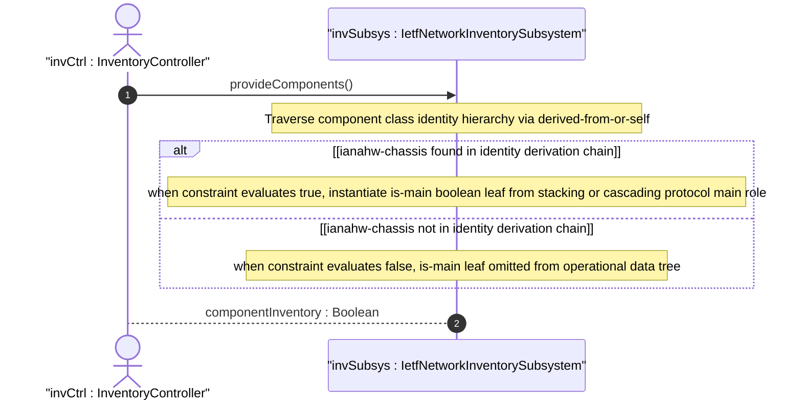

# User Story: Compute Conditional Applicability of is-main Flag for Chassis Components

## Parent Epic
- [ ] #67 - [ietf-network-inventory: Base Network Inventory Data Model](https://github.com/gintatkinson/3dgs-033/blob/main/docs/epics/epic-05-ietf-network-inventory.md) (is-main leaf governed by derived-from-or-self when constraint, draft Section 3.3 and Appendix E)

## Domain Object Mapping
- **Primary Domain Objects:** Component (class leaf, is-main leaf, when constraint using derived-from-or-self XPath)
- **Actor/Role:** InventoryController — the server-side subsystem that evaluates the XPath `when` expression `derived-from-or-self(class, 'ianahw:chassis')` and conditionally instantiates the `is-main` boolean

## BDD Scenario (OOA/OOD Realization)

**Given** a component with `class` set to `ianahw:chassis` in a multi-chassis network element
**When** the inventory controller evaluates `when "derived-from-or-self(../nwi:class, 'ianahw:chassis')"`
**Then** the `derived-from-or-self` function traverses the identity hierarchy from the component's class identity
**And** if the identity is `ianahw:chassis` or a derived identity, the check returns true
**And** the `is-main` leaf is instantiated for that component
**And** the boolean value indicates whether this chassis takes the main role

**Given** a component with `class` set to `ianahw:port` (not derived from chassis)
**When** the inventory controller evaluates the `when` constraint
**Then** `derived-from-or-self(ianahw:port, 'ianahw:chassis')` evaluates to false
**And** the `is-main` leaf is not instantiated — it is omitted from the operational data tree

**Given** a component with `class` set to a future identity that derives from `ianahw:chassis` (e.g., a vendor-specific sub-chassis type)
**When** the inventory controller evaluates the `when` constraint
**Then** `derived-from-or-self` correctly walks the identity derivation chain
**And** the check returns true because the future identity has `ianahw:chassis` as an ancestor
**And** the `is-main` leaf is instantiated, providing forward compatibility for extended chassis types

**Given** a component with `class` set to `nwi:non-hardware-component-class` (a non-hardware identity via the union)
**When** the `when` constraint is evaluated
**Then** the identity hierarchy does not include `ianahw:chassis`
**And** `is-main` is not instantiated

## UML Sequence Diagram


## Operational Context

From schema `is-main` description:

> This node indicates whether the chassis is taking or not the 'main' role. This node is applicable only to scenarios where the network element contains chassis components which can take or not the 'main' role (e.g., multi-chassis network elements).

From schema `is-main` when constraint:

> `derived-from-or-self(../nwi:class, 'ianahw:chassis')` — evaluates to true when the component class identity is `ianahw:chassis` or any identity deriving from it.

From draft-ietf-ivy-network-inventory-yang-18, Appendix E:

> Stacked switches: use Priority/MAC-Addr(s) to decide Main/Members selection and communication. Cascaded switches: the root of the tree is configured as Main.

## Required Features Matrix
- [ ] #64 - [Define Network Inventory Root Container](https://github.com/gintatkinson/3dgs-033/blob/main/docs/features/feat-22-network-inventory-root.md) (the module defines the non-hardware-component-class identity that must be excluded by the when check)
- [ ] #65 - [Define Network Elements Container and List](https://github.com/gintatkinson/3dgs-033/blob/main/docs/features/feat-23-network-elements-list.md) (the NE provides the scope within which chassis components and their is-main flags are evaluated)
- [ ] #66 - [Define Components Container and List](https://github.com/gintatkinson/3dgs-033/blob/main/docs/features/feat-24-components-list.md) (the component class identity determines is-main applicability via the derived-from-or-self XPath function)

## Source References
Structural Schema: [ietf-network-inventory.yang](https://github.com/ietf-ivy-wg/network-inventory-yang/blob/main/yang/ietf-network-inventory.yang) (Clause: leaf is-main with when constraint, lines 466-483)
Normative Specification: [draft-ietf-ivy-network-inventory-yang-18](https://datatracker.ietf.org/doc/html/draft-ietf-ivy-network-inventory-yang) (Section 3.3, Appendix E)

> [!WARNING]
> **Mermaid Block Closing Constraints & Code Fence Integrity:**
> - Every Mermaid diagram MUST be strictly closed with ```` ``` ```` on a new line. Leaking Mermaid blocks (e.g. having headings like `##` inside an unclosed diagram) or stray/unclosed code fences will fail downstream validation checks.
> - Ensure there are no stray backticks or unmatched code fences in the document.
> - **All Mermaid syntax constraints are defined in `rules/platform-independence.md` and MUST be observed in full** — including the prohibition on semicolons in `Note` and message text, colons in class members and note strings, stereotypes on relationship lines, and curly braces in class member lines. Do not maintain a local subset here; subsets drift (issue #289).
