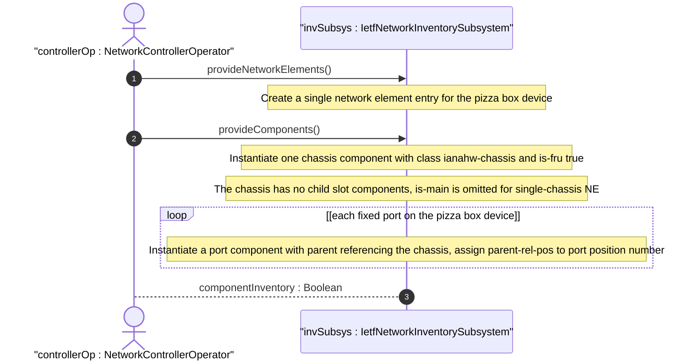
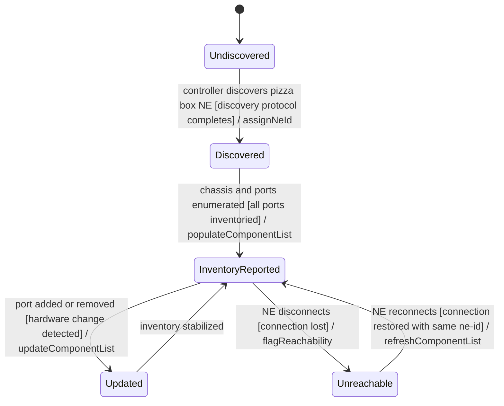

# User Story: Report Non-Modular Pizza Box Network Element Inventory

## Parent Epic
- [ ] #67 - [ietf-network-inventory: Base Network Inventory Data Model](https://github.com/gintatkinson/3dgs-033/blob/main/docs/epics/epic-05-ietf-network-inventory.md) (non-modular NEs modelled as single chassis with ports, Appendix F)

## Domain Object Mapping
- **Primary Domain Objects:** NetworkElement, Component (chassis class, port class)
- **Actor/Role:** NetworkControllerOperator — the management entity that discovers and reports fixed-port non-modular network elements (pizza boxes) to the inventory

## BDD Scenario (OOA/OOD Realization)

**As a** NetworkControllerOperator
**I want to** report the inventory of a non-modular network element (pizza box) with fixed ports to the network inventory
**So that** the inventory accurately represents a single-chassis device with no slots or removable modules

**Given** a pizza box NE "Pizza-Box-NE-1" with one chassis and eight integrated ports
**When** the controller discovers and populates the component list for this NE
**Then** the component list contains exactly one chassis component with `class` = `ianahw:chassis` and `is-fru` = true
**And** eight port components each with `class` = `ianahw:port` and `parent` = ["pizza-chassis"]
**And** each port has `parent-rel-pos` set to its position number (1 through 8)
**And** no slot or card components are present (the device has no modular slots)
**And** the `is-main` flag is omitted for the chassis because this is a single-chassis NE

**Given** a pizza box NE with an integrated port (non-pluggable) at position 1 and an empty pluggable port at position 2
**When** the controller reports the component list
**Then** the integrated port is a leaf component with empty parenting (it does not contain sub-components)
**And** the empty pluggable port is reported as a port component with no child transceiver module

**Given** a pizza box NE where operator-assigned asset IDs need to be tracked
**When** the controller reports the chassis component
**Then** the `asset-id` leaf carries the operator-assigned tracking identifier
**And** the `uuid` leaf provides a globally unique identifier independent of the component-id

## UML Sequence Diagram


## UML State Machine Diagram


## Operational Context

From draft-ietf-ivy-network-inventory-yang-18, Appendix F:

> Non-modular network elements (also known as "pizza boxes") are network elements composed by a single chassis as a self-contained system. A non-modular network element does not have any slots to take cards so it cannot take any non-field replaceable modules other than pluggable ports.
>
> Using the base network inventory YANG data model a non-modular network element can be modelled as a network element containing only one chassis and ports (as child components of the chassis).
>
> Reporting the single chassis component within a non-modular network element is required because the chassis component is the type of component which provides the physical characteristics of the network element chassis.

## Required Features Matrix
- [ ] #64 - [Define Network Inventory Root Container](https://github.com/gintatkinson/3dgs-033/blob/main/docs/features/feat-22-network-inventory-root.md) (the root container anchors the inventory data tree where pizza box NEs are reported)
- [ ] #65 - [Define Network Elements Container and List](https://github.com/gintatkinson/3dgs-033/blob/main/docs/features/feat-23-network-elements-list.md) (each pizza box device is modelled as a single network element entry with ne-id and ne-type)
- [ ] #66 - [Define Components Container and List](https://github.com/gintatkinson/3dgs-033/blob/main/docs/features/feat-24-components-list.md) (the chassis component models the pizza box chassis, port components model the fixed ports with parent references to the chassis)

## Source References
Structural Schema: [ietf-network-inventory.yang](https://github.com/ietf-ivy-wg/network-inventory-yang/blob/main/yang/ietf-network-inventory.yang) (Clause: list component with leaf-list parent, lines 425-484)
Normative Specification: [draft-ietf-ivy-network-inventory-yang-18](https://datatracker.ietf.org/doc/html/draft-ietf-ivy-network-inventory-yang) (Appendix F)

> [!WARNING]
> **Mermaid Block Closing Constraints & Code Fence Integrity:**
> - Every Mermaid diagram MUST be strictly closed with ```` ``` ```` on a new line. Leaking Mermaid blocks (e.g. having headings like `##` inside an unclosed diagram) or stray/unclosed code fences will fail downstream validation checks.
> - Ensure there are no stray backticks or unmatched code fences in the document.
> - **All Mermaid syntax constraints are defined in `rules/platform-independence.md` and MUST be observed in full** — including the prohibition on semicolons in `Note` and message text, colons in class members and note strings, stereotypes on relationship lines, and curly braces in class member lines. Do not maintain a local subset here; subsets drift (issue #289).
