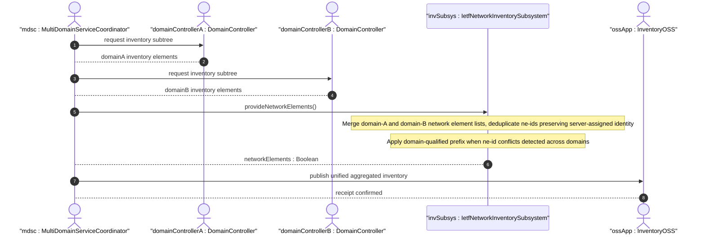

# User Story: Aggregate Network Inventory Across Hierarchical Controllers

## Parent Epic
- [ ] #67 - [ietf-network-inventory: Base Network Inventory Data Model](https://github.com/gintatkinson/3dgs-033/blob/main/docs/epics/epic-05-ietf-network-inventory.md) (hierarchical controller aggregation described in Section 6 Operational Considerations)

## Domain Object Mapping
- **Primary Domain Objects:** NetworkInventory, NetworkElements, NetworkElement (ne-id, ne-ref typedef)
- **Actor/Role:** MultiDomainServiceCoordinator (MDSC) — the higher-level hierarchical controller that aggregates inventory data from multiple lower-level domain controllers to provide a unified network-wide inventory view

## BDD Scenario (OOA/OOD Realization)

**As a** MultiDomainServiceCoordinator (MDSC)
**I want to** aggregate network inventory data from multiple domain controllers into a single unified inventory view
**So that** upper-layer OSS applications and inventory management systems receive a consolidated network-wide inventory without needing to query each domain controller individually

**Given** three domain controllers (DC-A, DC-B, DC-C) each managing a subset of network elements in a multi-domain network
**And** DC-A reports 50 network elements, DC-B reports 30 network elements, and DC-C reports 20 network elements
**When** the MDSC queries all three domain controllers using the network inventory YANG data model at the MPI interface
**Then** the MDSC receives 100 network element entries in total
**And** the MDSC combines them into a single `network-elements` container
**And** the MDSC resolves and deduplicates overlapping ne-id assignments across domains (if any) using the server-assigned ne-id persistence mechanism
**And** the combined inventory is reported northbound to the Inventory OSS

**Given** a domain controller that reports a network element NE-DC-A-01 with ne-id assigned at the domain level
**When** the MDSC aggregates this NE alongside NEs from other domains
**Then** the MDSC preserves the original ne-id assigned by the domain controller (the authority assigning the ne-id)
**And** if a naming conflict exists across domains, the MDSC applies a domain-qualified prefix or UUID-based disambiguation

**Given** an Inventory OSS requesting a full synchronization of the network inventory for a large-scale network
**When** the OSS queries the MDSC for the complete `/nwi:network-inventory` subtree
**Then** the MDSC provides a read-only snapshot of the combined inventory
**And** scalability limitations observed in Appendix C (combining-regrouping during full sync) are managed through NACM filtering and RESTCONF filtering mechanisms as outlined in Section 7

## UML Sequence Diagram


## Operational Context

From draft-ietf-ivy-network-inventory-yang-18, Section 1:

> Exposing standard interfaces to retrieve network element components as maintained in an inventory are key enablers for many applications. For example, [I-D.ietf-teas-actn-poi-applicability] identifies a gap about the lack of YANG data models that could be used at ACTN Multi-Domain Service Coordinator-Provisioning Network Controller Interface (MPI) level to report whole or partial network hardware inventory information available at domain controller level towards upper layer systems (e.g., MDSC or OSS layers).

From Section 6, Operational Considerations:

> In case of hierarchical controllers, a hierarchical network controller can also collect the network inventory information from its lower level network controllers using this YANG data model (or other mechanisms which are outside the scope of this document) and report the combined network inventory information to a higher level network controller, to an Inventory OSS or to any other type of application which needs to discover the network inventory information.

From Section 6:

> When this model is used, the source of truth for the inventory data in the scope of this model is the network controller providing this data.

## Required Features Matrix
- [ ] #64 - [Define Network Inventory Root Container](https://github.com/gintatkinson/3dgs-033/blob/main/docs/features/feat-22-network-inventory-root.md) (the root container serves as the anchor for the aggregated inventory at the MDSC level, and the ne-ref typedef enables cross-module NE referencing)
- [ ] #65 - [Define Network Elements Container and List](https://github.com/gintatkinson/3dgs-033/blob/main/docs/features/feat-23-network-elements-list.md) (each domain controller provides its network-element list which the MDSC merges into a unified list, preserving ne-id assignment authority)
- [ ] #66 - [Define Components Container and List](https://github.com/gintatkinson/3dgs-033/blob/main/docs/features/feat-24-components-list.md) (component-level inventory is also aggregated per NE, with the component-ref and port-ref groupings enabling cross-domain component references)

## Source References
Structural Schema: [ietf-network-inventory.yang](https://github.com/ietf-ivy-wg/network-inventory-yang/blob/main/yang/ietf-network-inventory.yang) (Clause: typedef ne-ref, container network-inventory, lines 100-109, 385-388)
Normative Specification: [draft-ietf-ivy-network-inventory-yang-18](https://datatracker.ietf.org/doc/html/draft-ietf-ivy-network-inventory-yang) (Section 1, Section 6, Appendix C)

> [!WARNING]
> **Mermaid Block Closing Constraints & Code Fence Integrity:**
> - Every Mermaid diagram MUST be strictly closed with ```` ``` ```` on a new line. Leaking Mermaid blocks (e.g. having headings like `##` inside an unclosed diagram) or stray/unclosed code fences will fail downstream validation checks.
> - Ensure there are no stray backticks or unmatched code fences in the document.
> - **All Mermaid syntax constraints are defined in `rules/platform-independence.md` and MUST be observed in full** — including the prohibition on semicolons in `Note` and message text, colons in class members and note strings, stereotypes on relationship lines, and curly braces in class member lines. Do not maintain a local subset here; subsets drift (issue #289).
