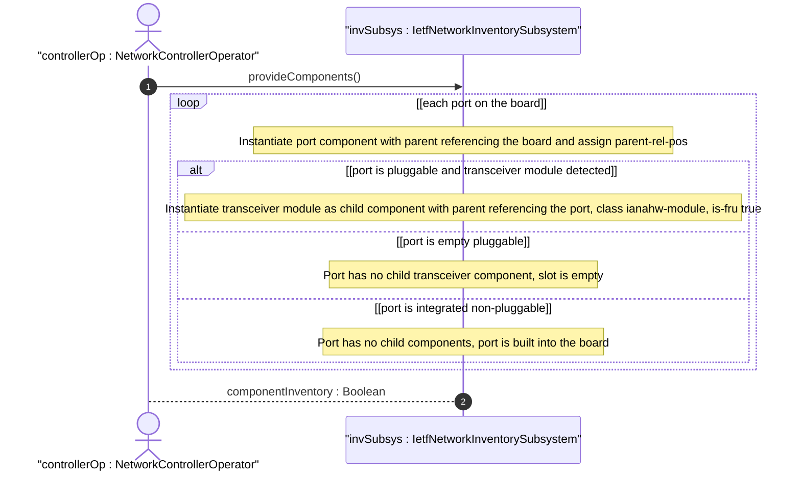

# User Story: Model Pluggable Transceiver Module Component Nesting

## Parent Epic
- [ ] #67 - [ietf-network-inventory: Base Network Inventory Data Model](https://github.com/gintatkinson/3dgs-033/blob/main/docs/epics/epic-05-ietf-network-inventory.md) (pluggable port scenarios with transceiver module child components, Appendix D)

## Domain Object Mapping
- **Primary Domain Objects:** Component (class: port, module), parent leaf-list
- **Actor/Role:** NetworkControllerOperator — the entity that discovers and reports port states including empty pluggable ports, integrated non-pluggable ports, and populated pluggable ports with transceiver module child components

## BDD Scenario (OOA/OOD Realization)

**As a** NetworkControllerOperator
**I want to** model three distinct port types — integrated non-pluggable, empty pluggable, and populated pluggable — as distinct component configurations within the network inventory
**So that** the inventory accurately reflects whether each port has an installed pluggable transceiver module

**Given** a board component with three ports: port-1 (integrated, non-pluggable), port-2 (empty pluggable), and port-3 (populated pluggable with transceiver-module-3)
**When** the controller reports the component list for the hosting network element
**Then** port-1 is a port component with no child components and `parent` = ["board-1"]
**And** port-2 is a port component with no child components (empty, no transceiver plugged in), `parent` = ["board-1"]
**And** port-3 is a port component with `parent` = ["board-1"]
**And** transceiver-module-3 is a component with `class` = `ianahw:module`, `parent` = ["port-3"], and `is-fru` = true
**And** the transceiver module is a child of port-3, not a sibling

**Given** a pluggable port that currently has no transceiver module installed
**When** a transceiver module is later plugged into that port
**Then** a new component entry for the transceiver module is added to the component list
**And** the new module component has `parent` = ["port-X"] referencing the hosting port
**And** the module carries its own `mfg-name`, `part-number`, `serial-number`, `hardware-rev`, and `is-fru` attributes

**Given** an empty pluggable port
**When** the inventory is queried for that port
**Then** the port reports its class as `ianahw:port` with no child components
**And** the absence of a child transceiver module is implicit from the empty child relationship

## UML Sequence Diagram


## Operational Context

From draft-ietf-ivy-network-inventory-yang-18, Appendix D:

> Figure 4 shows an example of a single board which contains three types of ports: (1) An integrated port (non-pluggable); (2) An empty port; (3) A pluggable port.

From the JSON example in Appendix D.1, the component list models:

> - port-1: integrated non-pluggable port with parent board-1, parent-rel-pos 1
> - port-2: empty pluggable port with parent board-1, parent-rel-pos 2
> - port-3: populated pluggable port with parent board-1, parent-rel-pos 3
> - transceiver-module-3: pluggable module with parent port-3, is-fru true

From draft Section 2.2 Terminology, Port:

> In case of pluggable ports, the port may be empty when no pluggable module is plugged in.

## Required Features Matrix
- [ ] #65 - [Define Network Elements Container and List](https://github.com/gintatkinson/3dgs-033/blob/main/docs/features/feat-23-network-elements-list.md) (the board and its ports belong to a network element that provides the component list scope)
- [ ] #66 - [Define Components Container and List](https://github.com/gintatkinson/3dgs-033/blob/main/docs/features/feat-24-components-list.md) (port and transceiver module are both modelled as components with component-id keys, class identities, and parent leaf-list establishing the containment relationship)

## Source References
Structural Schema: [ietf-network-inventory.yang](https://github.com/ietf-ivy-wg/network-inventory-yang/blob/main/yang/ietf-network-inventory.yang) (Clause: leaf-list parent, lines 430-445)
Normative Specification: [draft-ietf-ivy-network-inventory-yang-18](https://datatracker.ietf.org/doc/html/draft-ietf-ivy-network-inventory-yang) (Appendix D, Section 2.2)

> [!WARNING]
> **Mermaid Block Closing Constraints & Code Fence Integrity:**
> - Every Mermaid diagram MUST be strictly closed with ```` ``` ```` on a new line. Leaking Mermaid blocks (e.g. having headings like `##` inside an unclosed diagram) or stray/unclosed code fences will fail downstream validation checks.
> - Ensure there are no stray backticks or unmatched code fences in the document.
> - **All Mermaid syntax constraints are defined in `rules/platform-independence.md` and MUST be observed in full** — including the prohibition on semicolons in `Note` and message text, colons in class members and note strings, stereotypes on relationship lines, and curly braces in class member lines. Do not maintain a local subset here; subsets drift (issue #289).
