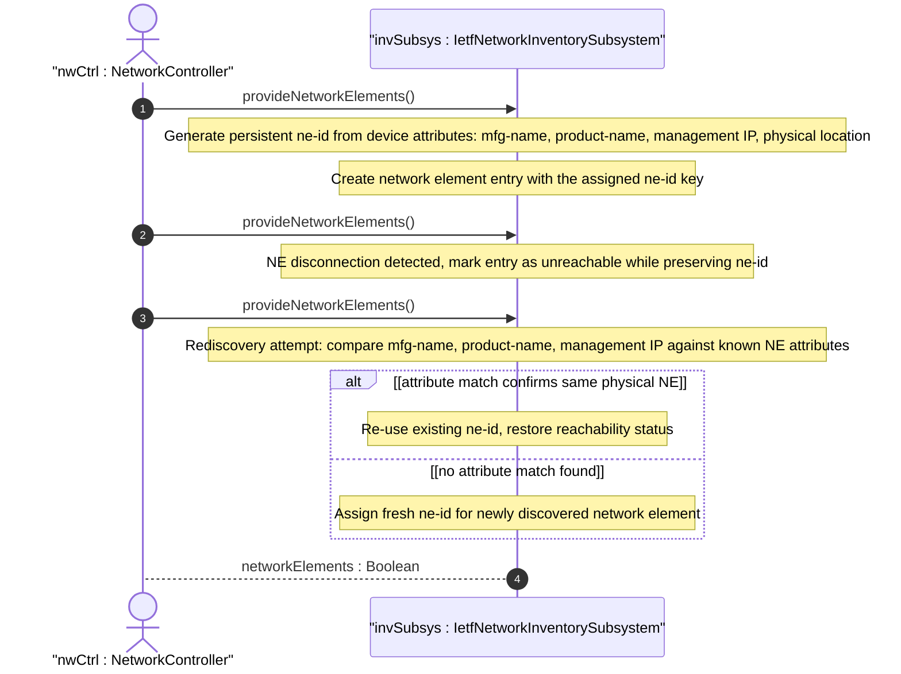

# User Story: Preserve Network Element Identity Across Disconnection Events

## Parent Epic
- [ ] #67 - [ietf-network-inventory: Base Network Inventory Data Model](https://github.com/gintatkinson/3dgs-033/blob/main/docs/epics/epic-05-ietf-network-inventory.md) (ne-id persistence across disconnections described in Section 3.2)

## Domain Object Mapping
- **Primary Domain Objects:** NetworkElement (ne-id leaf, ne-id key), ne-ref typedef
- **Actor/Role:** NetworkController — the server that assigns persistent ne-id values and ensures that the same network element is consistently identified across discovery cycles, even through disconnection events

## BDD Scenario (OOA/OOD Realization)

**As a** NetworkController
**I want to** assign a stable ne-id to each network element that persists across disconnection and reconnection cycles
**So that** inventory consumers (OSS, MDSC, audit tools) can reliably track the same network element over time without identity churn

**Given** a network element NE-A initially discovered by the controller and assigned ne-id "NE-001" based on its mfg-name "Cisco Systems", product-name "ASR 9006", and management IP "10.0.0.1"
**When** NE-A temporarily disconnects from the controller (e.g., network link failure, maintenance reboot)
**And** NE-A later reconnects with the same identifying characteristics (mfg-name, product-name, management IP, physical location)
**Then** the controller recognizes NE-A as the same network element and re-uses ne-id "NE-001"
**And** all previously linked references (e.g., from location modules via ne-ref, augmentation modules) remain valid

**Given** a network element NE-B with ne-id "NE-002" that is decommissioned and physically removed from the network
**When** a new network element NE-C is later installed at the same physical location with different identifying characteristics
**Then** the controller assigns a new ne-id (e.g., "NE-003") to NE-C
**And** the old ne-id "NE-002" is not reassigned to the new element

**Given** a network controller that uses a combination of attributes (mfg-name, product-name, management IP, physical location) to re-identify reconnecting NEs
**When** the controller's discovery mechanism determines that a reconnecting device matches a previously-known NE
**Then** the controller MAY use implementation-specific heuristics (outside the scope of standardization) to confirm the match
**And** if the match is confirmed, the original ne-id is preserved

**Given** a network element that is temporarily unreachable (e.g., management plane link down but device still operational)
**When** an OSS queries the inventory
**Then** the NE entry remains in the network-elements list with its original ne-id
**And** the distinction between "temporarily unreachable" and "decommissioned" is determined by the controller's discovery mechanism and is outside the scope of the base inventory model

## UML Sequence Diagram


## Operational Context

From draft-ietf-ivy-network-inventory-yang-18, Section 3.2:

> The ne-id should be assigned such that the same network element will always be identified through the same identifier, even if the network elements get disconnected from the network controller. Mechanisms to ensure this (e.g., checking the mfg-name, product-name, management IP address, physical location) are implementation specific and outside the scope of standardization.

From Section 1:

> The distinction between a temporarily unreachable network element and one that has been removed from the network is outside the scope of this document and depends on the discovery mechanism used by the controller.

From Section 6:

> This information can be provided by a network controller to a higher level hierarchical network controller, to an Inventory OSS or to any other type of application which needs to discover the network inventory information.

## Required Features Matrix
- [ ] #65 - [Define Network Elements Container and List](https://github.com/gintatkinson/3dgs-033/blob/main/docs/features/feat-23-network-elements-list.md) (ne-id is the list key for network-element and must be assigned as a persistent, stable identifier by the server)

## Source References
Structural Schema: [ietf-network-inventory.yang](https://github.com/ietf-ivy-wg/network-inventory-yang/blob/main/yang/ietf-network-inventory.yang) (Clause: leaf ne-id as list key, lines 393-402)
Normative Specification: [draft-ietf-ivy-network-inventory-yang-18](https://datatracker.ietf.org/doc/html/draft-ietf-ivy-network-inventory-yang) (Section 1, Section 3.2, Section 6)

> [!WARNING]
> **Mermaid Block Closing Constraints & Code Fence Integrity:**
> - Every Mermaid diagram MUST be strictly closed with ```` ``` ```` on a new line. Leaking Mermaid blocks (e.g. having headings like `##` inside an unclosed diagram) or stray/unclosed code fences will fail downstream validation checks.
> - Ensure there are no stray backticks or unmatched code fences in the document.
> - **All Mermaid syntax constraints are defined in `rules/platform-independence.md` and MUST be observed in full** — including the prohibition on semicolons in `Note` and message text, colons in class members and note strings, stereotypes on relationship lines, and curly braces in class member lines. Do not maintain a local subset here; subsets drift (issue #289).
