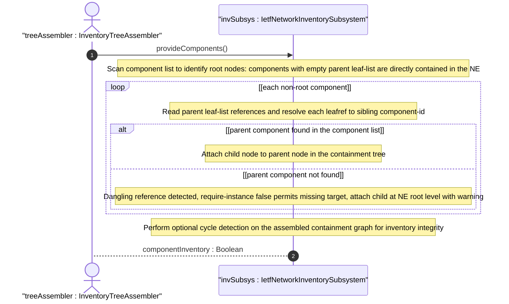

# User Story: Assemble Component Containment Tree from Parent References

## Parent Epic
- [ ] #67 - [ietf-network-inventory: Base Network Inventory Data Model](https://github.com/gintatkinson/3dgs-033/blob/main/docs/epics/epic-05-ietf-network-inventory.md) (component parent leaf-list establishing a directed acyclic graph of containment, draft Section 3.3.1)

## Domain Object Mapping
- **Primary Domain Objects:** Component (parent leaf-list, component-id key), NetworkElement
- **Actor/Role:** InventoryTreeAssembler — the application or visualization layer that constructs a tree representation of the physical component containment from the flat component list

## BDD Scenario (OOA/OOD Realization)

**Given** a network element NE-1 with a flat component list containing: chassis-1, slot-1-1 (parent: chassis-1), card-1-1 (parent: slot-1-1), port-1-1-1 (parent: card-1-1)
**When** the InventoryTreeAssembler processes the component list to build a containment tree
**Then** the algorithm identifies chassis-1 as a root node (empty parent list, directly in the NE)
**And** slot-1-1 is attached as a child of chassis-1
**And** card-1-1 is attached as a child of slot-1-1
**And** port-1-1-1 is attached as a child of card-1-1
**And** the resulting tree has depth 4 with the path: NetworkElement -> chassis-1 -> slot-1-1 -> card-1-1 -> port-1-1-1

**Given** the same component list where the parent references form a valid containment hierarchy
**When** the tree is traversed from any node upward via the parent leaf-list
**Then** the traversal reaches a root component (one whose parent list is empty)
**And** the leaf-level components (e.g., ports with no children) terminate the downward traversal

**Given** a component "orphan-board" whose parent leaf-list references "missing-slot" which does not exist in the component list
**When** the tree is assembled
**Then** the algorithm detects the dangling parent reference
**And** "orphan-board" is attached as a root node at the NE level with a warning indicator
**And** the assembly does not fail (referential integrity is relaxed per `require-instance false`)

**Given** a component "multi-parent-module" that has two parent references: ["chassis-1", "chassis-2"]
**When** the tree is assembled
**Then** the algorithm correctly models the component as having two parents
**And** if a strict tree (single-parent) representation is required, the algorithm reports an ambiguity for operator resolution

## UML Sequence Diagram


## Operational Context

From draft-ietf-ivy-network-inventory-yang-18, Section 3.3.1:

> Figure 1 describes the relationship between typical inventory objects in a physical network element. The model manages all the hardware components without distinguishing between holder and equipment groups.

From the schema, the parent leaf-list models containment with `require-instance false`:

> The parent references establish a directed acyclic graph of physical containment. Components with empty parent lists are directly contained in the network element.

From the cascaded switch example (Appendix E), the component tree for a single chassis can span: chassis -> slot -> card -> port -> transceiver-module, illustrating the depth of the traversal.

## Required Features Matrix
- [ ] #65 - [Define Network Elements Container and List](https://github.com/gintatkinson/3dgs-033/blob/main/docs/features/feat-23-network-elements-list.md) (the network element provides the scope within which the component containment tree is computed)
- [ ] #66 - [Define Components Container and List](https://github.com/gintatkinson/3dgs-033/blob/main/docs/features/feat-24-components-list.md) (the parent leaf-list defines the edges of the containment graph, and the component-id key provides the node identifiers for tree construction)

## Source References
Structural Schema: [ietf-network-inventory.yang](https://github.com/ietf-ivy-wg/network-inventory-yang/blob/main/yang/ietf-network-inventory.yang) (Clause: leaf-list parent, lines 430-445)
Normative Specification: [draft-ietf-ivy-network-inventory-yang-18](https://datatracker.ietf.org/doc/html/draft-ietf-ivy-network-inventory-yang) (Section 3.3.1, Appendix E)

> [!WARNING]
> **Mermaid Block Closing Constraints & Code Fence Integrity:**
> - Every Mermaid diagram MUST be strictly closed with ```` ``` ```` on a new line. Leaking Mermaid blocks (e.g. having headings like `##` inside an unclosed diagram) or stray/unclosed code fences will fail downstream validation checks.
> - Ensure there are no stray backticks or unmatched code fences in the document.
> - **All Mermaid syntax constraints are defined in `rules/platform-independence.md` and MUST be observed in full** — including the prohibition on semicolons in `Note` and message text, colons in class members and note strings, stereotypes on relationship lines, and curly braces in class member lines. Do not maintain a local subset here; subsets drift (issue #289).
