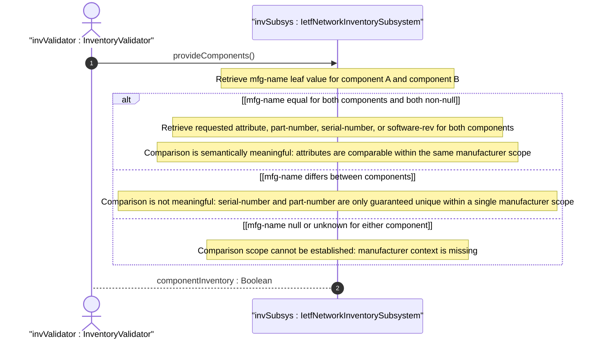

# User Story: Validate Component Comparison Scope Within Manufacturer Boundaries

## Parent Epic
- [ ] #67 - [ietf-network-inventory: Base Network Inventory Data Model](https://github.com/gintatkinson/3dgs-033/blob/main/docs/epics/epic-05-ietf-network-inventory.md) (mfg-name scoping constraint on part-number, software-rev, and serial-number comparisons, Section 3.3)

## Domain Object Mapping
- **Primary Domain Objects:** Component (mfg-name leaf, part-number leaf, serial-number leaf, software-rev list)
- **Actor/Role:** InventoryValidator — the audit subsystem that evaluates whether component attribute comparisons are semantically meaningful based on the manufacturer name scope

## BDD Scenario (OOA/OOD Realization)

**Given** two components, both with `mfg-name` = "Cisco Systems": component-A with `part-number` = "ASR-9006-AC" and component-B with `part-number` = "ASR-9006-DC"
**When** an operator compares the `part-number` values of these components
**Then** the comparison is semantically meaningful because both components share the same `mfg-name`
**And** the operator can conclude that part-number "ASR-9006-AC" represents an AC-powered chassis variant while "ASR-9006-DC" represents a DC-powered variant within the same vendor's product line

**Given** two components with different `mfg-name` values: component-C (`mfg-name` = "Cisco Systems", `serial-number` = "FTX12345678") and component-D (`mfg-name` = "Juniper Networks", `serial-number` = "FTX12345678")
**When** an operator attempts to compare the `serial-number` values
**Then** the comparison is not meaningful because the serial numbers are only guaranteed unique within the scope of a single manufacturer and part-number
**And** the inventory system SHOULD flag or warn the operator that cross-manufacturer serial number comparison is semantically unreliable

**Given** two components with the same `mfg-name` = "Cisco Systems" and the same `part-number` = "QSFP-100G-SR4-S"
**When** an operator compares the `serial-number` values "FBN23456789" and "FBN23456790"
**Then** the comparison is meaningful because serial numbers are expected to be unique within the scope of the same part-number and manufacturer
**And** a duplicate serial number within the same part-number/`mfg-name` scope indicates a potential data integrity issue

**Given** a component whose `mfg-name` is unknown to the server (leaf not instantiated)
**When** an operator attempts to compare that component's `part-number` or `serial-number` with another component
**Then** any comparison involving the unknown-manufacturer component is flagged as unreliable
**And** the audit subsystem notes that the comparison scope cannot be established without a known `mfg-name`

## UML Sequence Diagram


## Operational Context

From draft-ietf-ivy-network-inventory-yang-18, Section 3.3, and schema `mfg-name` refine description:

> Note that comparisons between instances of the 'part-number', 'software-rev', and 'serial-number' nodes are only meaningful amongst components with the same value of 'mfg-name'.

> If the manufacturer name string associated with the component is unknown to the server, then this node is not instantiated.

> The preferred value is the manufacturer name string actually printed on the component itself (if present).

From Section 3.3:

> It is expected that vendors assign unique serial numbers to different component instances at least within the scope of the part-number.

## Required Features Matrix
- [ ] #66 - [Define Components Container and List](https://github.com/gintatkinson/3dgs-033/blob/main/docs/features/feat-24-components-list.md) (the mfg-name leaf establishes the comparison scope boundary, and the part-number, serial-number, and software-rev data nodes are the attributes whose cross-component comparisons must be validated against the mfg-name scope)

## Source References
Structural Schema: [ietf-network-inventory.yang](https://github.com/ietf-ivy-wg/network-inventory-yang/blob/main/yang/ietf-network-inventory.yang) (Clause: refine mfg-name description, lines 2020-2038)
Normative Specification: [draft-ietf-ivy-network-inventory-yang-18](https://datatracker.ietf.org/doc/html/draft-ietf-ivy-network-inventory-yang) (Section 3.3)

> [!WARNING]
> **Mermaid Block Closing Constraints & Code Fence Integrity:**
> - Every Mermaid diagram MUST be strictly closed with ```` ``` ```` on a new line. Leaking Mermaid blocks (e.g. having headings like `##` inside an unclosed diagram) or stray/unclosed code fences will fail downstream validation checks.
> - Ensure there are no stray backticks or unmatched code fences in the document.
> - **All Mermaid syntax constraints are defined in `rules/platform-independence.md` and MUST be observed in full** — including the prohibition on semicolons in `Note` and message text, colons in class members and note strings, stereotypes on relationship lines, and curly braces in class member lines. Do not maintain a local subset here; subsets drift (issue #289).
