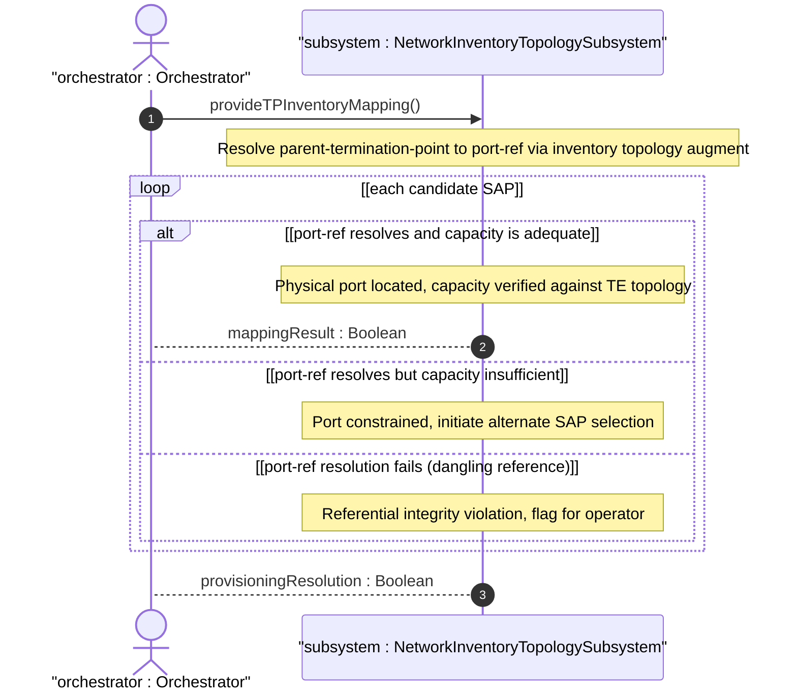
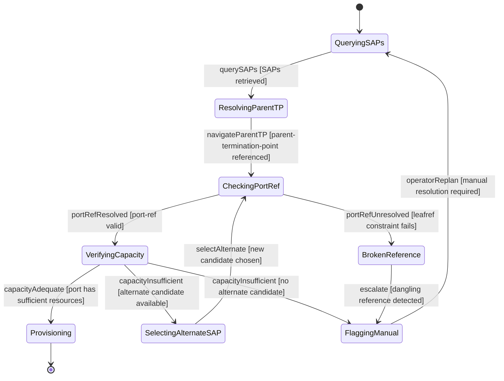

# User Story: Resolve Service Attachment Point to Physical Port via Inventory Topology

## Parent Epic
- [ ] #86 - [ietf-network-inventory-topology: Network Inventory Topology Mapping](https://github.com/gintatkinson/3dgs-033/blob/main/docs/epics/epic-06-ietf-network-inventory-topology.md) (SAP parent-termination-point to physical port resolution during service provisioning, draft Section 3.1)

## Domain Object Mapping
- **Primary Domain Objects:** TerminationPoint, TPInventoryMappingAttributes, port-ref, ne-ref
- **Actor/Role:** Orchestrator — the service orchestration system that queries SAPs and navigates to the underlying physical port via inventory-topology port-ref during service provisioning

## BDD Scenario (OOA/OOD Realization)

**As an** Orchestrator
**I want to** resolve a Service Attachment Point's parent-termination-point to the underlying physical port component via the inventory topology port-ref mapping
**So that** I can verify physical port capacity before committing a service provisioning request

**Given** a service provisioning request targets a set of candidate SAPs across multiple PEs
**And** each candidate SAP has a parent-termination-point referencing a topology TP
**And** the referenced TP has nwit:inventory-mapping-attributes present with a valid port-ref leafref to a physical port component in the network inventory
**When** the orchestrator queries the SAP data model and navigates via parent-termination-point to the inventory-topology port-ref
**Then** the orchestrator resolves the logical SAP to the physical port component location
**And** the orchestrator can consult TE topology models to verify whether the identified port has adequate capacity for the requested service
**And** the chained resolution from SAP through TP through port-ref to physical component is traceable end-to-end

**Given** a candidate SAP whose underlying physical port has insufficient resources (e.g., port speed fully utilized)
**When** the capacity check reveals the constraint
**Then** the orchestrator selects an alternate SAP mapping to a different port with adequate capacity
**And** if no alternative SAP is available, the orchestrator flags the request for manual operator intervention with precise inventory bottleneck information

## UML Sequence Diagram

## UML State Machine Diagram

## Operational Context

From draft-ietf-ivy-network-inventory-topology-08, Section 3.1:

> During service provisioning, the SAP's parent-termination-point can be associated with the inventory topology's port-ref to locate the underlying physical resource.

> The orchestrator can then consult other relevant topology models (e.g., the Traffic Engineering topology data model) to verify whether the identified port has adequate capacity for the requested service.

> If the physical port underlying a candidate SAP has insufficient resources (e.g., port speed fully utilized), the orchestrator can select an alternate SAP that maps to a different port with adequate capacity. If no alternative SAP is available, the orchestrator flags the request for manual intervention, providing the operator with precise inventory information about the bottleneck.

## Required Features Matrix
- [ ] #84 - [Define Termination Point Inventory Mapping](https://github.com/gintatkinson/3dgs-033/blob/main/docs/features/feat-28-tp-inventory-mapping.md) (port-ref leafref provides the link from logical TP to physical port component, enabling the SAP-to-port resolution chain)
- [ ] #85 - [Define Port Breakout Capability](https://github.com/gintatkinson/3dgs-033/blob/main/docs/features/feat-29-port-breakout-capability.md) (breakout channel capacity must be accounted for when verifying port resource adequacy for a service request)
- [ ] #82 - [Define Node Inventory Mapping Attributes](https://github.com/gintatkinson/3dgs-033/blob/main/docs/features/feat-26-node-inventory-mapping.md) (ne-ref on the parent node identifies the network element hosting the resolved port)
- [ ] #81 - [Define Inventory Topology Network Type](https://github.com/gintatkinson/3dgs-033/blob/main/docs/features/feat-25-inventory-topology-network-type.md) (the inventory-topology network type must be present for the TP inventory mapping augment to be active)

## Source References
Structural Schema: [ietf-network-inventory-topology.yang](https://github.com/ietf-ivy-wg/network-inventory-topology/blob/main/yang/ietf-network-inventory-topology.yang) (Clause: augment /nw:networks/nw:network/nw:node/nt:termination-point/inventory-mapping-attributes, lines 222-242)
Normative Specification: [draft-ietf-ivy-network-inventory-topology-08](https://datatracker.ietf.org/doc/html/draft-ietf-ivy-network-inventory-topology) (Section 3.1, Section 5, Section 6)
