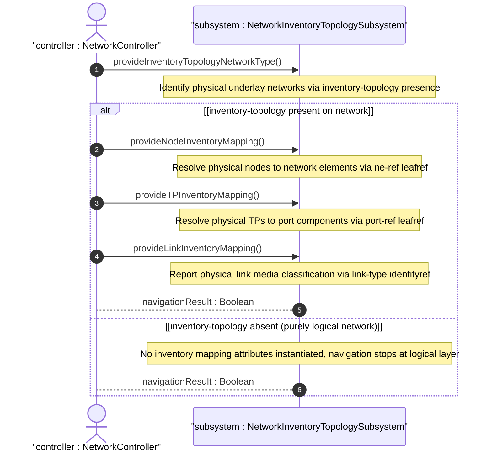

# User Story: Navigate Multi-Layer Network Topology to Underlying Physical Inventory

## Parent Epic
- [ ] #86 - [ietf-network-inventory-topology: Network Inventory Topology Mapping](https://github.com/gintatkinson/3dgs-033/blob/main/docs/epics/epic-06-ietf-network-inventory-topology.md) (multi-layer navigation from overlay to physical inventory, draft Section 3.2)

## Domain Object Mapping
- **Primary Domain Objects:** Network, Node, Link, TerminationPoint, NodeInventoryMappingAttributes, TPInventoryMappingAttributes, LinkInventoryMappingAttributes
- **Actor/Role:** NetworkController — the multi-layer controller that navigates across topology layers and queries the inventory mapping at the physical underlay

## BDD Scenario (OOA/OOD Realization)

**As a** NetworkController
**I want to** navigate from logical overlay layers (Layer 2, Layer 3, Optical) down through the physical layer to the network inventory component references
**So that** I can trace a service path from its logical representation to the physical hardware and verify end-to-end resource allocation

**Given** a multi-layer network topology encompassing physical elements (associated with inventory) and logical elements (associated with underlay topology elements)
**And** the physical underlay network carries the nwit:inventory-topology network type
**And** physical nodes have nwit:inventory-mapping-attributes with ne-ref pointing to network elements
**And** physical termination points have nwit:inventory-mapping-attributes with port-ref pointing to port components
**When** the controller traverses from an overlay layer down to the physical layer per the base network topology model's underlay traversal mechanism
**And** at the physical layer queries the inventory mapping attributes
**Then** each physical node resolves to its corresponding network element in the inventory
**And** each physical termination point resolves to its port component
**And** each physical link reports its media classification via link-type
**And** the navigation path from overlay to physical component is fully traceable across all layers

## UML Sequence Diagram

## Operational Context

From draft-ietf-ivy-network-inventory-topology-08, Section 3.2:

> A multi-layer network can contain multiple types of topological elements: physical elements (associated with an inventory element) or logical elements (associated with topology elements in the underlay layer).

> The topology models support navigation across the different layers, down to the physical layer, as defined in the base network topology model. The navigation between the physical layer and the network inventory is outside the scope of the topology models and is addressed in this document.

From draft-ietf-ivy-network-inventory-topology-08, Section 1:

> This YANG data model can be used to represent a physical network instance at the lowest underlay abstraction level. Alternatively, it can be used in conjunction with existing network topology models (e.g., Service Attachment Point, Layer 2, Layer 3, Traffic Engineering, and Optical Transport Network topologies) when they contain nodes, links, or termination points belonging to the lowest underlay level.

From the YANG module description (node augment):

> This enables correlation between the logical node and its physical network element.

## Required Features Matrix
- [ ] #81 - [Define Inventory Topology Network Type](https://github.com/gintatkinson/3dgs-033/blob/main/docs/features/feat-25-inventory-topology-network-type.md) (the inventory-topology network type discriminates physical-underlay networks from purely logical networks during layer traversal)
- [ ] #82 - [Define Node Inventory Mapping Attributes](https://github.com/gintatkinson/3dgs-033/blob/main/docs/features/feat-26-node-inventory-mapping.md) (ne-ref provides the mapping from physical topology node to network element for layer-crossing inventory correlation)
- [ ] #84 - [Define Termination Point Inventory Mapping](https://github.com/gintatkinson/3dgs-033/blob/main/docs/features/feat-28-tp-inventory-mapping.md) (port-ref provides the mapping from physical TP to port component for cross-layer resource tracing)
- [ ] #83 - [Define Link Inventory Media Classification](https://github.com/gintatkinson/3dgs-033/blob/main/docs/features/feat-27-link-inventory-media-classification.md) (link-type provides physical media classification for links at the underlay layer)

## Source References
Structural Schema: [ietf-network-inventory-topology.yang](https://github.com/ietf-ivy-wg/network-inventory-topology/blob/main/yang/ietf-network-inventory-topology.yang) (entire module, lines 1-269)
Normative Specification: [draft-ietf-ivy-network-inventory-topology-08](https://datatracker.ietf.org/doc/html/draft-ietf-ivy-network-inventory-topology) (Section 3.2, Section 1, Section 4, Section 6)
