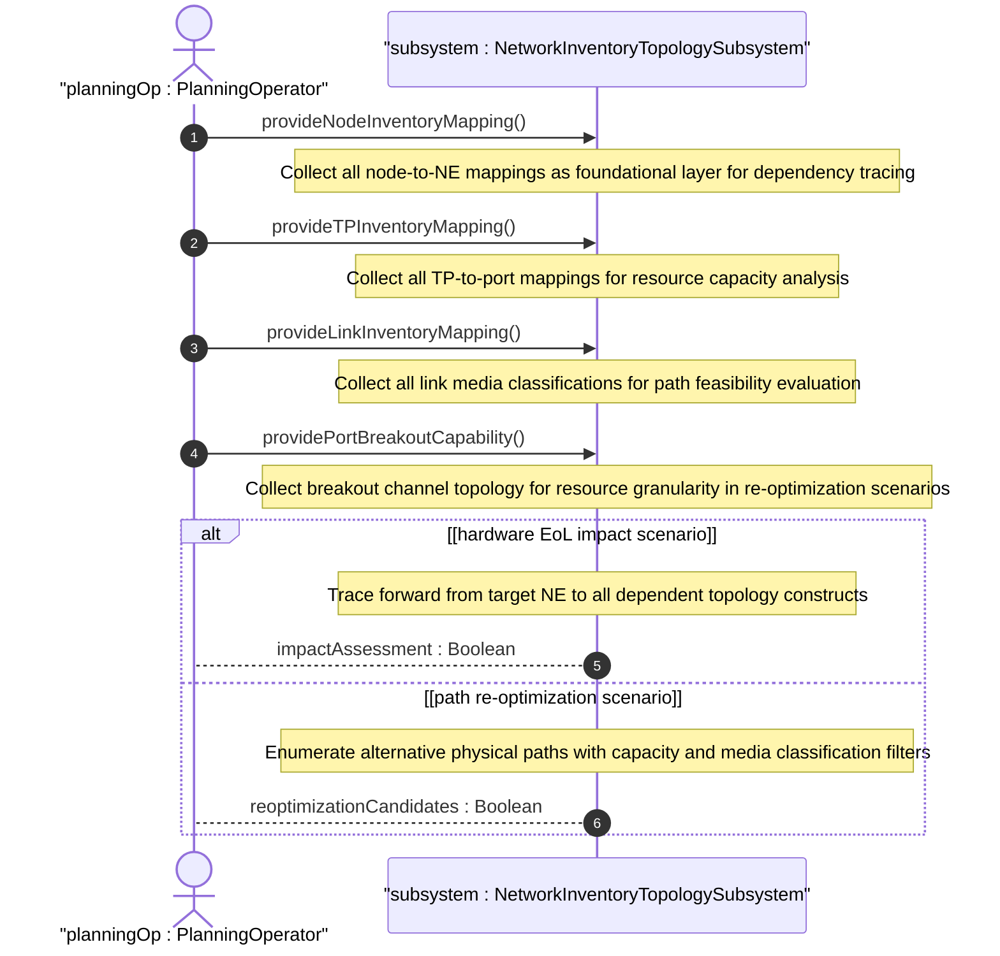

# User Story: Execute What-If Scenario Analysis Using Topology-to-Inventory Mapping

## Parent Epic
- [ ] #86 - [ietf-network-inventory-topology: Network Inventory Topology Mapping](https://github.com/gintatkinson/3dgs-033/blob/main/docs/epics/epic-06-ietf-network-inventory-topology.md) (what-if analysis for NDT and SIMAP architectures, draft Section 3.3)

## Domain Object Mapping
- **Primary Domain Objects:** Network, Node, NodeInventoryMappingAttributes, TerminationPoint, TPInventoryMappingAttributes, LinkInventoryMappingAttributes
- **Actor/Role:** PlanningOperator — the network operator or digital twin system that simulates topology changes and resource impacts against the physical inventory

## BDD Scenario (OOA/OOD Realization)

**As a** PlanningOperator
**I want to** perform what-if scenario analysis using the inventory-topology mapping as the foundational data layer
**So that** I can predict the impact of hardware end-of-life, evaluate path re-optimization under resource constraints, and assess service availability before committing changes

**Given** a Network Digital Twin (NDT) or Service and Infrastructure Map (SIMAP) system requires accurate mapping between logical network topology and physical inventory
**And** the physical underlay network exposes full inventory-topology mapping with ne-ref on nodes, port-ref on TPs, and link-type on links
**When** the operator initiates a what-if analysis scenario (e.g., hardware EoL impact prediction)
**Then** the system queries the inventory-topology mapping to identify all logical entities affected by the target physical resource
**And** the system traces forward from physical NE/port to all dependent logical topology constructs (nodes, TPs, links, SAPs)
**And** the system evaluates the cascading impact on service paths, capacity, and redundancy
**And** the analysis result provides a quantified impact assessment to inform remediation decisions

**Given** a path re-optimization scenario under physical port constraints
**When** the what-if engine evaluates alternative underlay paths
**Then** the system queries the inventory-topology mapping to enumerate all available physical ports and their breakout capabilities
**And** the system validates that each alternative path maps to physical resources with adequate capacity
**And** the system excludes paths whose physical port links are classified as unknown or unassessed media types

## UML Sequence Diagram

## Operational Context

From draft-ietf-ivy-network-inventory-topology-08, Section 3.3:

> [I-D.irtf-nmrg-network-digital-twin-arch] defines Network Digital Twin (NDT) as a virtual representation of the physical network. Such representation is meant to be used to analyze, diagnose, emulate, and then manage the physical network based on data, models, and interfaces.

> [I-D.ietf-nmop-simap-concept] defines Service and Infrastructure Maps (SIMAP) as an abstraction model that provides a unified view of both service and infrastructure information, enabling correlation between service requirements and underlying resource capabilities.

> Both architectures require accurate mapping between logical network topology and physical inventory as a foundational data layer. This model provides the essential physical resource information to such systems, enabling them to perform accurate "what-if" analysis (e.g., impact prediction of hardware End-of-Life, path re-optimization under resource constraints, service availability assessment).

## Required Features Matrix
- [ ] #81 - [Define Inventory Topology Network Type](https://github.com/gintatkinson/3dgs-033/blob/main/docs/features/feat-25-inventory-topology-network-type.md) (identifies which networks carry physical underlay mapping data for what-if dependency tracing)
- [ ] #82 - [Define Node Inventory Mapping Attributes](https://github.com/gintatkinson/3dgs-033/blob/main/docs/features/feat-26-node-inventory-mapping.md) (ne-ref enables forward tracing from physical NE to dependent logical topology nodes for EoL impact analysis)
- [ ] #84 - [Define Termination Point Inventory Mapping](https://github.com/gintatkinson/3dgs-033/blob/main/docs/features/feat-28-tp-inventory-mapping.md) (port-ref enables enumeration of all physical ports and their mapped TPs for capacity-based path re-optimization)
- [ ] #83 - [Define Link Inventory Media Classification](https://github.com/gintatkinson/3dgs-033/blob/main/docs/features/feat-27-link-inventory-media-classification.md) (link-type classification filters feasible paths and excludes unclassifiable media during alternative path evaluation)
- [ ] #85 - [Define Port Breakout Capability](https://github.com/gintatkinson/3dgs-033/blob/main/docs/features/feat-29-port-breakout-capability.md) (breakout channel enumeration provides physical resource granularity for fine-grained re-optimization analysis)

## Source References
Structural Schema: [ietf-network-inventory-topology.yang](https://github.com/ietf-ivy-wg/network-inventory-topology/blob/main/yang/ietf-network-inventory-topology.yang) (entire module, all augment containers)
Normative Specification: [draft-ietf-ivy-network-inventory-topology-08](https://datatracker.ietf.org/doc/html/draft-ietf-ivy-network-inventory-topology) (Section 3.3, Section 1, Section 6)
