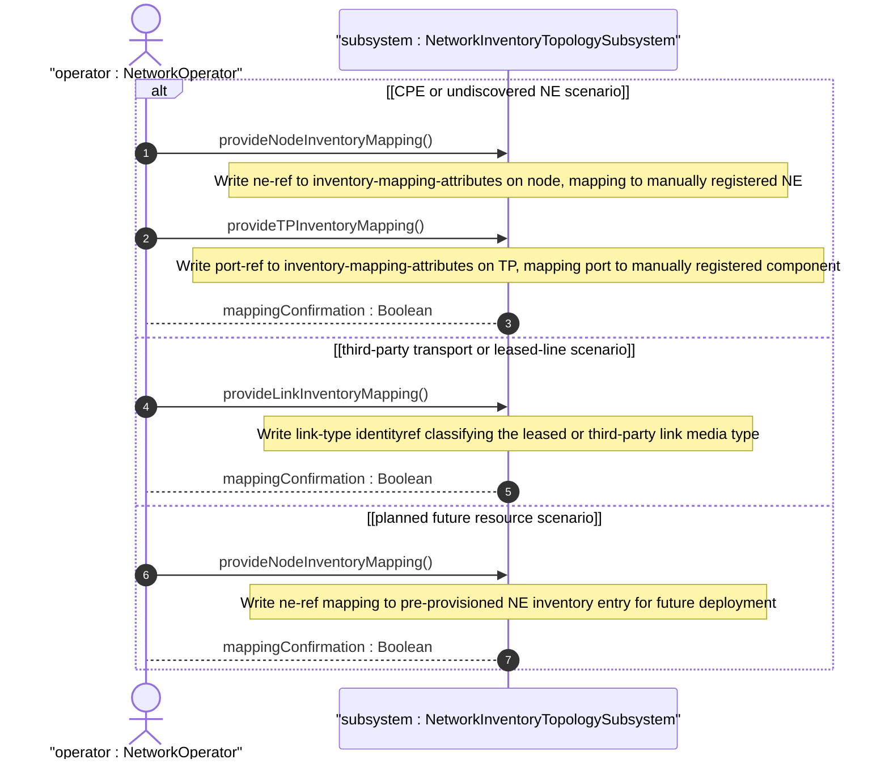
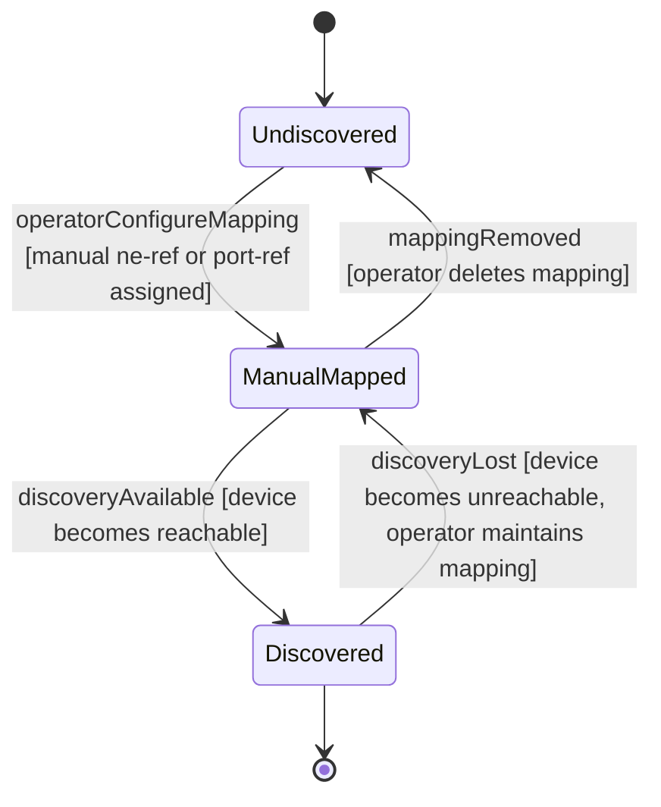

# User Story: Configure Manual Inventory-Topology Mapping for Undiscovered Resources

## Parent Epic
- [ ] #86 - [ietf-network-inventory-topology: Network Inventory Topology Mapping](https://github.com/gintatkinson/3dgs-033/blob/main/docs/epics/epic-06-ietf-network-inventory-topology.md) (manual configuration for undiscovered resources, draft Section 6)

## Domain Object Mapping
- **Primary Domain Objects:** NodeInventoryMappingAttributes, TPInventoryMappingAttributes, LinkInventoryMappingAttributes, ne-ref, port-ref, link-type
- **Actor/Role:** NetworkOperator — the human operator who manually populates inventory-topology mappings for resources outside the automated discovery domain

## BDD Scenario (OOA/OOD Realization)

**As a** NetworkOperator
**I want to** manually configure inventory-topology mapping containers for resources that cannot be discovered automatically
**So that** the topology-to-inventory correlation remains complete and accurate even for CPE outside the management domain, leased lines, and planned future resources

**Given** a physical underlay network with nwit:inventory-topology present
**And** an automatic discovery system that cannot reach customer-premises equipment (CPE) outside the operator's management domain
**When** the operator manually configures nwit:inventory-mapping-attributes on a topology node with ne-ref pointing to a manually registered network element
**Then** the mapping is persisted in the read-write configuration datastore
**And** the node is treated as a physical node with full NE correlation for service provisioning
**And** the manual mapping is semantically indistinguishable from an automatically discovered mapping

**Given** a leased-line link provided by a third-party operator where detailed physical attributes are not visible to the lessee
**When** the operator manually configures nwit:inventory-mapping-attributes on the link with link-type set to leased-fiber
**Then** the link is classified as a fiber link with the leased-fiber identity indicating limited physical visibility
**And** the system does not attempt to query detailed passive inventoried attributes for this link
**And** the link participates in topology navigation with its appropriate media classification

**Given** a planned or hypothetical resource for future deployment that has no live hardware
**When** the operator configures nwit:inventory-mapping-attributes on the topology node with ne-ref pointing to a pre-provisioned NE inventory entry
**Then** the mapping is available for what-if planning and capacity forecasting
**And** the planned resource appears in topology queries with an indicator of its planned state

## UML Sequence Diagram

## UML State Machine Diagram

## Operational Context

From draft-ietf-ivy-network-inventory-topology-08, Section 6:

> Automatic discovery serves as the primary mechanism, with selective configuration capabilities provided for scenarios where discovery is not feasible.

> The inventory-mapping-attributes containers are defined as read-write (config true) to accommodate cases where automatic discovery is not possible, including: Customer-premises equipment (CPE) outside the operator's management domain; Leased lines and third-party transport resources; Planned or hypothetical resources for future deployment.

From draft-ietf-ivy-network-inventory-topology-08, Section 6:

> The following nodes are read-only (config false) as they represent hardware-determined state: port-breakout: Hardware capability determined by physical port characteristics

From the YANG module presence statement (node augment):

> If present, it indicates this is a physical node, which maps to a network element. If not present, it indicates it is an abstract node.

From the leased-fiber identity description:

> Leased fiber link. The physical medium is fiber, but the link is provided by a third-party operator. Detailed physical attributes are typically not visible to the lessee.

## Required Features Matrix
- [ ] #81 - [Define Inventory Topology Network Type](https://github.com/gintatkinson/3dgs-033/blob/main/docs/features/feat-25-inventory-topology-network-type.md) (the inventory-topology network type may be manually configured when discovery identifies a physical underlay network)
- [ ] #82 - [Define Node Inventory Mapping Attributes](https://github.com/gintatkinson/3dgs-033/blob/main/docs/features/feat-26-node-inventory-mapping.md) (read-write ne-ref mapping enables manual operator configuration of node-to-NE correlation)
- [ ] #84 - [Define Termination Point Inventory Mapping](https://github.com/gintatkinson/3dgs-033/blob/main/docs/features/feat-28-tp-inventory-mapping.md) (read-write port-ref mapping enables manual TP-to-port component correlation)
- [ ] #83 - [Define Link Inventory Media Classification](https://github.com/gintatkinson/3dgs-033/blob/main/docs/features/feat-27-link-inventory-media-classification.md) (read-write link-type enables manual media classification including leased-fiber for third-party links)

## Source References
Structural Schema: [ietf-network-inventory-topology.yang](https://github.com/ietf-ivy-wg/network-inventory-topology/blob/main/yang/ietf-network-inventory-topology.yang) (Clauses: node augment lines 154-177, TP augment lines 222-242, link augment lines 179-220)
Normative Specification: [draft-ietf-ivy-network-inventory-topology-08](https://datatracker.ietf.org/doc/html/draft-ietf-ivy-network-inventory-topology) (Section 6, Section 4.1, Section 5)
