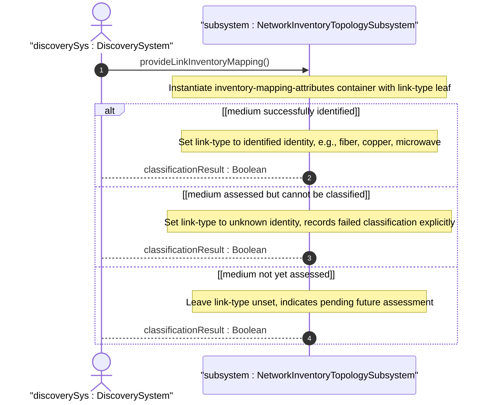
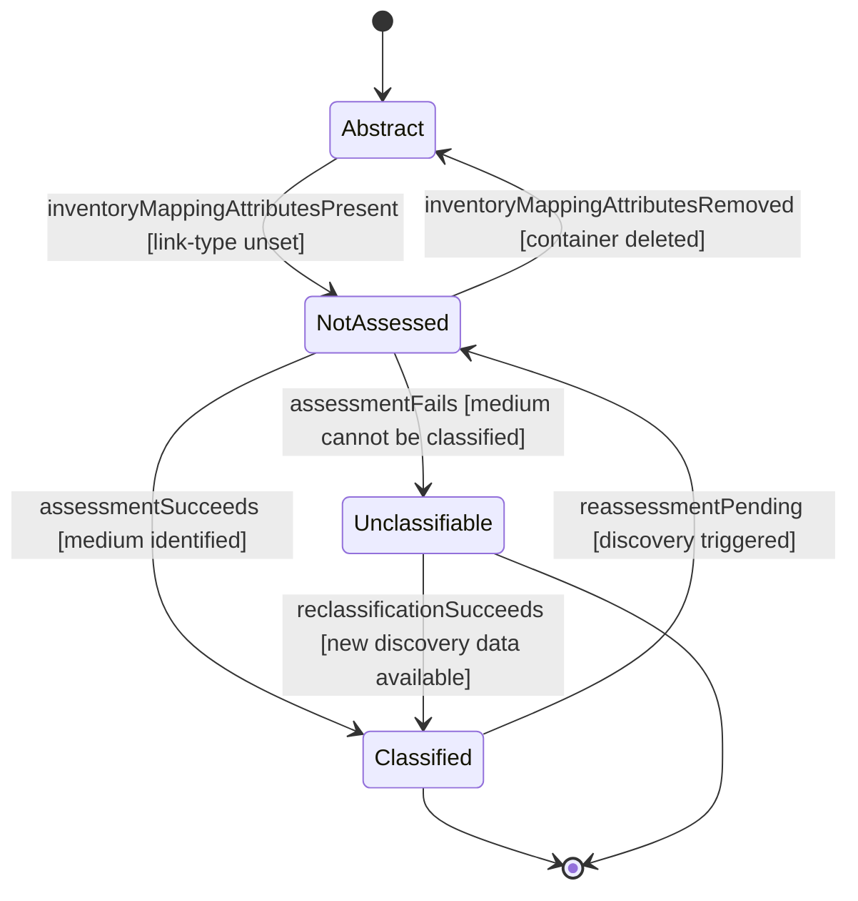

# User Story: Classify Link Media Type with Distinct Unknown-Versus-Unassessed Semantics

## Parent Epic
- [ ] #86 - [ietf-network-inventory-topology: Network Inventory Topology Mapping](https://github.com/gintatkinson/3dgs-033/blob/main/docs/epics/epic-06-ietf-network-inventory-topology.md) (link-type classification with explicit unknown-vs-unset state distinction, draft Section 4.1)

## Domain Object Mapping
- **Primary Domain Objects:** Link, LinkInventoryMappingAttributes, link-type, LinkTypeBase, Unknown
- **Actor/Role:** DiscoverySystem — the automated topology discovery service that classifies physical link media types

## BDD Scenario (OOA/OOD Realization)

**As a** DiscoverySystem
**I want to** classify each physical link's media type into a well-defined identityref value with a clear ternary distinction between classified, not-assessed, and cannot-classify states
**So that** downstream systems can make informed decisions without conflating undiscovered links with genuinely unclassifiable media

**Given** a physical underlay network with nwit:inventory-topology network type
**And** a link with nwit:inventory-mapping-attributes container present
**When** the discovery system assesses the link and successfully identifies the medium (e.g., fiber, copper, coax, microwave, wlan)
**Then** the link-type leaf is set to the corresponding identity (e.g., fiber)
**And** the link is in the Classified state

**Given** a link whose medium is assessed but cannot be classified into any defined identity
**When** the discovery system exhausts all classification methods without a match
**Then** the link-type leaf is set to the unknown identity
**And** the link is explicitly recorded as Unclassifiable
**And** the unknown value is distinguishable from unset in all downstream queries

**Given** a link that has an inventory-mapping-attributes container present but whose medium has not yet been assessed by any discovery pass
**When** the link-type leaf is not set (absent)
**Then** the link is in the Not Assessed state
**And** downstream systems interpret the unset leaf as requiring a future discovery pass, not as a classification failure
**And** the Not Assessed state is semantically distinct from the Unclassifiable (unknown) state

**Given** a link whose parent network does not carry the inventory-topology network type
**When** the nwit:inventory-mapping-attributes container is absent
**Then** the link is Abstract/Logical — not a physical underlay link and no media classification applies
**And** the link has no inventory-mapping-attributes container and cannot receive a link-type value

## UML Sequence Diagram

## UML State Machine Diagram

## Operational Context

From the YANG module `unknown` identity description:

> The link media type is unknown or could not be determined. This identity is used as a fallback when the physical medium cannot be classified into any of the other defined types. When a discovery system is unable to determine the media type, it should set this identity rather than leaving the leaf unset. An unset leaf indicates that the link type has not been assessed, whereas unknown explicitly records that the medium could not be classified.

From draft-ietf-ivy-network-inventory-topology-08, Section 4.1:

> "link-type": An identityref indicating the link media type. Examples of wired link types are "copper", "fiber", or "coax". For wireless media, values such as "microwave", or "wlan" may be used.

From the YANG module link container description:

> This container provides lightweight media classification. The link-type indicates which specialized inventory model contains detailed resource information: Wired media (fiber, copper): passive network inventory; Wireless media (microwave, Wi-Fi): wireless-specific inventory.

## Required Features Matrix
- [ ] #83 - [Define Link Inventory Media Classification](https://github.com/gintatkinson/3dgs-033/blob/main/docs/features/feat-27-link-inventory-media-classification.md) (the link-type identityref and its identity hierarchy including unknown are defined here, providing the classification mechanism and the unknown fallback identity)
- [ ] #81 - [Define Inventory Topology Network Type](https://github.com/gintatkinson/3dgs-033/blob/main/docs/features/feat-25-inventory-topology-network-type.md) (the inventory-topology network type must be present for the link inventory mapping augment to be active, gating the Abstract state)

## Source References
Structural Schema: [ietf-network-inventory-topology.yang](https://github.com/ietf-ivy-wg/network-inventory-topology/blob/main/yang/ietf-network-inventory-topology.yang) (Clauses: identity link-type through unknown, lines 68-128; link augment, lines 179-220)
Normative Specification: [draft-ietf-ivy-network-inventory-topology-08](https://datatracker.ietf.org/doc/html/draft-ietf-ivy-network-inventory-topology) (Section 4.1, Section 5, Appendix A)
