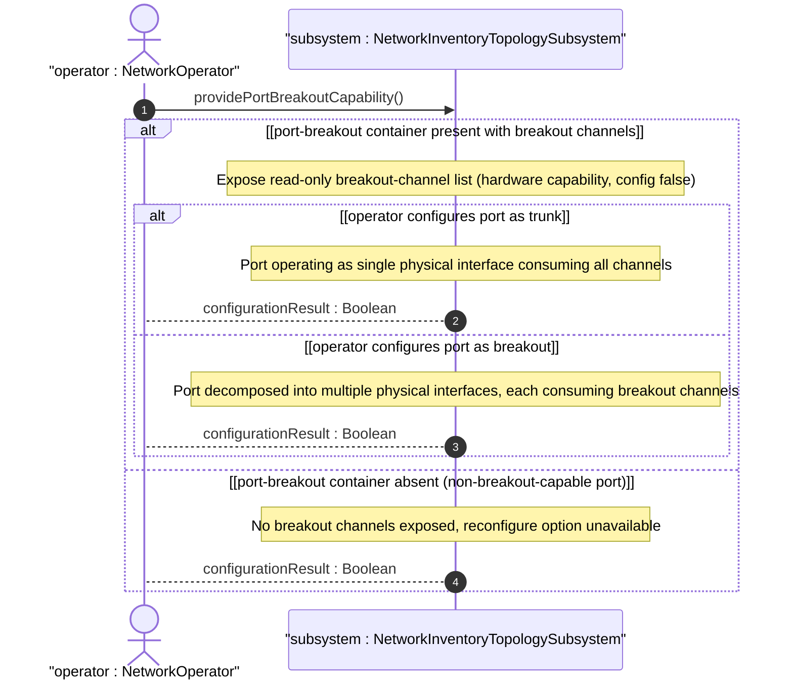
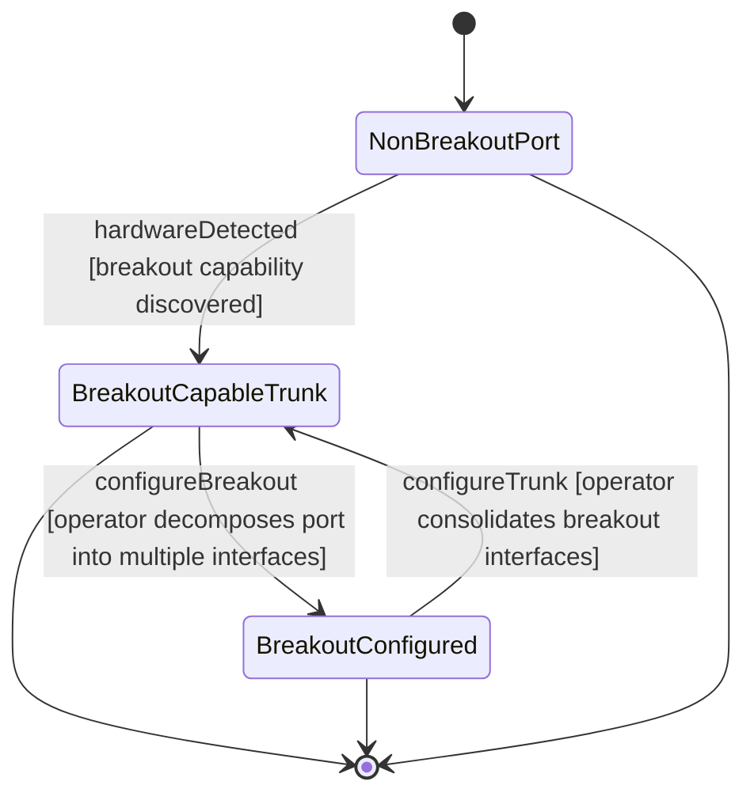

# User Story: Configure Port as Trunk or Breakout from Breakout-Capable Hardware

## Parent Epic
- [ ] #86 - [ietf-network-inventory-topology: Network Inventory Topology Mapping](https://github.com/gintatkinson/3dgs-033/blob/main/docs/epics/epic-06-ietf-network-inventory-topology.md) (trunk vs breakout port configuration using hardware capability data, draft Section 4.2)

## Domain Object Mapping
- **Primary Domain Objects:** TerminationPoint, PortBreakout, BreakoutChannel, channel-id
- **Actor/Role:** NetworkOperator — the human operator who configures breakout-capable ports as either trunk (single interface) or breakout (multiple interfaces) based on exposed hardware capability

## BDD Scenario (OOA/OOD Realization)

**As a** NetworkOperator
**I want to** inspect the read-only port-breakout container on a breakout-capable termination point and configure the port as either a single trunk interface or as multiple breakout interfaces
**So that** I can leverage high-density port hardware (e.g., 400G DR4) in the configuration best suited to the current network topology

**Given** a physical underlay network with nwit:inventory-topology network type
**And** a termination point representing a 400 Gb/s DR4 port whose underlying hardware supports partitioning into 4 independent 100 Gb/s lanes
**When** the nwit:port-breakout container is present on the TP with a breakout-channel list containing channels 1, 2, 3, 4
**Then** the TP's hardware breakout capability is visible as read-only operational state
**And** the operator can view the intrinsic channel topology independently of the current trunk-or-breakout configuration

**Given** a breakout-capable port currently configured as a single trunk interface (one physical interface consuming all 4 breakout channels)
**When** the operator reconfigures the port as a breakout port
**Then** the port is decomposed into two or more physical interfaces
**And** each physical interface may run at the same or different speeds
**And** each physical interface may consume the same or a different number of breakout channels
**And** the port-breakout container and its breakout-channel list remain unchanged (hardware capability is immutable)

**Given** a breakout-capable port currently configured as a breakout port with multiple physical interfaces
**When** the operator reconfigures the port back to a trunk port
**Then** the multiple breakout physical interfaces are consolidated into a single physical interface
**And** the breakout-channel list in the port-breakout container remains unchanged

**Given** a standard 10 Gb/s SFP+ port that does not support channel breakout
**When** the port's TP data is queried
**Then** the nwit:port-breakout container is absent
**And** the operator cannot configure the port as a breakout — the configuration option is unavailable

## UML Sequence Diagram

## UML State Machine Diagram

## Operational Context

From draft-ietf-ivy-network-inventory-topology-08, Section 4.2:

> High-density Ethernet ports (e.g., 400 Gb/s DR4) can be split into multiple independent lower-speed channels. The breakout channels represent the intrinsic capability of the port to be partitioned, regardless of whether the port is currently configured as a trunk or as a breakout port.

> A trunk port is associated with exactly one physical interface. A breakout port is a port that is decomposed into two or more physical interfaces; those interfaces may run at the same or different speeds and may consume the same or a different number of breakout channels.

> It is assumed that a port which supports breakout can be configured either as a trunk port or as a breakout port. Interface channelisation (e.g., VLAN sub-interfaces) is outside the scope of this document.

From draft-ietf-ivy-network-inventory-topology-08, Section 6:

> port-breakout: Hardware capability determined by physical port characteristics (config false)

From the YANG module port-breakout description:

> Breakout capability of the physical port represented by this TP. This container is present only when the underlying hardware supports partitioning the port into multiple independent channels (e.g., 400G to 4x100G).

## Required Features Matrix
- [ ] #85 - [Define Port Breakout Capability](https://github.com/gintatkinson/3dgs-033/blob/main/docs/features/feat-29-port-breakout-capability.md) (the read-only port-breakout container and breakout-channel list expose the hardware capability that drives the trunk-or-breakout configuration decision)
- [ ] #81 - [Define Inventory Topology Network Type](https://github.com/gintatkinson/3dgs-033/blob/main/docs/features/feat-25-inventory-topology-network-type.md) (the inventory-topology network type gates the when condition under which port-breakout is valid on a TP)
- [ ] #84 - [Define Termination Point Inventory Mapping](https://github.com/gintatkinson/3dgs-033/blob/main/docs/features/feat-28-tp-inventory-mapping.md) (the inventory mapping on the TP identifies which physical port component provides the breakout capability)

## Source References
Structural Schema: [ietf-network-inventory-topology.yang](https://github.com/ietf-ivy-wg/network-inventory-topology/blob/main/yang/ietf-network-inventory-topology.yang) (Clause: container port-breakout and list breakout-channel, lines 244-266)
Normative Specification: [draft-ietf-ivy-network-inventory-topology-08](https://datatracker.ietf.org/doc/html/draft-ietf-ivy-network-inventory-topology) (Section 4.2, Section 5, Section 6, Appendix B)
