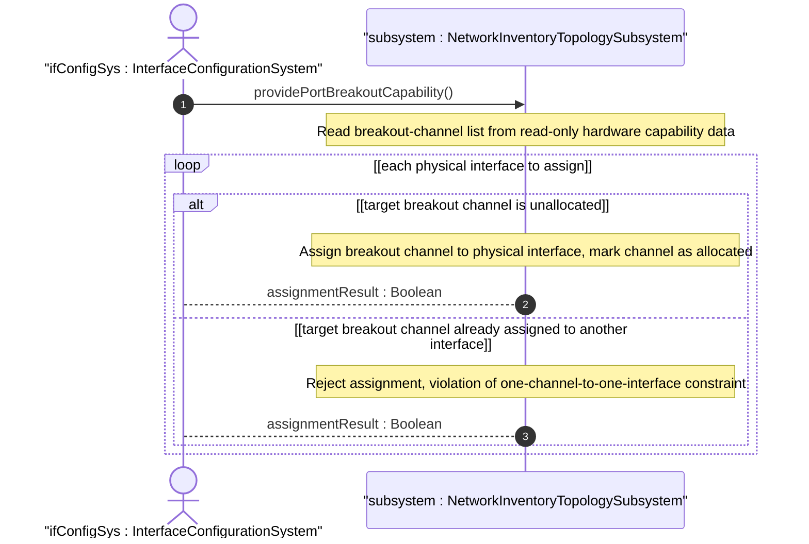
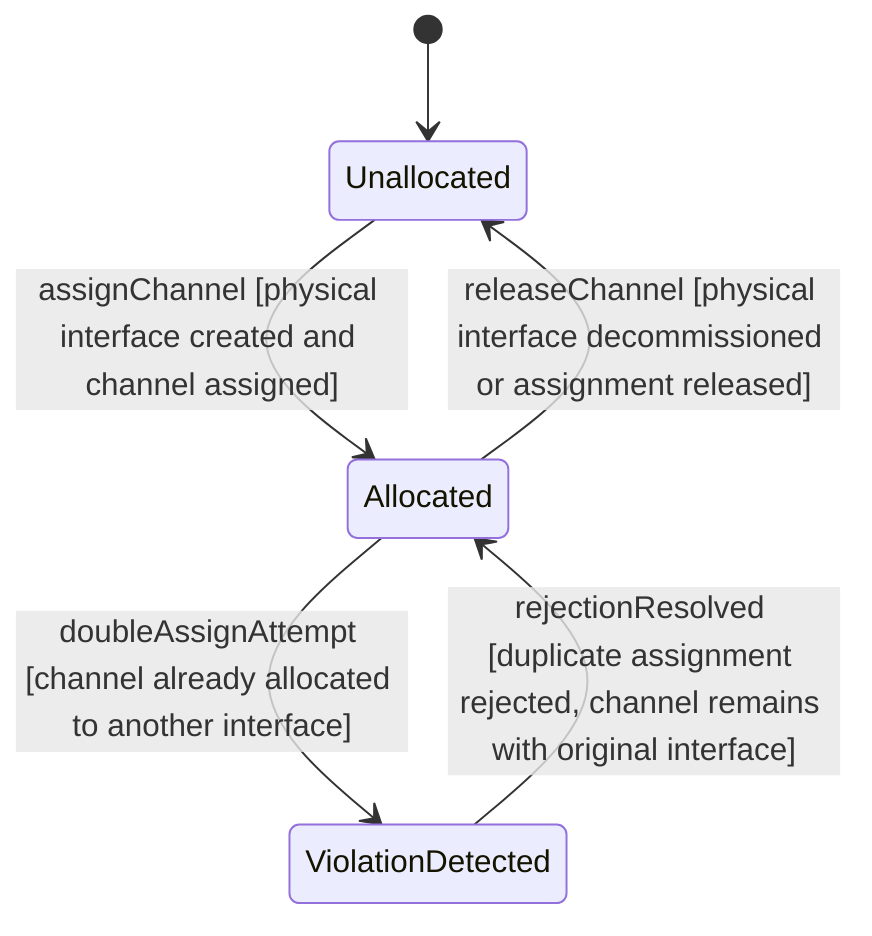

# User Story: Enforce Breakout-Channel Exclusive Assignment Constraint

## Parent Epic
- [ ] #86 - [ietf-network-inventory-topology: Network Inventory Topology Mapping](https://github.com/gintatkinson/3dgs-033/blob/main/docs/epics/epic-06-ietf-network-inventory-topology.md) (breakout-channel must-not-be-assigned-to-more-than-one-physical-interface constraint, draft Section 4.2)

## Domain Object Mapping
- **Primary Domain Objects:** PortBreakout, BreakoutChannel, channel-id
- **Actor/Role:** InterfaceConfigurationSystem — the system that assigns physical interfaces to breakout channels when a port is configured in breakout mode

## BDD Scenario (OOA/OOD Realization)

**As an** InterfaceConfigurationSystem
**I want to** enforce that each breakout channel is assigned to at most one physical interface at any given time
**So that** the port's physical resources are not double-allocated, preventing interface collisions and resource corruption

**Given** a breakout-capable port with nwit:port-breakout present containing a breakout-channel list with N channels (e.g., channel-ids 1, 2, 3, 4)
**And** the port is configured in breakout mode
**When** the interface configuration system assigns breakout channel 1 to physical interface "if-100G-1"
**Then** the assignment is recorded and breakout channel 1 is marked as allocated
**And** any subsequent attempt to assign breakout channel 1 to a different physical interface (e.g., "if-100G-5") is rejected
**And** the one-channel-to-many-interfaces constraint is enforced by the configuration system

**Given** a breakout channel currently assigned to physical interface "if-100G-1"
**When** physical interface "if-100G-1" is decommissioned or its assignment is released
**Then** breakout channel 1 becomes available for reallocation
**And** the channel can be assigned to a different physical interface

**Given** a trunk port consuming all breakout channels as a single physical interface
**When** the port is reconfigured to breakout mode and interfaces are assigned
**Then** the trunk's single physical interface releases all breakout channels
**And** individual breakout interfaces are assigned channels respecting the exclusivity constraint
**And** the total channel allocation count across all breakout interfaces equals the total channel count exposed by the port

## UML Sequence Diagram

## UML State Machine Diagram

## Operational Context

From draft-ietf-ivy-network-inventory-topology-08, Section 4.2:

> Breakout channel is an atomic resource element obtained by partitioning a breakout port. One physical interface may be associated with one or more breakout channels, but one breakout channel MUST NOT be associated with more than one physical interface.

> A trunk port is associated with exactly one physical interface. A breakout port is a port that is decomposed into two or more physical interfaces; those interfaces may run at the same or different speeds and may consume the same or a different number of breakout channels.

From the YANG module breakout-channel description:

> List of breakout channels available on this port. Each entry represents an independent lane or sub-port that can be used for channelized interfaces.

From draft-ietf-ivy-network-inventory-topology-08, Appendix B:

> This appendix provides an example of a 400 Gb/s DR4 port that is physically implemented as four independent 100 Gb/s lanes (an MPO breakout). The lanes are exposed as breakout-channel entries so that the port can later be configured as either a single 400G trunk or four 100G breakout interfaces.

## Required Features Matrix
- [ ] #85 - [Define Port Breakout Capability](https://github.com/gintatkinson/3dgs-033/blob/main/docs/features/feat-29-port-breakout-capability.md) (the breakout-channel list keyed by channel-id provides the atomic resource elements for which exclusivity must be enforced)
- [ ] #81 - [Define Inventory Topology Network Type](https://github.com/gintatkinson/3dgs-033/blob/main/docs/features/feat-25-inventory-topology-network-type.md) (the inventory-topology network type gates the when condition under which port-breakout is valid)

## Source References
Structural Schema: [ietf-network-inventory-topology.yang](https://github.com/ietf-ivy-wg/network-inventory-topology/blob/main/yang/ietf-network-inventory-topology.yang) (Clause: container port-breakout and list breakout-channel, lines 244-266)
Normative Specification: [draft-ietf-ivy-network-inventory-topology-08](https://datatracker.ietf.org/doc/html/draft-ietf-ivy-network-inventory-topology) (Section 4.2, Section 5, Appendix B)
