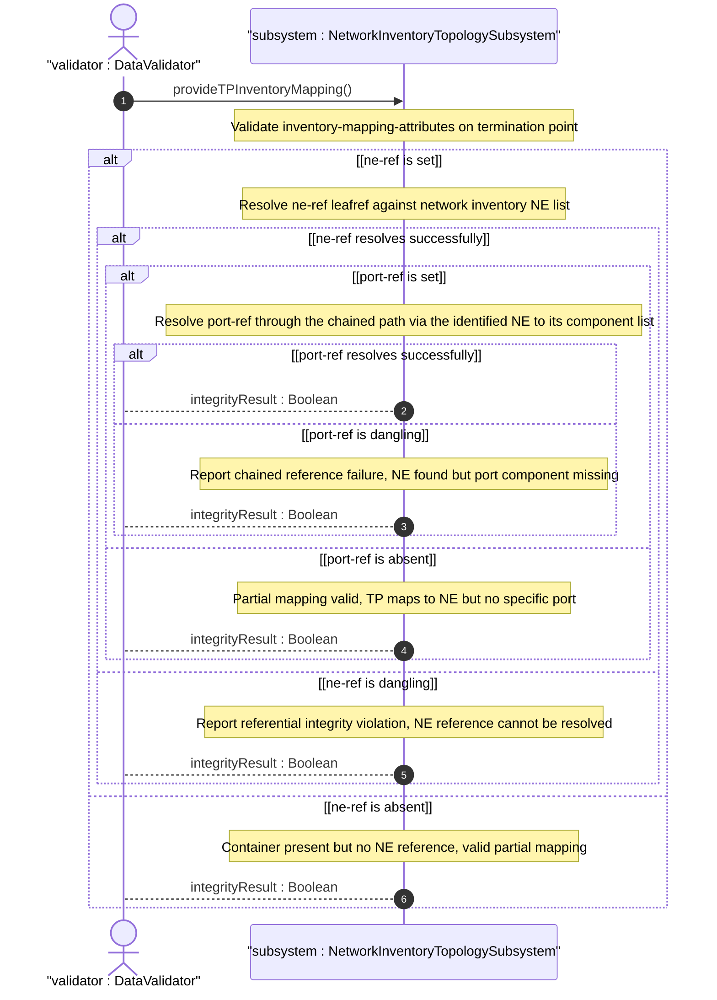
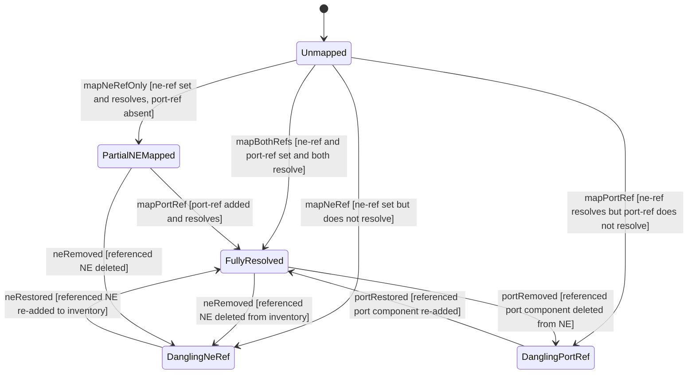

# User Story: Validate Chained Leafref Referential Integrity from TP to Port Component

## Parent Epic
- [ ] #86 - [ietf-network-inventory-topology: Network Inventory Topology Mapping](https://github.com/gintatkinson/3dgs-033/blob/main/docs/epics/epic-06-ietf-network-inventory-topology.md) (leafref integrity validation across the TP-to-port chained reference, draft Section 5, Section 6)

## Domain Object Mapping
- **Primary Domain Objects:** TerminationPoint, TPInventoryMappingAttributes, ne-ref, port-ref
- **Actor/Role:** DataValidator — the validation engine that verifies leafref constraints across the network inventory topology at commit time and during operational queries

## BDD Scenario (OOA/OOD Realization)

**As a** DataValidator
**I want to** verify that every TP inventory mapping reference resolves through a valid chain from ne-ref to port-ref to the target component
**So that** the topology-to-inventory correlation does not contain dangling references, which would cause incorrect resource allocation or navigation failures

**Given** a termination point with nwit:inventory-mapping-attributes present
**And** the ne-ref leaf points to a network element "NE-R1" that exists in the network inventory
**And** the port-ref leafref points to a component "eth-port-5" within that network element's component list
**When** the data tree is validated
**Then** the ne-ref resolves to a valid ne-id in /nwi:network-inventory/nwi:network-elements/nwi:network-element
**And** the port-ref resolves to a valid component-id within the components list of the network element identified by ne-ref
**And** both leafref constraints pass validation

**Given** a termination point with ne-ref pointing to an NE that has been removed from the inventory
**When** the data tree is validated or the TP detail is queried
**Then** the ne-ref leafref constraint fails
**And** the dangling reference is surfaced as a referential integrity error
**And** the error identifies the specific TP and the unresolvable NE reference

**Given** a termination point with a valid ne-ref but a port-ref that targets a component-id not present in the referenced NE's component list
**When** the data tree is validated
**Then** the port-ref leafref constraint fails
**And** the error is reported as a chained reference failure — the NE exists but the port component does not

**Given** a termination point with inventory-mapping-attributes present but ne-ref unset
**When** the data tree is validated
**Then** the container is valid (both leaves are optional)
**And** the TP has a partial mapping (associated with no NE, representing a logical TP within a physical network)

**Given** a termination point with inventory-mapping-attributes present and only ne-ref set (port-ref unset)
**When** the data tree is validated
**Then** the container is valid
**And** the TP maps to an NE but not to a specific port component
**And** the validator does not attempt to resolve the absent port-ref

## UML Sequence Diagram

## UML State Machine Diagram

## Operational Context

From draft-ietf-ivy-network-inventory-topology-08, Section 6:

> Operators should ensure leafref integrity between topology mapping references and the base network inventory — dangling references indicate stale or inconsistent data.

From the YANG module TP augment description:

> Reference to the physical port component in the network inventory. This reference establishes a 1:1 mapping between the logical TP and its physical port component.

From the YANG module node augment description:

> Reference to the NE in the inventory that corresponds to this topology node. This reference establishes a 1:1 mapping between the logical node and its physical NE.

From the Feature feat-28 constraints:

> port-ref: optional leaf of type leafref — must reference a component-id within the components list of the network element identified by ne-ref. Both ne-ref and port-ref must resolve to existing inventory entities at validation time.

## Required Features Matrix
- [ ] #84 - [Define Termination Point Inventory Mapping](https://github.com/gintatkinson/3dgs-033/blob/main/docs/features/feat-28-tp-inventory-mapping.md) (the ne-ref and port-ref leafrefs are defined here, and the chained reference path from TP through NE to port component originates from these two leaves)
- [ ] #82 - [Define Node Inventory Mapping Attributes](https://github.com/gintatkinson/3dgs-033/blob/main/docs/features/feat-26-node-inventory-mapping.md) (the same ne-ref leafref type and resolution semantics apply to node-level mapping, sharing the validation logic)
- [ ] #81 - [Define Inventory Topology Network Type](https://github.com/gintatkinson/3dgs-033/blob/main/docs/features/feat-25-inventory-topology-network-type.md) (the inventory-topology network type must be present for the TP inventory mapping augment to be valid and subject to leafref validation)

## Source References
Structural Schema: [ietf-network-inventory-topology.yang](https://github.com/ietf-ivy-wg/network-inventory-topology/blob/main/yang/ietf-network-inventory-topology.yang) (Clauses: TP augment lines 222-242, node augment lines 154-177)
Normative Specification: [draft-ietf-ivy-network-inventory-topology-08](https://datatracker.ietf.org/doc/html/draft-ietf-ivy-network-inventory-topology) (Section 5, Section 6)
