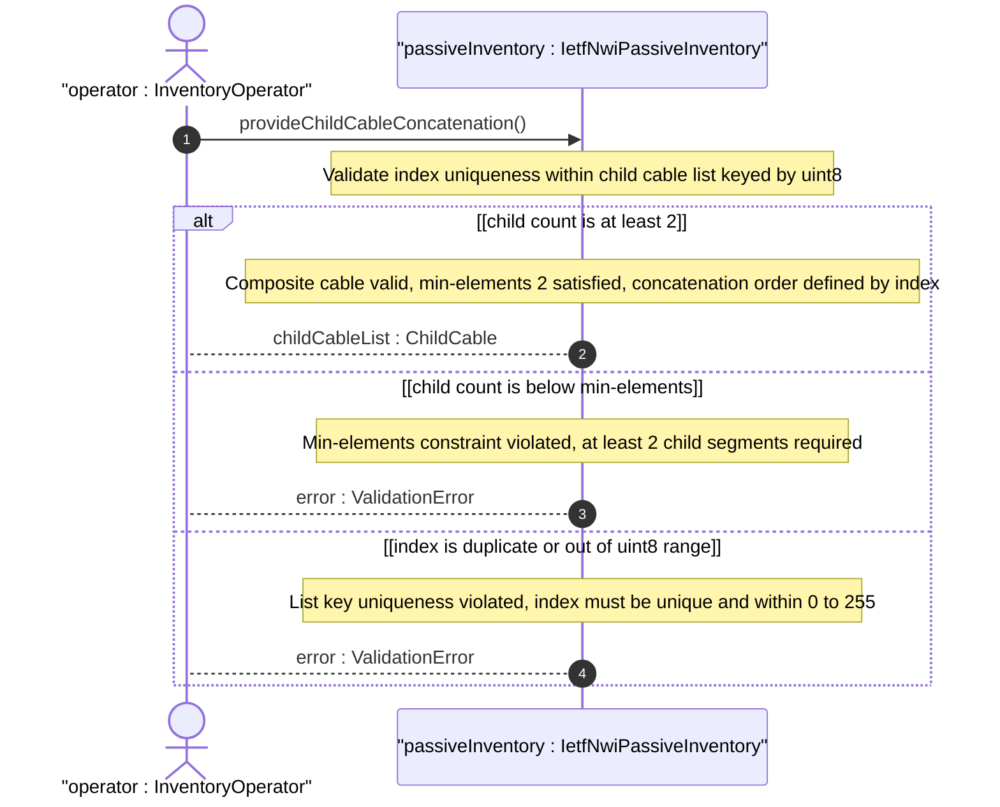
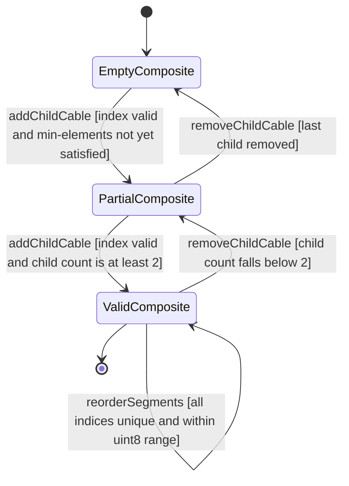

# User Story: Concatenate Child Cable Segments into Ordered Composite Cable

## Parent Epic
- [ ] #108 - [IETF NWI Passive Inventory](https://github.com/gintatkinson/3dgs-033/blob/main/docs/epics/epic-07-ietf-nwi-passive-inventory.md) (the child-cable list with ordered concatenation realizes the guiding media concatenation concept defined in Section 3.1 and Section 5)

## Domain Object Mapping
- **Primary Domain Objects:** Cable, ChildCable, AEnd, ZEnd, ConnectedDeviceType
- **Actor/Role:** InventoryOperator — the domain controller or operator provisioning composite cable routes that span multiple physical infrastructure segments

## BDD Scenario (OOA/OOD Realization)

**As an** InventoryOperator
**I want to** model a composite cable as an ordered concatenation of at least two child cable segments each carrying their own end-to-end device references
**So that** the physical cable path spanning joint boxes, splice points, and intermediate infrastructure transitions is represented as a single logically contiguous guiding medium

**Given** a parent cable with id "cable-composite-001" exists in the inventory
**And** the parent cable has cable-type "optical-fiber" and cable-role "backbone"
**When** the operator adds two child cables with index 1 (id "seg-fo-a", length 500, a-end connected to active NE "ne-core-01" port "port-1-1-1", z-end connected to passive joint-box "jb-street-5") and index 2 (id "seg-fo-b", length 600, a-end connected to joint-box "jb-street-5", z-end connected to active NE "ne-edge-02" port "port-1-1")
**Then** the composite cable is persisted with ordered child segments forming a continuous physical path from ne-core-01 through jb-street-5 to ne-edge-02
**And** child cable indices 1 and 2 define the concatenation order along the cable route

**Given** a parent cable with two child cable segments (indices 1 and 2)
**When** the operator attempts to delete child cable index 2
**Then** the operation is rejected because the child-cable list would contain only 1 entry, violating the min-elements 2 constraint

**Given** a parent cable with three child segments (indices 1, 2, 3)
**When** the operator reorders by reassigning index values so that segment 3 becomes index 2 and segment 2 becomes index 3
**Then** the reordering succeeds with no duplicate indices
**And** the concatenation order reflects the physical path sequence

**Given** a child cable with index 1
**When** the operator attempts to add another child cable also with index 1
**Then** the operation is rejected because index is the list key and must be unique

**Given** a child cable entry
**When** the operator attempts to set index to 256 (exceeding uint8 range)
**Then** the operation is rejected with a range validation error

## UML Sequence Diagram

## UML State Machine Diagram

## Operational Context

From draft-ygb-ivy-passive-network-inventory-05, Section 3.1 (Terminology):

> "Guiding media: refers to physical transmission pathways - such as optical fiber cables, electrical cables, and coaxial cables - that direct and confine electromagnetic signals along a specific route. ... Guiding media can be concatenated to form longer guiding media."

From Section 5 (YANG Model Overview):

> "Cables: a list of cables with each containing an optional list of child cables."

## Required Features Matrix
- [ ] #100 - [Define Cable Entity](https://github.com/gintatkinson/3dgs-033/blob/main/docs/features/feat-30-cable-entity.md) (the parent Cable entity provides the container for the child-cable list and the id, length, and type attributes inherited by child segments)
- [ ] #105 - [Define Child Cables](https://github.com/gintatkinson/3dgs-033/blob/main/docs/features/feat-35-child-cables.md) (the child-cable list with min-elements 2, index key, and ordering semantics are defined here — this is the primary structural feature for concatenation)
- [ ] #101 - [Define Cable A-End Connection](https://github.com/gintatkinson/3dgs-033/blob/main/docs/features/feat-31-cable-a-end-connection.md) (each child cable inherits a-end container from common-cable-attributes for the source connection endpoint)
- [ ] #102 - [Define Cable Z-End Connection](https://github.com/gintatkinson/3dgs-033/blob/main/docs/features/feat-32-cable-z-end-connection.md) (each child cable inherits z-end container from common-cable-attributes for the destination connection endpoint)
- [ ] #103 - [Define Connected Device Type Selector](https://github.com/gintatkinson/3dgs-033/blob/main/docs/features/feat-33-connected-device-type-selector.md) (the connected-device-type choice within each child cable's a-end and z-end selects between passive and active device references at segment boundaries)

## Source References
Structural Schema: [ietf-nwi-passive-inventory.yang](https://github.com/aguoietf/draft-ygb-ivy-passive-network-inventory/blob/main/yang/ietf-nwi-passive-inventory.yang) (Clause: grouping child-cables, list child-cable, lines 419-436)
Normative Specification: [draft-ygb-ivy-passive-network-inventory-05](https://datatracker.ietf.org/doc/draft-ygb-ivy-passive-network-inventory/) (Clause: Section 3.1, Section 5)
