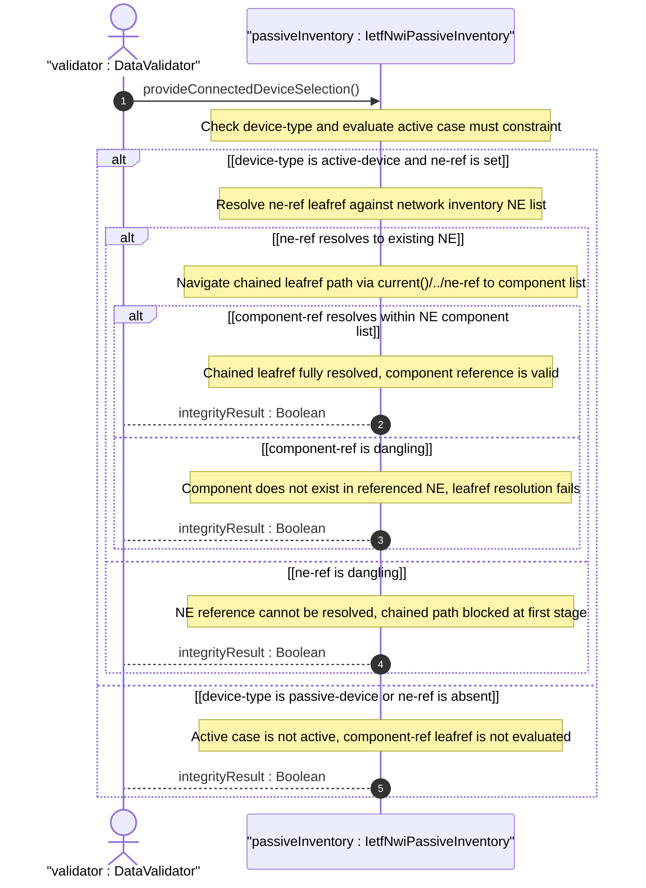
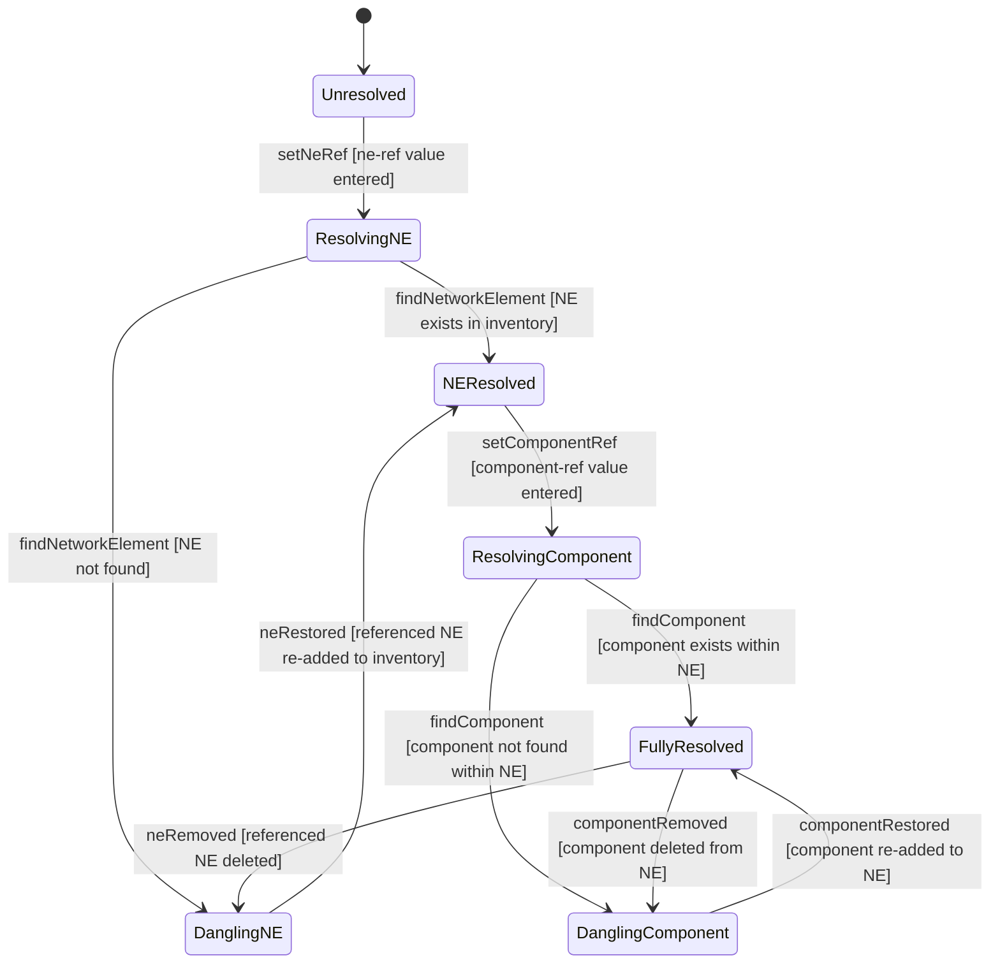

# User Story: Resolve Cascading Leafref Path for Active Device Component Reference

## Parent Epic
- [ ] #108 - [IETF NWI Passive Inventory](https://github.com/gintatkinson/3dgs-033/blob/main/docs/epics/epic-07-ietf-nwi-passive-inventory.md) (the component-ref leafref with chained path resolution via current() function realizes the active device connection endpoint defined in the connected-device-end grouping)

## Domain Object Mapping
- **Primary Domain Objects:** AEnd, ZEnd, ConnectedDeviceType, ActiveCase
- **Actor/Role:** DataValidator — the validation engine that resolves chained leafref paths at commit time and during operational queries

## BDD Scenario (OOA/OOD Realization)

**As a** DataValidator
**I want to** resolve the component-ref leafref through its chained path that navigates via ne-ref to the correct NE and then to its specific component
**So that** the connected active device's component reference is guaranteed to point to an existing port or component within the correct network element

**Given** a cable A-end has device-type "active-device" and ne-ref points to "ne-core-01"
**And** network element "ne-core-01" exists in the inventory with components including "port-eth-1-1-1"
**When** the operator sets component-ref to "port-eth-1-1-1"
**Then** the leafref path resolves by navigating from the component-ref leaf, evaluating current()/../ne-ref to "ne-core-01", locating the network element in the inventory, and verifying "port-eth-1-1-1" exists in that NE's component list
**And** the reference is validated and persisted

**Given** a cable Z-end has device-type "active-device" and ne-ref "ne-core-01"
**When** the operator sets component-ref to "port-nonexistent-99" which does not exist in ne-core-01's component list
**Then** the leafref resolution fails
**And** a validation error is returned indicating the component does not exist within the referenced network element

**Given** a cable has a valid ne-ref "ne-core-01" with a valid component-ref "port-eth-1-1-1"
**When** the referenced network element "ne-core-01" is removed from the inventory
**Then** the component-ref leafref becomes dangling
**And** the next validation cycle reports a chained reference integrity failure — the NE no longer exists so the chained path cannot resolve

**Given** a cable A-end has device-type "active-device" and ne-ref is set to a valid NE
**When** the operator does not set component-ref (leaving it absent)
**Then** the leafref path for component-ref is not evaluated because the leaf is optional
**And** the cable end connects to the NE but not to a specific component

## UML Sequence Diagram

## UML State Machine Diagram

## Operational Context

From draft-ygb-ivy-passive-network-inventory-05, the YANG module connected-device-end grouping, active case:

> The `component-ref` leafref uses the path expression `current()/../ne-ref` to resolve the target component within the correct network element's component list, establishing a chained referential integrity constraint.

From Section 8 (Security Considerations):

> Write operations (e.g., edit-config) to these data nodes without proper protection can have a negative effect on network operations.

## Required Features Matrix
- [ ] #103 - [Define Connected Device Type Selector](https://github.com/gintatkinson/3dgs-033/blob/main/docs/features/feat-33-connected-device-type-selector.md) (the active case with ne-ref and component-ref leafrefs and their must constraints define the structural references that this story resolves — the cascading leafref path is defined here)
- [ ] #101 - [Define Cable A-End Connection](https://github.com/gintatkinson/3dgs-033/blob/main/docs/features/feat-31-cable-a-end-connection.md) (the A-end container hosts the connected-device-type choice where the active case component-ref is validated)
- [ ] #102 - [Define Cable Z-End Connection](https://github.com/gintatkinson/3dgs-033/blob/main/docs/features/feat-32-cable-z-end-connection.md) (the Z-end container identically hosts the active case where the same cascading leafref resolution applies)
- [ ] #100 - [Define Cable Entity](https://github.com/gintatkinson/3dgs-033/blob/main/docs/features/feat-30-cable-entity.md) (the parent Cable entity provides the context for end-point connection references)

## Source References
Structural Schema: [ietf-nwi-passive-inventory.yang](https://github.com/aguoietf/draft-ygb-ivy-passive-network-inventory/blob/main/yang/ietf-nwi-passive-inventory.yang) (Clause: grouping connected-device-end, case active, leaf component-ref path expression, lines 305-329)
Normative Specification: [draft-ygb-ivy-passive-network-inventory-05](https://datatracker.ietf.org/doc/draft-ygb-ivy-passive-network-inventory/) (Clause: Section 6.1, Section 8)
