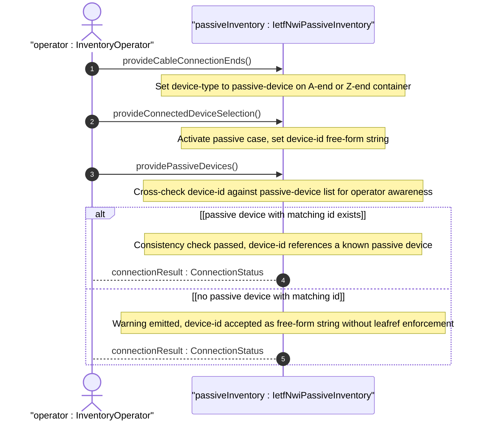
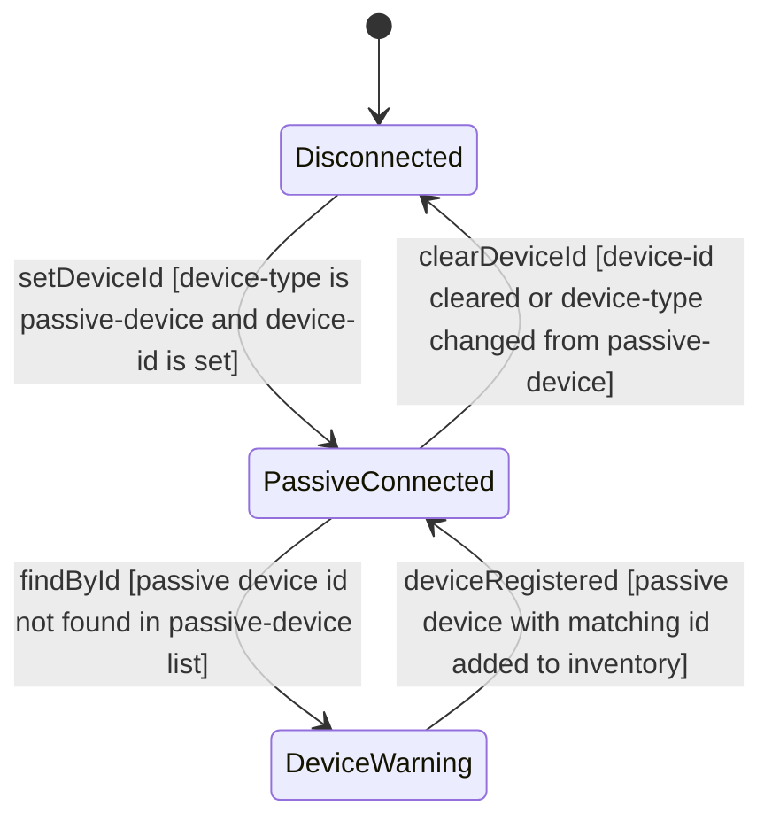

# User Story: Connect Cable End to Passive Device by Device Identifier

## Parent Epic
- [ ] #108 - [IETF NWI Passive Inventory](https://github.com/gintatkinson/3dgs-033/blob/main/docs/epics/epic-07-ietf-nwi-passive-inventory.md) (the passive case of the connected-device-type choice enables cable-to-passive-device connections as described in Section 3.1 terminology)

## Domain Object Mapping
- **Primary Domain Objects:** AEnd, ZEnd, ConnectedDeviceType, PassiveCase, PassiveDevice
- **Actor/Role:** InventoryOperator — the operator provisioning cable-to-passive-device connections in the physical infrastructure

## BDD Scenario (OOA/OOD Realization)

**As an** InventoryOperator
**I want to** connect a cable end to a passive device using its unique device identifier
**So that** the physical cable termination point on a passive device such as an ODF, splitter, or fiber access terminal is recorded in the inventory topology

**Given** a cable with id "cable-fo-001" exists in the inventory
**And** a passive device with id "odf-central-office-01" of type ODF is registered in the passive-device list
**When** the operator sets the cable's A-end device-type to "passive-device" and enters device-id "odf-central-office-01"
**Then** the cable A-end is connected to the passive device ODF-central-office-01
**And** the passive case of the connected-device-type choice is active with device-id persisted

**Given** a cable A-end has device-type "passive-device" and device-id "splitter-outdoor-05"
**When** the operator queries the cable end connection
**Then** the passive device identifier "splitter-outdoor-05" is returned
**And** the active case fields (ne-ref, component-ref) are absent because only one choice case is valid at a time

**Given** a cable A-end has device-type "active-device"
**When** the operator attempts to set device-id "odf-co-01" in the passive case
**Then** the operation is rejected because the must constraint requires device-type to be "passive-device" when device-id is present
**And** the cross-validation error identifies the type mismatch

**Given** a cable Z-end is configured with device-type "passive-device" and device-id "fdt-cabinet-12"
**When** the referenced passive device "fdt-cabinet-12" is deleted from the passive-device list
**Then** the device-id reference becomes a dangling string reference because device-id is a free-form string type, not a leafref
**And** the inventory operator is responsible for maintaining consistency between device-id values and the passive-device list

**Given** a cable end Z-end has device-type "passive-device"
**When** the operator sets the device-id to refer to a passive device in the inventory and also configures the parent cable's optical-cable attributes with fiber-type "G652D"
**Then** the cable models a fiber optic cable segment terminating at a passive optical distribution frame with configured optical properties

## UML Sequence Diagram

## UML State Machine Diagram

## Operational Context

From draft-ygb-ivy-passive-network-inventory-05, Section 3.1 (Terminology):

> "Passive device: refers to a physical device within a network that does not require external power to function, and simply manipulates signals through processes like transmission, reflection, splitting, filtering, or attenuation without actively amplifying or generating the signal. Examples include optical fibers, splitters, couplers, and optical filters, all of which are used to direct signals within a system without needing power."

From Section 1 (Introduction):

> "Passive infrastructure serves as physical connections between active network devices, forming the backbone for network topology."

## Required Features Matrix
- [ ] #103 - [Define Connected Device Type Selector](https://github.com/gintatkinson/3dgs-033/blob/main/docs/features/feat-33-connected-device-type-selector.md) (the passive case with device-id and its must constraint define the structural reference that this story uses for the passive connection)
- [ ] #101 - [Define Cable A-End Connection](https://github.com/gintatkinson/3dgs-033/blob/main/docs/features/feat-31-cable-a-end-connection.md) (the A-end container hosts the connected-device-type choice where the passive case device-id is set)
- [ ] #102 - [Define Cable Z-End Connection](https://github.com/gintatkinson/3dgs-033/blob/main/docs/features/feat-32-cable-z-end-connection.md) (the Z-end container identically hosts the passive case for the destination connection)
- [ ] #106 - [Define Passive Device Entity](https://github.com/gintatkinson/3dgs-033/blob/main/docs/features/feat-36-passive-device-entity.md) (the passive-device list defines the entities that device-id references, providing the target domain for cable-to-passive-device connections)
- [ ] #100 - [Define Cable Entity](https://github.com/gintatkinson/3dgs-033/blob/main/docs/features/feat-30-cable-entity.md) (the parent Cable entity provides the context for end-point passive device connections)

## Source References
Structural Schema: [ietf-nwi-passive-inventory.yang](https://github.com/aguoietf/draft-ygb-ivy-passive-network-inventory/blob/main/yang/ietf-nwi-passive-inventory.yang) (Clause: grouping connected-device-end, case passive, leaf device-id, lines 296-304)
Normative Specification: [draft-ygb-ivy-passive-network-inventory-05](https://datatracker.ietf.org/doc/draft-ygb-ivy-passive-network-inventory/) (Clause: Section 1, Section 3.1)
