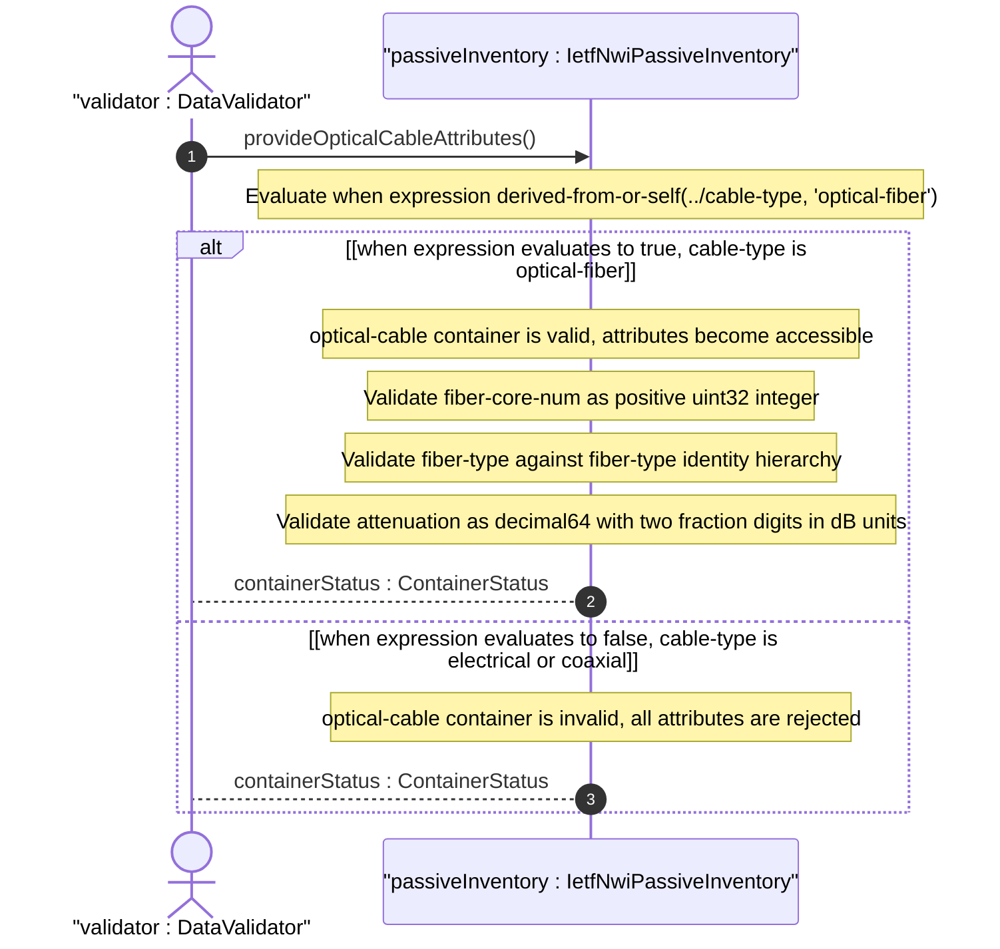
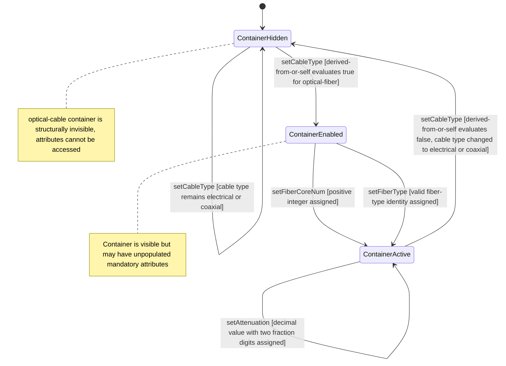

# User Story: Conditionally Activate Optical Cable Attributes Based on Cable Type

## Parent Epic
- [ ] #108 - [IETF NWI Passive Inventory](https://github.com/gintatkinson/3dgs-033/blob/main/docs/epics/epic-07-ietf-nwi-passive-inventory.md) (the when expression on the optical-cable container enforces conditional attribute activation described in the optical-cable-attributes grouping)

## Domain Object Mapping
- **Primary Domain Objects:** Cable, OpticalCable
- **Actor/Role:** DataValidator — the validation engine that evaluates the when expression at data tree validation time

## BDD Scenario (OOA/OOD Realization)

**As a** DataValidator
**I want to** conditionally enable the optical-cable container and its attributes only when the parent cable-type is optical-fiber
**So that** optical-specific attributes such as fiber core count, fiber type, and attenuation are valid only for fiber optic cables and never appear for electrical or coaxial cables

**Given** a cable has cable-type set to "optical-fiber"
**When** the operator populates the optical-cable container with fiber-core-num 96, fiber-type "G652D", and attenuation 0.22
**Then** the when expression evaluates to true because `derived-from-or-self(../cable-type, 'optical-fiber')` matches
**And** the optical-cable container is valid and its attributes are persisted

**Given** a cable has cable-type set to "electrical-cable"
**When** the operator attempts to populate the optical-cable container with fiber-core-num 48
**Then** the when expression evaluates to false
**And** the optical-cable container is invalid and cannot contain fiber-core-num, fiber-type, or attenuation values

**Given** a cable has cable-type "optical-fiber" with optical-cable attributes configured (fiber-core-num 48, fiber-type "G657A1")
**When** the operator changes the cable-type from "optical-fiber" to "coaxial-cable"
**Then** the when expression re-evaluates to false
**And** the optical-cable container is removed from the data tree
**And** the previously stored optical attributes are discarded

**Given** a cable has cable-type "electrical-cable" with no optical-cable container
**When** the operator changes cable-type to "optical-fiber"
**Then** the when expression re-evaluates to true
**And** the optical-cable container becomes available
**And** the operator may now populate fiber-core-num, fiber-type, and attenuation

**Given** a cable with cable-type "optical-fiber" and an optical-cable container
**When** the operator queries the cable detail
**Then** the optical-cable container is returned with its three attributes
**And** the container is annotated as conditionally valid based on the when expression

## UML Sequence Diagram

## UML State Machine Diagram

## Operational Context

From draft-ygb-ivy-passive-network-inventory-05, Section 3.1 (Terminology):

> "Optical Cable: refers to a type of guiding media that uses optical fiber as media to transmit optical signals. An optical cable can contain one or multiple fiber cores, also known as fiber strands, each serving as an independent guiding media for data transmission."

From Section 2.1 (Passive Infrastructure in Optical Transport Networks):

> "Passive infrastructure in optical transport networks serves as the backbone for high-capacity data transmission. Key components include fiber optic cables, which act as the primary medium of long distance transmission."

From the YANG module optical-cable-attributes grouping:

> The `when "derived-from-or-self(../cable-type, 'optical-fiber')"` expression ensures the optical-cable container is only valid when the parent cable's cable-type identity derives from optical-fiber.

## Required Features Matrix
- [ ] #104 - [Define Optical Cable Attributes](https://github.com/gintatkinson/3dgs-033/blob/main/docs/features/feat-34-optical-cable-attributes.md) (the optical-cable container, its when expression, and the fiber-core-num, fiber-type, and attenuation attributes are defined here as the structural features that this story dynamically enables)
- [ ] #100 - [Define Cable Entity](https://github.com/gintatkinson/3dgs-033/blob/main/docs/features/feat-30-cable-entity.md) (the cable-type identityref on the parent Cable entity is the predicate that the when expression evaluates against)

## Source References
Structural Schema: [ietf-nwi-passive-inventory.yang](https://github.com/aguoietf/draft-ygb-ivy-passive-network-inventory/blob/main/yang/ietf-nwi-passive-inventory.yang) (Clause: grouping optical-cable-attributes, container optical-cable, when expression, lines 366-395)
Normative Specification: [draft-ygb-ivy-passive-network-inventory-05](https://datatracker.ietf.org/doc/draft-ygb-ivy-passive-network-inventory/) (Clause: Section 2.1, Section 3.1)
