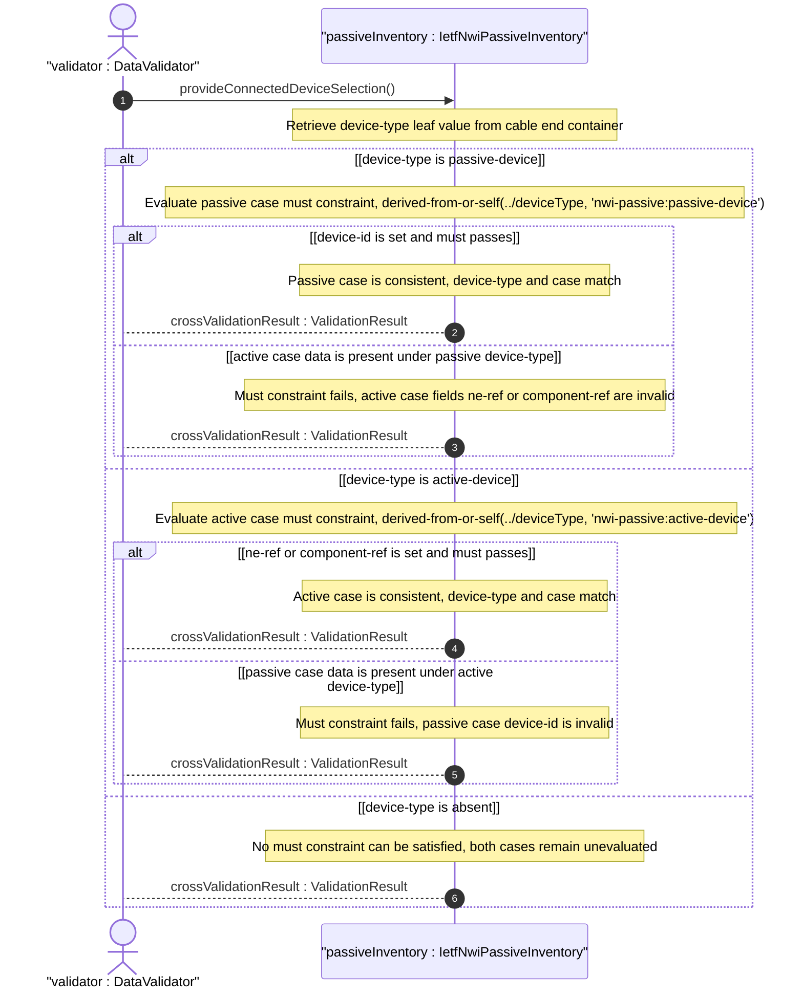
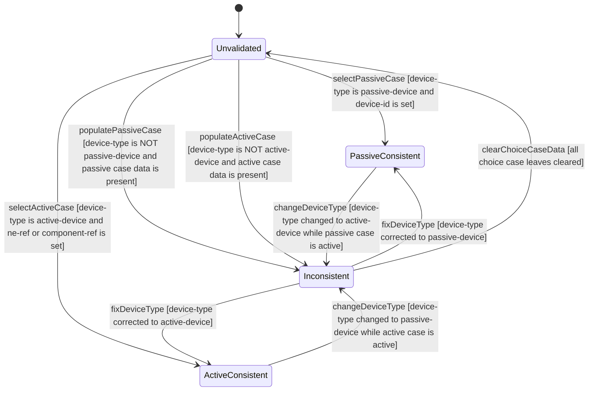

# User Story: Cross-Validate Connected Device Type with Choice Case Selection

## Parent Epic
- [ ] #108 - [IETF NWI Passive Inventory](https://github.com/gintatkinson/3dgs-033/blob/main/docs/epics/epic-07-ietf-nwi-passive-inventory.md) (the must constraints on the passive and active choice cases enforce device-type-to-case consistency defined in the connected-device-end grouping)

## Domain Object Mapping
- **Primary Domain Objects:** AEnd, ZEnd, ConnectedDeviceType, PassiveCase, ActiveCase
- **Actor/Role:** DataValidator — the validation engine that enforces the must constraint expressions cross-referencing the device-type leaf against the active choice case at commit time

## BDD Scenario (OOA/OOD Realization)

**As a** DataValidator
**I want to** enforce that the selected choice case is always consistent with the declared device-type classification
**So that** a cable end cannot simultaneously declare itself connected to an active device while holding a passive device identifier, preventing data inconsistency between the type declaration and the reference fields

**Given** a cable A-end has device-type set to "active-device"
**When** the operator populates the active case with ne-ref "ne-core-01" and component-ref "port-1-1-1"
**Then** the must constraint `derived-from-or-self(../device-type, 'nwi-passive:active-device')` is satisfied
**And** both ne-ref and component-ref are persisted

**Given** a cable Z-end has device-type set to "active-device"
**When** the operator attempts to populate the passive case with device-id "splitter-03"
**Then** the must constraint `derived-from-or-self(../device-type, 'nwi-passive:passive-device')` on the passive case fails
**And** the passive case data is rejected because device-type does not derive from passive-device

**Given** a cable A-end has device-type set to "passive-device"
**When** the operator populates the passive case with device-id "odf-co-01"
**Then** the must constraint `derived-from-or-self(../device-type, 'nwi-passive:passive-device')` is satisfied
**And** the device-id is persisted

**Given** a cable A-end has device-type set to "passive-device"
**When** the operator attempts to populate the active case with ne-ref "ne-core-01"
**Then** the must constraint `derived-from-or-self(../device-type, 'nwi-passive:active-device')` on the active case fails
**And** the active case data is rejected because device-type does not derive from active-device

**Given** a cable end has no device-type set
**When** the operator attempts to populate either the passive case with device-id or the active case with ne-ref
**Then** the corresponding must constraint fails because `derived-from-or-self` cannot match an absent device-type to either identity

**Given** a cable end with consistent device-type and case selection
**When** the operator changes device-type from "active-device" to "passive-device" while the active case is populated
**Then** the active case must constraint is re-evaluated
**And** the active case data becomes invalid because device-type no longer derives from active-device
**And** the previously stored ne-ref and component-ref values are rejected

## UML Sequence Diagram

## UML State Machine Diagram

## Operational Context

From draft-ygb-ivy-passive-network-inventory-05, Section 1 (Introduction):

> "[I-D.ietf-ivy-network-inventory-yang] incorporates the component concept from [RFC8348] to detail the equipment and holder information of a NE. ... the passive devices that cannot be discovered by the NE are thus not included in the modeling and needs to be addressed."

The `must` constraints ensure that when a cable end declares itself connected to a passive device, it can only hold a passive device identifier, and when it declares connection to an active device, it can only hold NE and component references.

## Required Features Matrix
- [ ] #103 - [Define Connected Device Type Selector](https://github.com/gintatkinson/3dgs-033/blob/main/docs/features/feat-33-connected-device-type-selector.md) (the connected-device-type choice with its passive and active cases and their must constraints are defined here — this is the primary structural feature that this story's cross-validation behavior enforces)
- [ ] #101 - [Define Cable A-End Connection](https://github.com/gintatkinson/3dgs-033/blob/main/docs/features/feat-31-cable-a-end-connection.md) (the A-end container hosts the device-type leaf and connected-device-type choice where cross-validation is performed)
- [ ] #102 - [Define Cable Z-End Connection](https://github.com/gintatkinson/3dgs-033/blob/main/docs/features/feat-32-cable-z-end-connection.md) (the Z-end container provides the identical cross-validation context for the destination connection end)
- [ ] #100 - [Define Cable Entity](https://github.com/gintatkinson/3dgs-033/blob/main/docs/features/feat-30-cable-entity.md) (the parent Cable entity provides the structural context for end-point consistency validation)

## Source References
Structural Schema: [ietf-nwi-passive-inventory.yang](https://github.com/aguoietf/draft-ygb-ivy-passive-network-inventory/blob/main/yang/ietf-nwi-passive-inventory.yang) (Clause: grouping connected-device-end, case passive must expression, case active must expression, lines 283-331)
Normative Specification: [draft-ygb-ivy-passive-network-inventory-05](https://datatracker.ietf.org/doc/draft-ygb-ivy-passive-network-inventory/) (Clause: Section 1)
