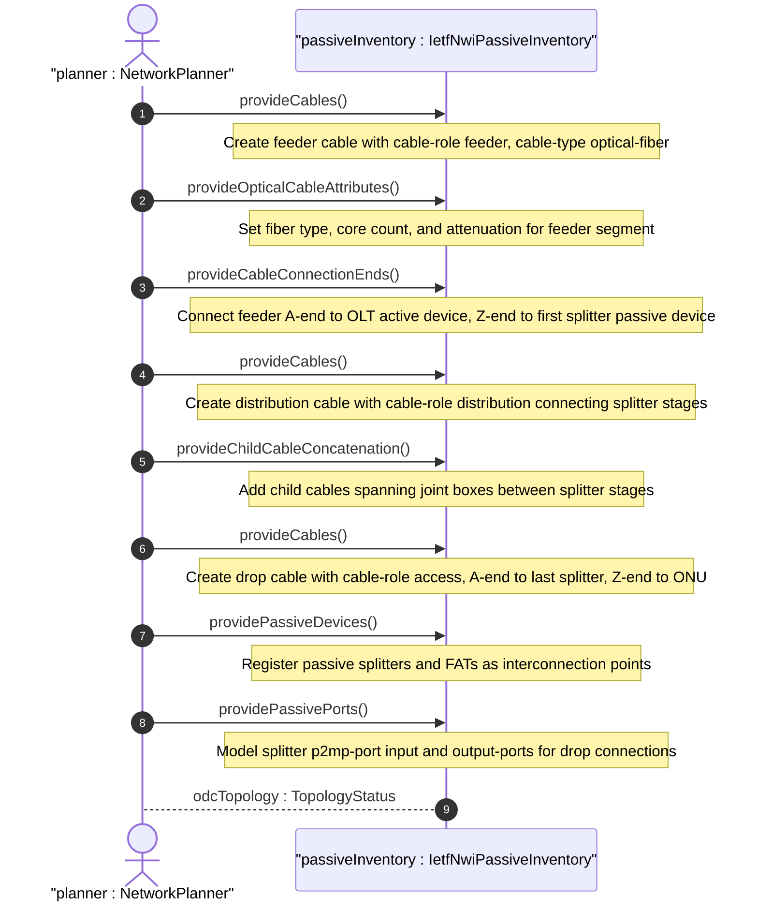
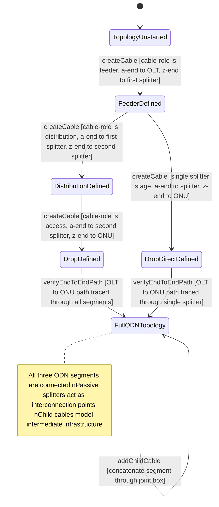

# User Story: Model PON ODN Feeder-Distribution-Drop Cable Topology

## Parent Epic
- [ ] #108 - [IETF NWI Passive Inventory](https://github.com/gintatkinson/3dgs-033/blob/main/docs/epics/epic-07-ietf-nwi-passive-inventory.md) (the cable and child-cable structures realize the PON ODN feeder-distribution-drop topology described in Section 2.2)

## Domain Object Mapping
- **Primary Domain Objects:** Cable, ChildCable, OpticalCable, AEnd, ZEnd, PassiveDevice, PassivePort
- **Actor/Role:** NetworkPlanner — the operator designing and provisioning passive optical distribution network segments connecting OLT to ONU through cascaded splitters

## BDD Scenario (OOA/OOD Realization)

**As a** NetworkPlanner
**I want to** model a PON Optical Distribution Network as concatenated cables representing feeder, distribution, and drop segments connected through passive optical splitters
**So that** the end-to-end physical fiber path from OLT at the central office through cascaded splitters in the field to the ONU at the subscriber location is fully represented in the passive inventory

**Given** the network inventory has an OLT network element "ne-olt-01" and an ONU network element "ne-onu-subscriber-a"
**When** the operator creates a feeder cable "cable-feeder-001" with cable-role "feeder", cable-type "optical-fiber", a-end connected to active device ne-olt-01 port "pon-port-1", and z-end connected to passive device "splitter-stage1"
**And** creates a distribution cable "cable-distribution-001" with cable-role "distribution", cable-type "optical-fiber", a-end connected to passive device "splitter-stage1" output port, and z-end connected to passive device "splitter-stage2"
**And** creates a drop cable "cable-drop-001" with cable-role "access", cable-type "optical-fiber", a-end connected to passive device "splitter-stage2", and z-end connected to active device ne-onu-subscriber-a port "pon-ont-1"
**Then** the three cables form a complete ODN topology representing the optical path from OLT to ONU through two splitter stages
**And** each cable segment independently carries its optical-cable attributes (fiber type, core count, attenuation)

**Given** a feeder cable "cable-feeder-001" spans a long distance passing through a joint box
**When** the operator models the feeder cable with two concatenated child cables: child cable index 1 (a-end at ne-olt-01, z-end at joint-box "jb-street-1") and child cable index 2 (a-end at joint-box "jb-street-1", z-end at passive device "splitter-stage1")
**Then** the composite feeder cable correctly models the physical path including the intermediate joint infrastructure

**Given** the full ODN topology is provisioned with feeder, distribution, and drop cables
**And** the drop cable connects to a passive device "fat-outdoor-01" of type FAT via its a-end
**When** the operator queries the FAT passive device
**Then** the FAT shows its hosted passive ports available for drop cable terminations
**And** the cable inventory shows the drop cable connected to the FAT

**Given** a PON ODN with cascaded splitters
**When** the operator provisions the optical splitter as a passive device with device-type "WDM" (or as a dedicated splitter type) and populates its passive-port list with one p2mp-port (input) and multiple output-ports
**Then** the splitter's point-to-multipoint optical splitting topology is represented in the passive device and port inventory

## UML Sequence Diagram

## UML State Machine Diagram

## Operational Context

From draft-ygb-ivy-passive-network-inventory-05, Section 2.2 (Passive Infrastructure in Optical Access Networks):

> "Passive Optical Networks (PONs) are a typical type of optical access network with significant passive infrastructure. The passive infrastructure in PON, often referred to as Optical Distribution Network (ODN), is the physical optical fiber-based network that connects the Optical Line Terminal (OLT) typically hosted in a central office to the Optical Network Unit/Terminal (ONU/ONT) typically deployed at the user's location."

> "The feeder segment of an ODN refers to the cabling between the OLT and the first splitter, whereas the distribution segment of the ODN comprises the fiber cabling between the first and second splitter stage. The drop segment comprises the drop fibers between the ONT/ONU and the second splitter stage."

> "The PON ODN hence comprises optical fiber cables and splitters but also many auxiliary components, such as connectors, fiber distribution terminals (FDT), fiber access terminals (FAT), wavelength co-existence elements, etc."

## Required Features Matrix
- [ ] #100 - [Define Cable Entity](https://github.com/gintatkinson/3dgs-033/blob/main/docs/features/feat-30-cable-entity.md) (the Cable entity with its cable-type and cable-role attributes is the foundational structure for modeling each ODN segment as a distinct cable with a topology role)
- [ ] #104 - [Define Optical Cable Attributes](https://github.com/gintatkinson/3dgs-033/blob/main/docs/features/feat-34-optical-cable-attributes.md) (each PON segment is an optical-fiber cable carrying fiber-type, core count, and attenuation attributes)
- [ ] #105 - [Define Child Cables](https://github.com/gintatkinson/3dgs-033/blob/main/docs/features/feat-35-child-cables.md) (child cable concatenation supports modeling of feeder/distribution/drop cables that span joint boxes, splice enclosures, and intermediate cabinets)
- [ ] #101 - [Define Cable A-End Connection](https://github.com/gintatkinson/3dgs-033/blob/main/docs/features/feat-31-cable-a-end-connection.md) (each segment's A-end connects to the source device — OLT at the feeder A-end, splitter at the distribution A-end, splitter at the drop A-end)
- [ ] #102 - [Define Cable Z-End Connection](https://github.com/gintatkinson/3dgs-033/blob/main/docs/features/feat-32-cable-z-end-connection.md) (each segment's Z-end connects to the destination device — splitter at feeder Z-end, second splitter at distribution Z-end, ONU at drop Z-end)
- [ ] #103 - [Define Connected Device Type Selector](https://github.com/gintatkinson/3dgs-033/blob/main/docs/features/feat-33-connected-device-type-selector.md) (the device-type choice at each cable end distinguishes between active OLT/ONU connections and passive splitter/FDT/FAT connections)
- [ ] #106 - [Define Passive Device Entity](https://github.com/gintatkinson/3dgs-033/blob/main/docs/features/feat-36-passive-device-entity.md) (passive splitters, FDTs, and FATs are modeled as passive devices serving as interconnection points between ODN segments)
- [ ] #107 - [Define Passive Port](https://github.com/gintatkinson/3dgs-033/blob/main/docs/features/feat-37-passive-port.md) (splitter passive-port entries model the point-to-multipoint port configuration with p2mp-port input and individual output-ports)

## Source References
Structural Schema: [ietf-nwi-passive-inventory.yang](https://github.com/aguoietf/draft-ygb-ivy-passive-network-inventory/blob/main/yang/ietf-nwi-passive-inventory.yang) (Full module, lines 1-522)
Normative Specification: [draft-ygb-ivy-passive-network-inventory-05](https://datatracker.ietf.org/doc/draft-ygb-ivy-passive-network-inventory/) (Clause: Section 2.2, Section 5)
