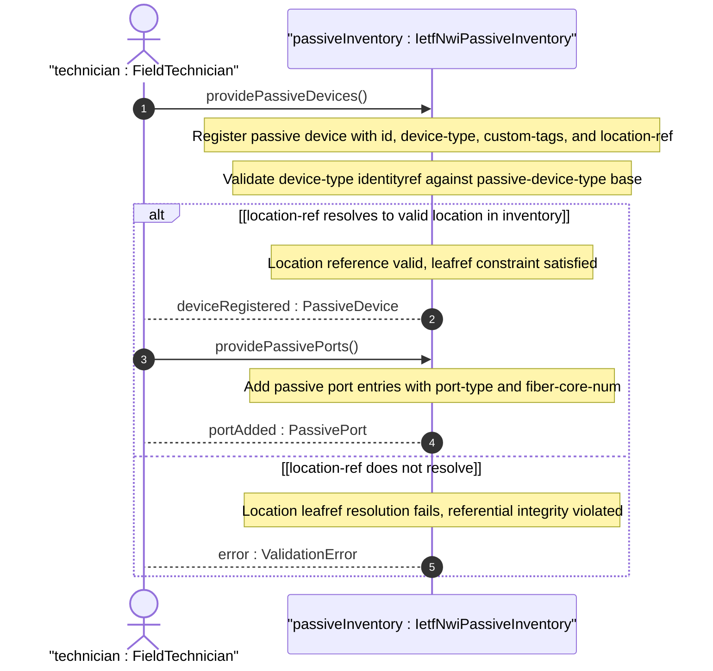
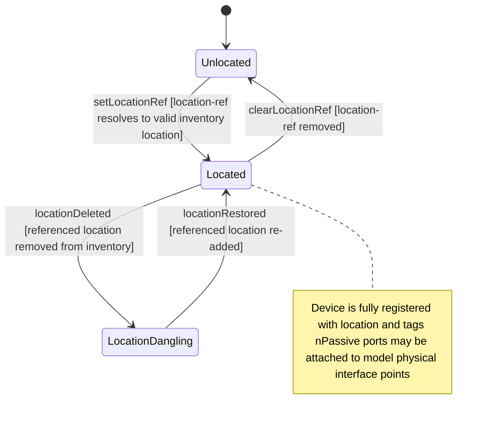

# User Story: Inventory Passive Device with Identification Tags and Location Reference

## Parent Epic
- [ ] #108 - [IETF NWI Passive Inventory](https://github.com/gintatkinson/3dgs-033/blob/main/docs/epics/epic-07-ietf-nwi-passive-inventory.md) (the passive-device list with custom-tags and location-ref provides the physical infrastructure inventory capability described in Section 1 and Section 5)

## Domain Object Mapping
- **Primary Domain Objects:** PassiveDevice, PassivePort
- **Actor/Role:** FieldTechnician — the operator performing physical site surveys and registering passive devices found at deployment locations

## BDD Scenario (OOA/OOD Realization)

**As a** FieldTechnician
**I want to** register a passive device in the inventory with its device type, custom identification tags such as RFID or QR codes, and a reference to its physical deployment location
**So that** all non-powered infrastructure components deployed in the field are tracked with their location and can be identified by their attached physical tags

**Given** the passive device list is empty
**And** a location "loc-equipment-room-3a" exists in the network inventory location model
**When** the technician registers a new passive device with id "odf-central-office-01", device-type "ODF", custom-tags ["RFID-8844-9921", "QR-ODF-CO-01"], and location-ref pointing to "loc-equipment-room-3a"
**Then** the passive device is persisted with all attributes
**And** the device is displayed in the inventory with its type classification, location reference, and tag count

**Given** a passive device "odf-co-01" exists with custom-tags ["RFID-001", "QR-001"]
**When** the technician scans a new QR code and adds custom-tag "QR-002"
**Then** the tag is appended to the leaf-list
**And** the device now carries three custom identification tags

**Given** a passive device has custom-tags ["RFID-001", "QR-001"]
**When** the technician removes the RFID tag "RFID-001"
**Then** the tag is removed from the leaf-list
**And** only "QR-001" remains

**Given** a passive device "fdt-cabinet-12" has location-ref pointing to "loc-street-corner-5"
**When** the location "loc-street-corner-5" is deleted from the location inventory
**Then** the location-ref leafref becomes dangling because it can no longer resolve
**And** the next validation cycle reports a referential integrity failure

**Given** a passive device with device-type "FAT" and location-ref "loc-pole-utility-7"
**When** the technician also adds passive ports to the device including a service-port for customer drop connections
**Then** the FAT device with its ports and location represents a complete field-deployed fiber access terminal ready for service provisioning

**Given** the passive device list contains multiple devices at different locations
**When** the technician queries devices filtered by location-ref "loc-central-office-b1"
**Then** all passive devices deployed at that location are returned
**And** the technician can browse the physical infrastructure at that site

## UML Sequence Diagram

## UML State Machine Diagram

## Operational Context

From draft-ygb-ivy-passive-network-inventory-05, Section 1 (Introduction):

> "Passive infrastructure refers to the underlying infrastructure of a telecommunication network that is not actively detectable or manageable. It typically includes non-powered, non-communicating devices and components, such as cabinets, cables, connectors, splitters, antennas, distribution frames, etc., that are either hosted within an actively managed device or deployed along the physical pathway between active devices."

> "[I-D.ietf-ivy-network-inventory-location] emphasizes the relative and geographic location, e.g. equipment room, geo-loation for NE. A passive device is deployed in a certain location visible by the operator, and thus can reference the location defined by [I-D.ietf-ivy-network-inventory-location]."

From Section 5 (YANG Model Overview):

> "Passive devices: a list of passive devices with extended attributed reported by the domain controller."

## Required Features Matrix
- [ ] #106 - [Define Passive Device Entity](https://github.com/gintatkinson/3dgs-033/blob/main/docs/features/feat-36-passive-device-entity.md) (the passive-device list with its id, device-type, custom-tags leaf-list, and location-ref leafref are defined here as the primary structural feature for this inventory behavior)
- [ ] #107 - [Define Passive Port](https://github.com/gintatkinson/3dgs-033/blob/main/docs/features/feat-37-passive-port.md) (the passive-port list hosted on each passive device provides the port-level interface points that a field technician configures after registering the device)

## Source References
Structural Schema: [ietf-nwi-passive-inventory.yang](https://github.com/aguoietf/draft-ygb-ivy-passive-network-inventory/blob/main/yang/ietf-nwi-passive-inventory.yang) (Clause: grouping passive-devices, list passive-device, leaf-list custom-tags, leaf location-ref, grouping passive-device-ports, lines 478-511)
Normative Specification: [draft-ygb-ivy-passive-network-inventory-05](https://datatracker.ietf.org/doc/draft-ygb-ivy-passive-network-inventory/) (Clause: Section 1, Section 5)
