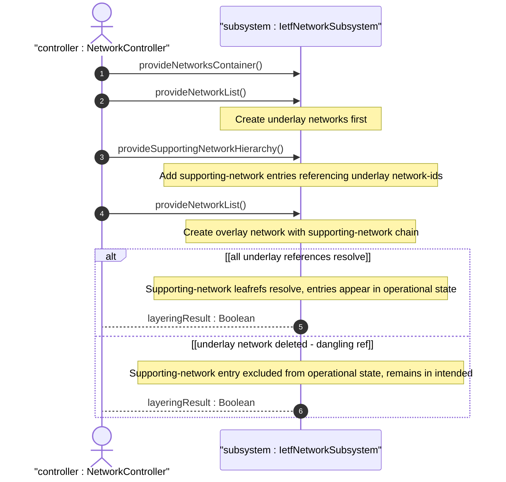

# User Story: Configure Underlay-Overlay Network Stacking via Supporting-Network Chain

## Parent Epic
- [ ] #124 - [ietf-network: Base Network Data Model](https://github.com/gintatkinson/3dgs-033/blob/main/docs/epics/epic-08-ietf-network.md) (hierarchical network layering via supporting-network list, clause 4.1 and 4.4.2)

## Domain Object Mapping
- **Primary Domain Objects:** Networks, Network, SupportingNetwork, network-id, network-ref
- **Actor/Role:** NetworkController — the SDN controller or management application that configures overlay networks stacked on underlay networks

## BDD Scenario (OOA/OOD Realization)

**As a** NetworkController
**I want to** configure an overlay network with supporting-network entries referencing its underlay networks
**So that** the network stack hierarchy is explicitly modeled and network-type-specific augmentations can conditionally apply based on the layered structure

**Given** an empty datastore with the ietf-network module initialized
**And** two underlay networks exist — "physical-transport" and "core-l3-igp"
**When** the controller creates an overlay network "vpn-overlay" with supporting-network entries referencing "physical-transport" and "core-l3-igp"
**Then** the overlay network appears with two supporting-network list entries
**And** each supporting-network/network-ref resolves to the corresponding underlay network-id
**And** the layering hierarchy is established in the operational state datastore

**Given** an overlay network with a supporting-network reference to "core-l3-igp"
**When** the referenced underlay network "core-l3-igp" is deleted from the network list
**Then** the supporting-network entry referencing it is excluded from the operational state datastore
**And** the entry persists in the intended datastore as a dangling reference
**And** all dependent supporting-node entries under the overlay network that chain through this underlay reference are also excluded from operational state

**Given** an overlay network with no supporting-network entries
**When** the controller queries the network's supporting-network list
**Then** the list is empty
**And** the network is identified as a root-level standalone network with no underlay dependencies

## UML Sequence Diagram

## Operational Context

From the IETF Network Topologies YANG Data Model specification, Section 4.1 (Base Network Model):

"A network can in turn be part of a hierarchy of networks, building on top of other networks. Any such networks are captured in the list 'supporting-network'. A supporting network is, in effect, an underlay network."

From the IETF Network Topologies YANG Data Model specification, Section 4.4.2 (Underlay Hierarchies and Mappings):

"To minimize assumptions regarding what a particular entity might actually represent, mappings between networks, nodes, links, and termination points are kept strictly generic."

From the IETF Network Topologies YANG Data Model specification, Section 4.4.3 (Dealing with Changes in Underlay Networks):

"It is possible for a network to undergo churn even as other networks are layered on top of it. When a supporting node, link, or termination point is deleted, the supporting leafrefs in the overlay will be left dangling. To allow for this possibility, the data model makes use of the 'require-instance' construct of YANG 1.1."

## Required Features Matrix
- [ ] #126 - [Define Networks Root Container](https://github.com/gintatkinson/3dgs-033/blob/main/docs/features/feat-38-networks-container.md) (top-level container anchoring the network list, entry point for all network instances)
- [ ] #127 - [Define Network List Entry](https://github.com/gintatkinson/3dgs-033/blob/main/docs/features/feat-39-network-list.md) (network list keyed by network-id, each network instance hosts its own supporting-network chain)
- [ ] #129 - [Define Supporting Network List](https://github.com/gintatkinson/3dgs-033/blob/main/docs/features/feat-41-supporting-network-list.md) (supporting-network list with network-ref leafref, the direct mechanism for layering)

## Source References
Structural Schema: [ietf-network@2018-02-26.yang](https://github.com/YangModels/yang/blob/main/standard/ietf/RFC/ietf-network%402018-02-26.yang) (Clause: 6.1, lines 119-153)
Normative Specification: [the IETF Network Topologies YANG Data Model specification](https://datatracker.ietf.org/doc/rfc8345/) (Clause: 4.1, 4.4.2, 4.4.3)
