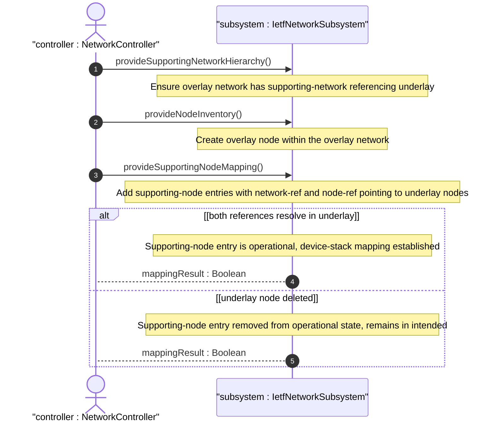

# User Story: Map Overlay Nodes to Supporting Nodes Across Layered Networks

## Parent Epic
- [ ] #124 - [ietf-network: Base Network Data Model](https://github.com/gintatkinson/3dgs-033/blob/main/docs/epics/epic-08-ietf-network.md) (supporting-node list for device-stack and node-level layering, clause 4.1 and 4.4.2)

## Domain Object Mapping
- **Primary Domain Objects:** Node, SupportingNode, SupportingNetwork, network-ref, node-ref
- **Actor/Role:** NetworkController — the management application that establishes node-level underlay mappings to represent device stacks and virtual-to-physical node relationships

## BDD Scenario (OOA/OOD Realization)

**As a** NetworkController
**I want to** map overlay nodes to their supporting underlay nodes via the supporting-node list
**So that** device stacks such as virtual-router-to-physical-server or router-to-route-processor-plus-line-cards are explicitly represented in the topology model

**Given** an overlay network "vpn-overlay" with a supporting-network referencing underlay "core-l3-igp"
**And** the underlay network contains nodes "baremetal-server-07" and "baremetal-server-12"
**When** the controller creates an overlay node "virtual-router-01" with supporting-node entries referencing both "baremetal-server-07" and "baremetal-server-12"
**Then** the overlay node maps to two underlay nodes representing the physical servers hosting the virtual router
**And** each supporting-node entry resolves its network-ref through the network-level supporting-network chain
**And** each supporting-node entry resolves its node-ref to a valid node-id in the underlay network

**Given** an overlay node with a supporting-node reference
**When** the referenced underlay node is deleted from the underlay network
**Then** the supporting-node entry is excluded from the operational state datastore
**And** the reference persists in the intended datastore as a dangling entry
**And** any dependent supporting-termination-point entries chained through this supporting-node are also excluded from operational state

**Given** a node with no supporting-node entries
**When** queried
**Then** the node is identified as a standalone node at its network layer with no device-stack decomposition

## UML Sequence Diagram

## Operational Context

From the IETF Network Topologies YANG Data Model specification, Section 4.1 (Base Network Model):

"Similar to a network, a node can be supported by other nodes and map onto one or more other nodes in an underlay network. This is captured in the list 'supporting-node'. The resulting hierarchy of nodes also allows for the representation of device stacks, where a node at one level is supported by a set of nodes at an underlying level. For example: a 'router' node might be supported by a node representing a route processor and separate nodes for various line cards and service modules, a virtual router might be supported or hosted on a physical device represented by a separate node, and so on."

From the IETF Network Topologies YANG Data Model specification, Section 4.4.2 (Underlay Hierarchies and Mappings):

"To minimize assumptions regarding what a particular entity might actually represent, mappings between networks, nodes, links, and termination points are kept strictly generic."

## Required Features Matrix
- [ ] #127 - [Define Network List Entry](https://github.com/gintatkinson/3dgs-033/blob/main/docs/features/feat-39-network-list.md) (network container for both overlay and underlay instances, node containment scope)
- [ ] #129 - [Define Supporting Network List](https://github.com/gintatkinson/3dgs-033/blob/main/docs/features/feat-41-supporting-network-list.md) (network-level underlay declaration, prerequisite for node-level support chain integrity)
- [ ] #130 - [Define Node List](https://github.com/gintatkinson/3dgs-033/blob/main/docs/features/feat-42-node-list.md) (node inventory within networks, overlay nodes are created as list entries)
- [ ] #131 - [Define Supporting Node List](https://github.com/gintatkinson/3dgs-033/blob/main/docs/features/feat-43-supporting-node-list.md) (supporting-node list with composite key network-ref plus node-ref, the direct mechanism for node-level underlay mapping)

## Source References
Structural Schema: [ietf-network@2018-02-26.yang](https://github.com/YangModels/yang/blob/main/standard/ietf/RFC/ietf-network%402018-02-26.yang) (Clause: 6.1, lines 155-188)
Normative Specification: [the IETF Network Topologies YANG Data Model specification](https://datatracker.ietf.org/doc/rfc8345/) (Clause: 4.1, 4.4.2)
