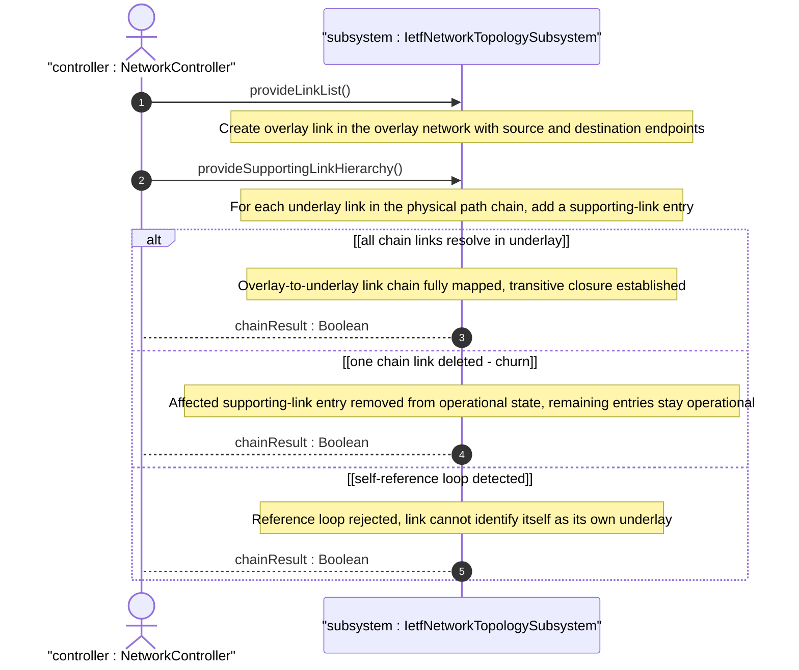

# User Story: Map Overlay Links to Supporting Links Across Layered Topologies

## Parent Epic
- [ ] #125 - [ietf-network-topology: Base Network Topology Augmentation](https://github.com/gintatkinson/3dgs-033/blob/main/docs/epics/epic-09-ietf-network-topology.md) (supporting-link list for overlay-underlay link dependency chains, clause 4.2 and 4.4.2)

## Domain Object Mapping
- **Primary Domain Objects:** Link, SupportingLink, SupportingNetwork, network-ref, link-ref
- **Actor/Role:** NetworkController — the management application that maps overlay links onto chains of underlay links to represent path-level layer mapping

## BDD Scenario (OOA/OOD Realization)

**As a** NetworkController
**I want to** map an overlay link onto a chain of supporting links in an underlay topology
**So that** the physical path carrying a logical tunnel or VPN link is explicitly traceable through the topology layers

**Given** an overlay network "vpn-overlay" with a supporting-network referencing underlay "l3-underlay"
**And** the underlay network contains a chain of three links connecting Chicago through Denver to San Francisco
**When** the controller creates an overlay link "vpn-tunnel-chi-sfo" between the Chicago and San Francisco overlay nodes
**And** adds supporting-link entries referencing all three underlay links in sequence
**Then** the overlay link maps to the entire underlay link chain
**And** each supporting-link entry resolves its network-ref through the network-level supporting-network chain
**And** each supporting-link entry resolves its link-ref to a valid link-id in the underlay network
**And** the transitive closure from overlay link to underlay link chain is explicitly represented

**Given** an overlay link with three supporting-link entries
**When** one of the underlay links in the chain is deleted due to topology churn
**Then** the corresponding supporting-link entry is excluded from the operational state datastore
**And** the remaining two resolved entries remain operational
**And** the overlay link remains partially supported

**Given** an overlay link with a supporting-link entry that references itself as its own underlay
**When** the reference is evaluated
**Then** a reference loop is detected
**And** the system rejects the self-referencing supporting-link as logically invalid

## UML Sequence Diagram

## Operational Context

From the IETF Network Topologies YANG Data Model specification, Section 4.2 (Base Network Topology Data Model):

"Similar to a node, a link can map onto one or more links (which are terminated by the corresponding underlay termination points) in an underlay topology. This is captured in the list 'supporting-link'."

From the IETF Network Topologies YANG Data Model specification, Section 4.4.2 (Underlay Hierarchies and Mappings):

"It is possible for links at one level of a hierarchy to map to multiple links at another level of the hierarchy. For example, a VPN topology might model VPN tunnels as links. Where a VPN tunnel maps to a path that is composed of a chain of several links, the link will contain a list of those supporting links. Likewise, it is possible for a link at one level of a hierarchy to aggregate a bundle of links at another level of the hierarchy."

From the ietf-network-topology YANG module, link-ref description (line 229):

"Reference loops in which a link identifies itself as its underlay, either directly or transitively, are not allowed."

## Required Features Matrix
- [ ] #129 - [Define Supporting Network List](https://github.com/gintatkinson/3dgs-033/blob/main/docs/features/feat-41-supporting-network-list.md) (network-level underlay declaration, prerequisite for link-level supporting-link chain)
- [ ] #132 - [Define Link List](https://github.com/gintatkinson/3dgs-033/blob/main/docs/features/feat-44-link-list.md) (link list augmented into network, overlay link is a link entry in the overlay network)
- [ ] #135 - [Define Supporting Link List](https://github.com/gintatkinson/3dgs-033/blob/main/docs/features/feat-47-supporting-link-list.md) (supporting-link list with composite key, the direct mechanism for link-level underlay chain mapping)

## Source References
Structural Schema: [ietf-network-topology@2018-02-26.yang](https://github.com/YangModels/yang/blob/main/standard/ietf/RFC/ietf-network-topology%402018-02-26.yang) (Clause: 6.2, lines 205-231)
Normative Specification: [the IETF Network Topologies YANG Data Model specification](https://datatracker.ietf.org/doc/rfc8345/) (Clause: 4.2, 4.4.2)
